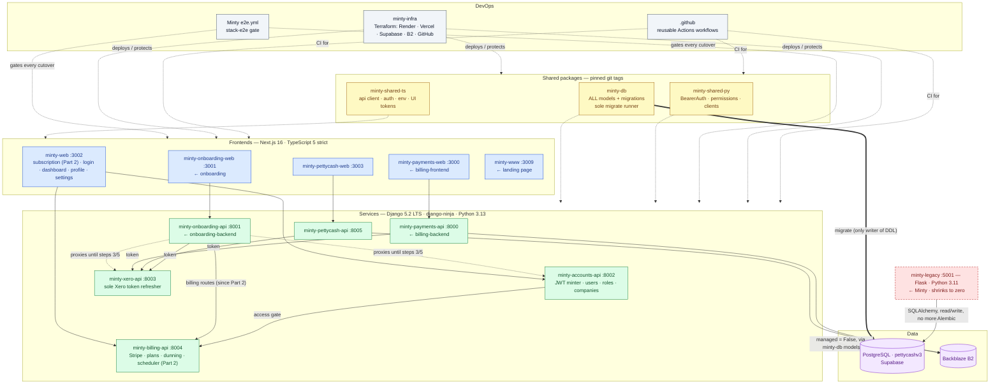

<!-- Source of truth for the plan. Originally authored as a Claude Code plan file; edit HERE from now on. -->

# Minty modernisation — three plans, in order

**Part 1 — Database cleansing on the current code** (done through Phase D): the production
database moves to the redesigned schema in `docs/schema/01_schema_rebased.sql`, and the three
apps that exist today — Minty (Flask), `billing-backend`, `onboarding-backend` — run on it
unchanged in architecture. Tests first, then code. **Status 2026-09-21: A closed, B done,
C closed (2026-09-17), D done (steps 1–5 on the 09-16 and both 09-18 dumps), Phase E — the
production cutover — prepared and rehearsed twice on the Supabase project (2026-09-18, dark,
Xero live). It is executed as the last step of Part 2, so the cutover ships the new
subscription stack dark beside the phase-C builds and there is one production window, not two.
Decided 2026-09-16: the production schema is named `pettycashv3` permanently.**

**Part 2 — Subscriptions on Django + Next.js** (direction taken 2026-09-21): the subscription
domain leaves Flask first, on its own two repositories — `minty-billing-api` (Django, :8004) and
`minty-web` (Next.js, :3002; subscription only for now, built so it can be extracted again) —
with Flask still the identity issuer and the DDL owner. Ends with the production cutover, dark;
launch day (8b) stays a separate later decision, now taken on the new stack.

**Part 3 — Multi-repo structure for the rest of the Flask → Django + Next.js migration**: the
former Part 2. Billing is no longer last; its step 2 (`minty-db`) also swallows
`minty-billing-api`'s `shared_models`; its step 4 grows `minty-web` instead of creating it;
ports follow the architecture diagram in `architecture/`. Added 2026-09-21: cross-cutting rule
10, **one shape for the links between services** (service ids, `<ID>_URL` variables, one links
module per repo, the entry-point table) — applied to the Part 2 repos at Part 2 step 5 and to
the rest at Part 3 step 4.

**Status 2026-10-02.** Part 2 steps 1–4 are done. Part of step 5 landed early: the dark switch,
Flask's Jinja module page and billing-frontend's profile pages were removed on 2026-10-01, and
on 2026-10-02 the env-var consolidation renamed the repos, moved every local port and cut every
URL variable over to one name per service. **`docs/ENVIRONMENT.md` is now the master copy of
the repo names, ports and variable names.** Where this document spells an older name
(`minty-billing-api`, `billing-frontend`, `MINTY_URL`, `HUB_WEB_URL`, `NEXT_PUBLIC_*`, :8004,
:3002, …), read it through that file's §2 (ports), §8 "Renamed repos" and §9 (old → new).
Dated entries keep the names that were true on their day. Still open: the rest of step 5
(listed in its note), step 6, step 7 (the production cutover), launch day (8b), and all of
Part 3 except the hub pages built early (entity list, My Profile).

**Status 2026-10-06.** Step 5 is done except rule 10's links modules, which moved to Part 3
step 4 (the user's call: they change no behaviour). On 2026-10-05 phase 2 of the hub move landed
(sign-in, module choice, Users and Entity & Integration in minty-web; see Part 3 step 4) and the
local checkout became `C:\Github\minty-subscription-api`. On 2026-10-06: minty-onboarding-api's
card, consent and finalize calls go to minty-subscription-api (finalize is native there and a
failed trial start fails it; the All Set screen has Try again); minty-payment-request-web reads
the notice from minty-subscription-api; and **Flask's subscription engine is deleted** (services,
payer portal, onboarding billing routes and finalize, the notice route, the CLI, the scheduler,
`stripe`, `apscheduler`), leaving `store_ro.py` and the models. Next: step 6, then step 7 (its
variables come from `.env.prod`; production changes are asked for first) and 8b.

---


# Part 1 — Database cleansing: tests first, then code to the new schema

## Context

Three codebases read and write one PostgreSQL schema, `pettycashv2` (67 tables, hand-written
Alembic, cannot be built from empty). A redesign already exists and is finished as SQL:
`docs/schema/01_schema_rebased.sql` — 58 tables + the `tracker` view, 21 enums, `uuid` PKs,
`numeric` money, `timestamptz`, `user`/`user_token` split, 9 renames, draft/v2 report tables
collapsed, sales channels normalised, dead columns and the 8 `auth_*`/`django_*` tables gone.
With it: generated loaders (`02`, `03`, `04`), `00_enum_coverage_check.sql`, `audit_models.py`,
and `APPLICATION_CHANGES.md` listing the 217 code findings the redesign causes (9 renamed
tables, 64 model columns the schema no longer has — each of which breaks every `SELECT` on its
model — and 144 type mismatches, of which the `Float`-on-money ones are real bugs).

What is missing is the application side and the production cutover. This plan does both, in
that order, with a test net built first — because the current suite cannot see the change:
Minty's 100 test files run on **SQLite via `db.create_all()`**, which builds the *old* shape
from the current models and knows nothing of enums, `uuid` or `numeric`. A green run on it
after the model edits would prove nothing about the database the code will actually meet.

**Out of scope here:** service extraction, repo renames, `minty-db`, CI/Terraform — all Part 2.
Part 2 step 1 (CI + housekeeping) can run in parallel with this and would make phase B's runs
automatic; it is not a prerequisite.

## One schema, one hop

**`01_schema_rebased.sql` is the only target.** `01_schema 2.sql` is the draft it was rebased
from — nine Alembic revisions behind — and is kept as the record of the original design, nothing
more. Today it is still on the critical path as a *staging shape*: the pipeline is two hops,
`pettycashv2 → pettycash_s2` (the original ` 1.sql` loaders, where the redesign transformation
actually happens) → `pettycash_test` (the `_rebased` loaders, a column-for-column copy). D1 and
D2, the three known build defects, and the "rebuild `pettycash_s2` first" step all live in that
first hop.

**Decision: the pipeline becomes one hop, `pettycashv2 → 01_schema_rebased`.** The
transformation logic (uuid minting for the two non-uuid user ids, the `report`/`report_draft`
merge with `DISTINCT ON (old_id)` by priority, the `sale_info` split, the three-way
`report_history` merge, the enum mappings) is ported from the ` 1.sql` files into
`docs/schema/generators` (`gen.py` already takes `GEN_SRC`/`GEN_DST` from the environment) so
`02`/`03` are generated against the rebased schema directly. D1–D5 disappear — there is no lossy
intermediate (see phase A). The row checks become "expected count" for the merged tables and stay "equal" for
the copied ones. `01_schema 2.sql` and its loaders move to `docs/schema/archive/`.

**And commit `docs/schema/` first.** None of it is in git — the most current schema exists
only on this machine. `git add docs/schema && git commit` is the first act of phase B.

### Where the rebased schema already is (local Postgres, checked 2026-09-15)

| Database | Schema | Tables | State |
|---|---|---|---|
| **`minty_cleanse`** — what `.env` points both URIs at now | `pettycashv2` (new, loaded) + `pettycash_legacy` | 59 | **The phase C database**; see Phase C |
| `minty_pettycashv3` | `pettycashv3` (new, loaded from the 09-16 dump) + `pettycashv2` (old, at v1a01) | 59 | The build under the permanent name (2026-09-16; rebuilt 2026-09-17 on items 21/22, ALL GREEN, attachments loaded); its dump `backups/minty_pettycashv3_<date>.dump` is what Supabase receives — the 09-16 one was restored there on 09-16; the 09-17 one replaces it (`DROP SCHEMA pettycashv3 CASCADE` then `pg_restore`). Becomes the phase C database once the qualifier rename lands. |
| `postgres` — the former app database | `pettycashv2` | 68 | **Old shape**: `roles`/`permissions`/`invitations`/`report_sale_detail`/`shop_expense`/`audit`/`bill_line_item` present, `report.status` varchar, 4 enums, Alembic `v1a01_billing_account` |
| `pcschema_test` | `pettycash_test` | 58 | Rebased, empty — the structural reference `audit_models.py` hardcodes |
| `pcbak_win` | `pettycash_test` (+ `pettycash_s2`, 43) | 57 | Rebased and **loaded** via the two-hop pipeline: 119 users, 3,749 reports, 82 entities |
| `pcbak_test` | `pettycash_test` + `pettycashv2` | 57 + 67 | Rebased, empty, beside an old-shape copy |
| `pcorig_test` | `pettycash_test` | 43 | Schema-2 draft shape, misnamed |
| `production-backup`, `prestaging-new`, `supa_rehearsal` | `pettycashv2` | 60 / 64 / 68 | Old shape, Supabase snapshots |

So: the redesign has been **built and loaded locally, but no application has ever run against
it** — every `pettycash_test` is in a database nothing connects to. And every one of them is
**one build behind the file**: none has `user.system_role` (D6) or `billing_account_payment_method`
(the 2026-09-10 change). The file is the truth; the databases are stale. Two consequences:
phase B's harness builds from `01_schema_rebased.sql` on every run and never reuses a database,
and `pcbak_win.pettycash_test` is the ready-made dataset for the first characterisation-test runs
(regenerate it once the one-hop pipeline exists).

## The rule: the schema is authoritative, the code follows it

This is `01_schema_rebased.sql`'s own Decision 10 — *"the database is authoritative; the
application follows it"* — and Part 1 applies it without exception. Where code and schema
disagree, the code changes. The only edits to `01` are the ones its own decision register
already calls its faults (D6) and the enum-narrowing pass it already schedules.

## Phase A — decisions (closed 2026-09-15)

All six review decisions and §4 are closed; the register is item 18 of `01_schema_rebased.sql`'s
header and it wins over anything below if they ever disagree.

| | Resolution |
|---|---|
| **D1–D5** | The one-hop pipeline showed they were artefacts of the schema-2 hop. The user then chose the **redesign's vocabulary**: the enums are `01_schema 2.sql`'s, production data is **mapped** on the way in (`gen.py ENUM_MAP` generates `02`, `03`, the count assertions and `00`), and the application changes to write those words in phase C. |
| **D6** | `user.system_role` uncommented; enum `normal / admin / superadmin`. The one `superuser` loads as `superadmin`. |
| **§4** | `entity_function_map.created_by` is a UUID FK to `user`; `_write_pairs` gains a `user_id`; no `actor` column. |
| **Enum narrowing** | Superseded — nothing left to narrow. Two members schema 2 lacked were kept as live workflow states: `bill_status.returned`, `publish_state.failed`. |
| **Module code** (2026-09-16) | `entity_function.function_code` `BILL` → **`PAYMENT_REQUEST`** (01 item 20): mapped by the loader in `entity_function` and `entity_module_subscription`, the `tracker` view filters on it. `billing_plan.code` keeps `BILL` / `BILL+PETTY_CASH` by decision, so the plan-key rule (sorted join of module codes) needs a mapping in phase C. Code that follows: `MODULE_BILL` ×2 + ~50 refs in Minty, billing-backend `core/entitlements.py`, onboarding-backend `plans.py`/`shared_models`, onboarding `lib/api.ts` `ModuleCode`, billing-frontend module claims. |

The vocabulary the code must now write (item 18), in one place because phase C keys on it:

| Enum | Old word(s) in code | New |
|---|---|---|
| `system_role` | `superuser` (JWT claim — Minty, billing-backend, onboarding-backend together) | `superadmin` |
| `report_status` | `posted` | **`submitted`** — `posted` has always meant "the wizard finished" (`ending.py:1568`, rendered "Submitted" at `report_history.html:513`); Xero publishing lives in `publishing_status`/`xero_integrated`. `published` stays declared, unused by the load (corrected 2026-09-16). `partially_published` gone |
| `publish_status` | `processing`, `not_published`/NULL | `publishing`, `unpublished` |
| `discrepancy_type` | `shortage`, `surplus` | `short`, `over` |
| `sale_type` | `Electronic`, `Delivery`, `Cash` | `electronic`, `delivery`, `other` |
| `invitation_status` | `cancelled` | `revoked` |
| `entity_status` | `active`, `cancelled`, `deleted` | `onboarding` / `connected` / `disconnected` only — see C2 |
| `bill_status` (billing-backend) | `voided`; dead `authorised`/`cancelled`/`sync_failed` | `void`; dead members removed |
| `publish_state` (billing-backend) | `not_published` (model default at `bills/models.py:45`, `BillActionBar.tsx:18`) | `draft` |
| `sync_direction` | `outbound` | `push` |
| `entity_role` | `'shop manager'` (one row) | `shop_manager` |

## Phase B — the test net (done; what it left behind)

Committed as `a32a136` ("Baseline test"). In place:

- **B1** `tests/pg_harness.py` + `tests/conftest.py` Postgres mode (`MINTY_TEST_PG_URI`), building
  a throwaway database from `01` and rename-swapping to `pettycashv2`, `create_all` a no-op.
  Three suite-level fixes that make real-database route tests possible in a full run at all
  (per-connection SQLite schema attach, per-process files, rebinding stale model references —
  the "not registered with this SQLAlchemy instance" trap). **The SQLite path is still the default.**
- **B2** `tests/_baseline/`: SQLite at HEAD = 62 failed / 29 errors / 1508 passed; `compare.py`.
  After B: 66 failed / 29 errors / 1558 passed, no pre-existing test moved.
- **B3** 57 characterisation tests (`tests/test_char_report_lifecycle.py`, `test_char_sales_methods.py`,
  `test_char_access.py`), factories in `tests/char_factories.py` with FakeS3 and FakeMail at the
  library boundary, `tests/test_zz_route_coverage.py` against `tests/_baseline/route_inventory.json`
  (132 in-scope endpoints; last measured 117 exercised). **Groups not yet written:** money exactness,
  Xero tokens, entities/settings, subscription, billing-backend, onboarding-backend — each is
  written at the start of the phase C unit that touches it (see C0).
- **B4** both Django repos: `settings_test.py` Postgres mode + root `conftest.py` using the harness.
- **B5** became `scripts/schema_migration/rehearse.py` (one hop) — see phase D.
- **B6** `audit_models.py` covers all three repos, target from env; `AUDIT_STRICT=1`.
- **Findings recorded as strict xfails:** F1 revert-to-draft deletes expenses (`services/ending.py`);
  F2 delete-report leaves expense receipts in S3; F3 `superuser` vs the enum (now decided: `superadmin`).
- One order-dependence to clear: `test_history_csv_lists_the_days_movements` passes alone, 500s in the full run.

## Phase C — the application follows the schema  (CLOSED 2026-09-17)

**The database:** `minty_cleanse` (local), built 2026-09-15 by
`rehearse.py --dump backups/production-backup_20260915.dump --db minty_cleanse --attachments`
against the updated `01` (59 tables + 2 views, 21 enums, `user.system_role` present) and
rename-swapped: `pettycashv2` is the new shape with production data (119 users, 82 entities,
3,749 reports, 10,172 expenses / 10,201 attachments, 482 bills); the old schema sits beside it as
`pettycash_legacy`. Minty's `.env` points at it (`.env.bak_before_minty_cleanse` has the old URIs).
**Rebuild it the same way whenever `01` changes** — never patch it by hand. Automated tests keep
using the harness (a fresh build from `01` per run); `minty_cleanse` is for running the apps and
for the manual checks.

**The list, measured against `minty_cleanse`** (`AUDIT_URI=<minty_cleanse> AUDIT_SCHEMA=pettycashv2
python docs/schema/generators/audit_models.py`): **287 findings** — Minty 154 (7 tables, 48
columns, 99 types), billing-backend 63 (2 / 14 / 47), onboarding-backend 70 (1 / 29 / 40).
`APPLICATION_CHANGES.md` is stale (217, two repos, older build); regenerate it from the audit
at the end of each unit rather than maintaining it by hand.

### C0 — ground rules for every unit

1. **Tests first, per unit.** If B3 has no characterisation tests for the area, write them on
   the current code (SQLite) before touching a model; run them in Postgres mode afterwards.
2. **One vocabulary module.** New `blueprints/shared/enums.py`: a Python `Enum` per Postgres enum
   (`ReportStatus`, `EntityStatus`, `SystemRole`, `SaleType`, `InvitationStatus`, `DiscrepancyType`,
   `PublishStatus`, `PublishState`, `SyncDirection`, …) with the members from `01`. Every string
   literal in item 18's list becomes a member reference; templates get them via a context
   processor. billing-backend and onboarding-backend get the same values as Django `TextChoices`
   in `shared_models/enums.py`. The three copies are checked equal by a test that reads `01`.
3. **Column types follow the schema.** SQLAlchemy: `db.Enum(<PyEnum>, name="report_status",
   schema="pettycashv2", native_enum=True, create_type=False, values_callable=…)`,
   `sqlalchemy.Uuid(as_uuid=False)` for ids, `Numeric(14, 2)` for money, `DateTime(timezone=True)`.
   Django: `UUIDField`, `DecimalField(max_digits=14, decimal_places=2)`, `TextChoices` fields.
4. **Graduation.** `tests/conftest.py` turns every `char` test into an xfail in Postgres mode.
   Replace that with a `PG_PENDING = {"test_char_report_lifecycle.py", …}` set in conftest; a
   unit removes its module from the set when it is green on Postgres, and from then on a
   regression there is a hard failure.
5. **Gate per unit:** `audit_models.py` shows **0 findings for the unit's tables** across all
   three repos; the unit's tests green on SQLite *and* Postgres; the full Minty suite (Postgres)
   has no newly failing test outside the unit (`compare.py`); the app boots against
   `minty_cleanse` and the unit's pages render for one real entity.
6. **Alembic is frozen from now.** No new revision. A schema change is an edit to `01` + `gen.py`,
   then `minty_cleanse` is rebuilt. (`Minty/migrations/` is deleted at the cutover, phase E.)
7. **Commit per unit**, on a branch (`part1-phase-c`), never mixing a rename with a behaviour fix.
8. **One database for the stack:** at the start of C1, `billing-backend/.env` and
   `onboarding-backend/.env` get `POSTGRES_DB=minty_cleanse` (decided 2026-09-15), so the three
   apps and `onboarding/e2e` run against the same data throughout phase C.

### C0.9 — the browser sees it: Minty E2E smoke (before C1)

Why: the route tests render Jinja but run no JavaScript, and Minty's report wizard is
large inline JS that reads the names the redesign changes (`sales.html` `calculateTotals()`,
the 3,500-line `expense.html` script, `cash_count.html`; 15 templates + 1 static JS file
reference renamed columns). A renamed JSON key there fails silently in every test we have.
`billing-frontend` has no tests at all and C8 changes its types.

- **`Minty/e2e/` — Playwright, TypeScript**, same layout and conventions as `onboarding/e2e`
  (`playwright.config.ts`, `helpers.ts`, credentials from env, skips with a reason when unset).
  Runs against the local stack on `minty_cleanse` (Flask :5001; Django :8000/:8001 and the Next
  apps only where a journey crosses into them). Test identity: a superadmin and one real entity
  from the loaded data (ids via env `E2E_MINTY_USER`, `E2E_MINTY_ENTITY`), logging in through the
  real OTP form with the mail transport stubbed (`MAIL_*` pointed at a local sink) or a
  test-only login route guarded by `TESTING` — decide in the unit; never a hardcoded password.
- **Journeys (~10):** login → entity list → open a company; the full report wizard in a real
  browser — opening, sales with per-method inputs and live totals, expenses with a receipt
  upload, deposit, cash count with denominations, ending → submitted page; report detail and
  history (figures match what the wizard showed); CSV download; entity settings: sales methods
  add/reorder/disable, users list and role change; Xero connect page renders (no real OAuth);
  the terms modal on first login.
- **`billing-frontend/e2e/` — Playwright, TypeScript**, same shape. It has no tests of any kind
  today and C8 changes what it renders (`bill_status`, `publish_state`, the bill payload). Runs
  against the stack on `minty_cleanse` with the JWT handoff from Minty (`billing_token` cookie
  minted the way `lib/auth.ts` expects) and Xero/Stripe stubbed at the Django boundary.
  Journeys (~8): module selection → payment-request list with status filters; bill detail with
  lines and totals; the action bar through submit → approve → pay → void (every status word the
  UI shows); attachment upload and preview; publish to Xero (stubbed) and the publish-state badge;
  payer portal — profile, billing/cards, invoices, subscriptions (these call Minty's `/api/me/*`);
  the maintenance page. Baseline green on the current code before C8 starts.
- **`billing-backend`** needs no browser suite: its 457 pytest tests plus the B4 Postgres mode
  cover it, and C8 adds API-level characterisation (`bills/tests/test_char_schema.py`). Its
  django-ninja OpenAPI (`/api/openapi.json`) is snapshotted before C8 so payload changes are a
  visible diff, not a surprise in the browser.
- **`onboarding`** already has `onboarding/e2e` (13 Playwright tests); it runs at the end of
  C1, C2, C3 and C9 since those units change what its API returns.
- **Frontend gates added to the units that touch a frontend:** C8 — `tsc --noEmit`,
  `npm run build` and the new e2e suite in `billing-frontend`, plus a vitest for the status maps
  (`billStatusDisplay.ts`, `billStatusRollback.ts`, `BillActionBar`); C3/C4 — the Minty wizard
  journeys must stay green after each template/JS change.
- **Old-name grep as a test** (`tests/test_zz_template_vocabulary.py`): once a unit lands, no
  file under `templates/**` or `static/js/**` may reference a column that unit removed
  (`cash_sales`, `shop_sales`, `delivery_sales`, `uploaded_by`, `xero_integrated_yes`,
  `actual_cash_total`, `withdrawal_*`, `sync_statuc`, `value_name` …); the list grows per unit.
- Fix `tests/test_zz_route_coverage.py`'s misses file (it currently writes one line per miss but
  the header count and the body disagree — 117/125 vs one row): write endpoint, methods, rule
  and reason as tab-separated fields so the to-do list is readable and complete. *(Superseded
  2026-10-01: the file is now the gate's known-gaps list, fixed-width - see the C10 note.)*
- **Gate for C0.9:** both new suites green against the *current* code on `postgres` (old schema),
  so they are a known-good baseline before C1 changes anything; then they run against
  `minty_cleanse` at the end of every unit from C1 on (Minty's after every unit, billing-frontend's
  after C1, C7 and C8).

**Status 2026-09-16 — C0.9 done.** `Minty/e2e/` (Playwright, 19 tests: login + terms modal,
the whole report wizard in a browser, settings/users/Xero page/module page/CSV) and
`billing-frontend/e2e/` (13 tests: handoff + status tabs, draft lifecycle + confirm validation,
payer portal) are green against the current code on the old-schema `postgres` database.
`Minty/scripts/e2e_seed.py` seeds the identity both suites use (`e2e@minty.test`,
`E2E Petty Cash Shop`, both modules on, synced accounts/contacts, bill account codes), and is safe
to re-run against `minty_cleanse`. Also landed: `tests/test_zz_template_vocabulary.py` (retired
names grep, empty until C1), `PG_PENDING` in `tests/conftest.py`, the route-coverage alias fix,
`billing-backend/bills/tests/test_openapi_snapshot.py` (43 paths, 58 schemas pinned),
`billing-frontend` `npm run typecheck`. Two more findings, recorded as `test.fail()`:
**F4** `cash_count.html` `applyCalculatorTotal()` strips only `$` so the Actual Cash Balance field
shows `HKD0.00` after Apply (display only; fix in C4); **F5** `/api/me/subscriptions` answers 500
for a payer with no subscriptions (`paid_through` referenced outside its loop in
`subscription/services/portal.py`; fix in C7). Next: **C1**.

**Done 2026-09-16 (C0.95):** `minty_cleanse` rebuilt from `backups/production-backup_20260916.dump`
(the 0915 dump no longer matches `gen.py`'s re-measured `EXPECT_SKIP` — 65 → 40 `sale_info`;
always pair the dump with the generator's counts). ALL GREEN in 206 s (7-minute window), swapped:
130 users, 88 entities, 4,861 reports (`submitted` 790 / `published` 4,046 / `draft` 25),
930 bills; `entity_function` = `PETTY_CASH`, `PAYMENT_REQUEST`; `module_code` on the three
`function_code` columns. Audit against it: **Minty 157, billing-backend 65, onboarding-backend 71**
(the +3/+2/+1 are the `module_code` type findings). `rehearse.py`'s app-database guard now warns
instead of failing when `RDS_DATABASE_URI` is unreachable (it points at Supabase in `.env` again —
note `FLASK_ENV` defaults to `production`, which selects **RDS**, so run Flask for phase C with
`FLASK_ENV=development` or point RDS at `minty_cleanse`).

### C1 — identity: `user`, `user_token`, `system_role`  (unblocks ~480 test errors across the repos)

- Tests first: B3 group **Xero tokens** (`tests/test_char_xero_tokens.py`): connect callback
  stores a token; expired → `services/auth/token_service.py` refreshes (transport stubbed at
  `requests`) and updates obtained-at; refresh failure → 409 "reconnect required" with nothing
  overwritten; disconnect clears; `/api/internal/xero/token` for a member; two users of one
  entity hold separate rows.
- `blueprints/auth/models/user.py`: drop `xero_entity_id`, `xero_token`, `access_token`,
  `refresh_token`, `id_token`, `expires_in`, `token_created_at`, `current_entity_id`;
  `system_role` → enum. `UserToken` (`user_token.py`, already exists) becomes the only token
  store: `access_token`, `access_token_obtained_at`, `access_token_expires_in`, `refresh_token`,
  `refresh_token_last_used_at`, `id_token`.
- Rewire the readers (from the reference count): `services/auth/token_service.py` (39),
  `blueprints/xero/routes/routes.py` (27), `entity/services/onboarding_xero.py` (12),
  `entity/routes/settings.py` (12), `xero/services/publish.py` (7), `user_management/routes/roles.py` (4),
  `entity/services/onboarding_account_codes.py` (4), `xero/services/settings.py` (3),
  `user_management/routes/create_user.py` (`xero_entity_id`), `deactivate_my_account`.
- `superuser → superadmin`: `blueprints/auth/system_roles.py:6`, `services/permission_policy.py:26`,
  `user_management/routes/admin_list.py:97`, two templates; **and in the same change**
  billing-backend `core/auth.py:61,132,226`, `core/views.py:34`; onboarding-backend `core/policy.py:42`
  — it rides in the JWT claim. `LEGACY_SUPERUSER_ROLES` keeps accepting `admin`/`super_admin` on read.
- `user_entity.create_at → created_at`; `entity_function.description`/`created_at` NOT NULL
  (the factories and the seed CLI set them).
- Mirrors: billing-backend `shared_models/models.py` (`user` 6, `entities` 3), onboarding-backend
  (`user` 1, `user_entity` 1).

**Done 2026-09-16 (C1).** Minty: `blueprints/shared/enums.py` (`SystemRole`, `EntityRole`; every
`_DbEnum` names its Postgres type via `pg_name`), `User` on `Uuid`/`system_role` enum/timestamptz
with the six token columns, `xero_entity_id` and `current_entity_id` gone; the token attributes
are properties over the one `user_token` row (`clear_tokens()` replaces the six-way clears);
`entities.connected_by_user_id` is the only "who connected" fact; `user_entity.created_at`;
`superuser → superadmin` everywhere (`SYSTEM_ROLE_SUPERUSER` keeps its name, `normalize_system_role`
still accepts the old spelling from pre-rename JWTs; `LEGACY_SUPERUSER_ROLES` stays
`admin`/`super_admin` — entity roles, never `superuser`). Presence follows item 14 (per person,
aware timestamps). billing-backend: `UserToken` mirror, `Entity.connected_by_user_id`,
`xero_token_service` is read-only over `user_token` (the dead refresh path deleted), raw SQL over
`user`/`user_entity` replaced by ORM, `str(request.auth_user.id)` where a uuid meets a text column
(until C8); onboarding-backend: `core/policy.py` on the enum, `find_resumable_entity` materialised
(the SQLite uuid-vs-text `__in` trap). Both Django repos: `shared_models/enums.py`
(`TextChoices`), `PgEnumField`, `db_default=Now()` for the schema's `NOT NULL DEFAULT now()`
stamps. Tests: `tests/test_char_xero_tokens.py` (10), `tests/test_enums_match_schema.py` (parses
`01`, checks all three copies), `RETIRED["C1"]` on, `test_user_presence` rewritten to item 14,
all test user ids are uuids now (SQLite rejects `"u1"`). **Gate:** audit = 0 on
`user`/`user_token`/`user_entity`/`email_otp` in all three repos (totals Minty 157→139,
billing 65→56, onboarding 71→64); SQLite suites: onboarding 369/369, billing 444 passed with the
same 14 pre-existing failures as HEAD, Minty no newly failing test vs the Phase B baseline; real
login form on `minty_cleanse` signs a superadmin in and routes to `/admin`. **Left to C2:** every
page and Postgres-mode test that reads `entities` (`minimum_qty` …, `entity_status` `'deleted'`,
`module_code` `'BILL'`) — `test_char_xero_tokens.py` is in `PG_PENDING` for that reason only.
**Decided 2026-09-16 (user): the lock dates are not stored — billing fetches them from Xero's
Organisation when publishing.** Context: billing-backend already GETs
`api.xro/2.0/Organisation` for `PeriodLockDate`/`EndOfYearLockDate` (`bills/api.py`
`_backfill_lock_dates`, triggered from the bills list) and caches the pair on `entities`;
`xero_publish_service._build_xero_invoice_payload` reads the cache to send a bill dated on/before
a lock as DRAFT instead of AUTHORISED. The schema dropped both columns, so in **C2, in the same
change as the `Entity` mirror**: `_backfill_lock_dates` and its list-time hook go;
`xero_publish_service` gains `fetch_lock_dates(access_token, xero_org_id) -> (period, eoy)` (the
same GET, moved, tolerant — a failed lookup logs and publishes as AUTHORISED, today's behaviour
when the cache is empty) called once per publish before the payload is built; tests stub the
Organisation GET at `requests` and pin DRAFT-on/before-lock and AUTHORISED-after. Minty's
`entity/routes/settings.py` lock-date form fields go with the columns (already in C2's list).
Cost: one extra Xero GET per publish; benefit: a lock moved in Xero takes effect immediately
instead of after the next bills-list visit.

### C2 — entities and modules

- Tests first: B3 group **entities** (`tests/test_char_entities.py`): create → creator is admin
  and the module map rows carry the creator; module toggle via settings vs CLI (`created_by` user
  vs NULL); settings page renders without the six dropped columns; status transitions; country /
  currency resolution against the real `fk_country_currency`.
- `entity.py`: drop `minimum_qty`, `deposit_frequency`, `deposit_day`, `xero_short_code`,
  `period_lock_date`, `end_of_year_lock_date` (write sites at `entity/routes/settings.py` — the
  lock-date form fields go with them; billing-backend stops caching the lock dates and asks
  Xero at publish — see the C1 close-out note above); `status` → `EntityStatus`.
- **Decided 2026-09-15:** `entity_status` is `onboarding / connected / disconnected` and means the
  Xero connection state once onboarding is done. The finalize step (`create.py:1219`) writes
  `active` today; it will write `connected` when the entity has a Xero org linked, else `disconnected`; Xero connect/disconnect
  (`xero/routes.py:1067`) move between the two; `cancelled`/`deleted` writers (`list.py:486`,
  `entity.py:33`) are removed — a cancelled subscription is a subscription state, not an entity
  state (that is what the loader's mapping already says of the nine historical rows). The wizard
  resumes on `onboarding` only; the access gate treats both other states as live.
- `entity_function_map`: no `id` (composite PK `entity_id, entity_function_id`), `created_by`
  uuid FK, `settings_json`, `enabled_at`/`disabled_at`; §4 `_write_pairs(user_id)` and its four
  callers (`create.py:1169`, `modules.py:393`, `settings.py:1921`, the CLI).
- Mirrors in both Django repos (`entities` 6+5 findings in onboarding-backend, `entity_function_map` in both).

**Done 2026-09-16 (C2).** Minty: `Entity` on the schema (uuid id, `entity_status` enum with
default `onboarding`, six columns gone, `financial_year_end_*`, tz stamps); `EntityFunction`
(`module_code` enum, `display_order`) and `EntityFunctionMap` (composite key, no `id`,
`created_by` uuid FK NULL-able, JSONB); `MODULE_BILL = "PAYMENT_REQUEST"` with the plan-word
mapping in one place (`subscription/services/billing.plan_code` / `plan_modules`; the catalogue,
notify and the onboarding plans endpoint speak module codes, `billing_plan.code` keeps `BILL`);
`_write_pairs(..., actor, user_id)` — `created_by` is the person or NULL, `actor` keeps only
the paid-subscription guard; finalize writes `connected`/`disconnected`, the legacy create form
`disconnected`, the Xero-consent-declined branch no longer writes `cancelled`, the soft-delete
route and every `deleted` filter are gone (no link pointed at it; `ENTITY_DELETE` stays in the
matrix); Minty's lock-date backfill removed. **`blueprints/shared/column_types.MintyUuid`**
is now the uuid column type everywhere (C1's columns retrofitted): native `uuid` on Postgres,
CHAR(36) hyphenated text on SQLite, so a converted column joined to a not-yet-converted
`String(36)` one still matches during phase C (`sqlalchemy.Uuid` stored 32-hex and the C1
entity-list join silently returned nothing on SQLite); junk ids pass through to the database
rather than raising inside SQLAlchemy. billing-backend: `Entity` mirror on the schema, `UserToken`
stamps, `CountryInfo` mirror, `CharNField` (`char(n)`), `bills.EntityFunction/Map` on the
schema (composite key; the map CRUD is addressed by `function_id`, OpenAPI snapshot updated),
`core/entitlements.MODULE_BILL = PAYMENT_REQUEST`, **lock dates fetched from Xero's
Organisation at publish time** (`xero_publish_service.fetch_lock_dates`; `_backfill_lock_dates`
and the bills-list hook deleted; DRAFT on/before a lock, AUTHORISED otherwise or when the lookup
fails); `get_entity_role` treats an empty/malformed entity id as no access. onboarding-backend:
mirrors on the schema (`Entity`, `CountryInfo`, `CurrencyInfo`, `EntityFunction/Map`,
`BillingPolicy.updated_at`), `_seed_module_defaults(user_id=)`, `plans.plan_modules`;
`onboarding` wizard: `ModuleCode = 'PETTY_CASH' | 'PAYMENT_REQUEST'` (`lib/api.ts`,
`lib/modules.ts`, `e2e/xeroFake.ts`; tsc clean, 289 vitest). Tests: `tests/test_char_entities.py`
(14; the four decided behaviours were strict xfails on the old code), `RETIRED["C2"]` on,
`PG_PENDING` accepts single cases (`test_char_xero_tokens.py::…disconnect…` waits on C6's
`roles`; `test_char_entities.py` on C3's `sale_info`), `truncate_all` is `TRUNCATE … CASCADE`
on Postgres, ~330 `"BILL"` module-code literals in Minty tests renamed (plan-word uses kept),
test entity ids are uuids in all three repos. **Gate:** audit 0 on `entities`,
`entity_function`, `entity_function_map`, `country_info`, `currency_info` in all three repos
(totals Minty 139→121, billing 56→43, onboarding 64→43); SQLite: Minty 0 newly failing vs C1
(1580 passed), billing 444 + the same 14 pre-existing, onboarding 369/369; Postgres: Minty 0
newly failing / 10 newly passing (1362 passed), token char tests 9/10 green, onboarding-backend
266 passed (was 153), billing-backend blocked only by `bill` (C8); on `minty_cleanse` the
entity list renders all 88 companies with module icons, module/users settings and the admin
dashboard render; `/entity/<id>` reaches `report.date` (C4), Xero settings reaches `roles`
(C6). **Notes for later units:** billing-backend's `bills/models.py` module models changed
without a Django migration on purpose (C8 deletes `bills/migrations`; do not run `migrate`
against the new schema before that); `scripts/e2e_seed.py` cannot run on `minty_cleanse` until
C3 (`sale_info`); `minty_cleanse` holds 19 enabled module grants of 176 (matches legacy — the
m1a01 revocation; decided: revoke as rehearsed, see Phase D).

### C3 — sales catalogue

- Tests: `test_char_sales_methods.py` exists; add the sales-page rendering and the `other` (Cash) bucket.
- `sale_info` becomes a **global catalogue** (`id, type, sale_name, value_name, display_order,
  enabled`); `entity_sale_setting` a link (`entity_id, sale_id, is_active, display_order`). The
  per-entity `CUSTOM_*` rows are gone (collapsed by the loader). `SaleInfo.resolve`/`ensure_custom`
  and `replace_sales_methods` (`entity/services/payment_methods.py:280`) change shape;
  `get_unique_sale_info_for_entity` (`report/routes/sales.py:48`) joins instead of grouping.
- `sale_type` lowercase + `other`: the 46 sites plus five `electronic_delivery_*` templates
  (`onboarding_state.py:166`, `payment_methods.py:89/209/268`, `sale_info.py:109`, …); the
  `value_name` → form-field convention in `sales.html` stays.

**Done 2026-09-16 (C3).** Minty: `SaleInfo` is the global catalogue (`sale_name` unique,
`type` = `SaleType` enum `electronic/delivery/other`, `value_name` = the form-field
convention, `enabled`), `EntitySaleSetting` the link `(entity_id, sale_id, is_active,
display_order)` with read-through properties so `method.sale_name/.type/.value_name` keep
working; `SaleInfo.ensure(name, type)` get-or-creates by name (a name any company typed is one
row for all), `create_default_entity_settings` links the 11 defaults, `payment_methods.py`
rewritten (JSON `type` carries the enum word; capitalised input still accepted via
`SaleType.normalize`; a shared catalogue row cannot be renamed from one company — 409);
`ReportSaleDetail.sale_id` points at the catalogue (both ids equal until C4 drops
`sale_info_id`); the report-side readers join `SaleInfo`, `sum_sales_by_type` returns
`electronic/delivery/cash` (Cash found by `value_name == cash_sales`, its type is `other`);
templates/JS speak the enum words. onboarding-backend: mirrors on the schema, `sales_methods`
service and the entity-create seed rewritten the same way (369/369). Tests: 4 new cases in
`test_char_sales_methods.py` (sales page inputs, Cash in `other`, one catalogue row for two
companies, a switched-off method keeps an old report's amount); `RETIRED["C3"]`; the char
modules for sales, entities and tokens are OUT of `PG_PENDING` (only single cases remain,
each tagged with the unit whose table they touch). **Two defects found and fixed:** (1)
`gen.py` loaded `sale_info.value_name` as NULL for every row (the source kept the key as
`legacy_column` / `entity_sale_setting.value_name`) — the sales form would have rendered no
inputs on the new schema; mapped, loaders regenerated from `minty_pettycashv3` (the only build
on the current `01`; `pcreh_20260916b` predates the `module_code` enum), `minty_cleanse`
rebuilt ALL GREEN in 195 s; (2) **`01` item 21**: `country_info` sat in the `updated_at`
trigger list without the column — every UPDATE on it failed. Fixed as the user decided
(2026-09-17): `country_info` is seeded once and only read, so it gets NO stamps; its name comes
out of the trigger array (33 → 32 triggers), `supabase/pettycashv3.sql` regenerated,
`minty_cleanse` rebuilt. **Standing rule from this:** no edit to `01` / `pettycashv3` without
asking first (memory `ask-before-schema-changes`). **Gate:** audit 0 on `sale_info` /
`entity_sale_setting` (totals Minty 121→105, onboarding 43→27); SQLite: Minty 0 newly failing
(1585 passed), onboarding 369/369; Postgres: Minty 0 newly failing, 1390 passed (+28),
onboarding-backend blocked only by `report`/`invitations` (C4/C6). **Seen in passing, not
C3's:** `docs/modernisation/modernisation_plan.md` and `docs/schema/README.md` were edited outside this
session on 2026-09-16 — the production schema is named **`pettycashv3` permanently, no
rename-swap**, and "the schema qualifier rename across the three apps is a Phase C item, not
yet done". It is not scheduled in any unit below; it is mechanical (`schema="pettycashv2"` in
~60 Minty models and `db.Enum(schema=)`, raw `pettycashv2.` SQL, `SESSION_SQLALCHEMY_SCHEMA`,
`tests/pg_harness.py`, the Django `search_path` settings, onboarding `lib/refData.ts`) and
best done as its own commit right after C3, before C4 touches the most files. Until then the
apps run on `minty_cleanse` under the `pettycashv2` name.

### C4 — the report core (largest)

- Tests: group 1 exists; add **money exactness** (`tests/test_char_money.py`, Decimal assertions per
  money column) and the expense-attachment listing/download before touching the models.
- `report.py`: `date → transaction_date` semantics, `cash_sales → cashsale_total`,
  `shop_sales`+`delivery_sales → nocashsale_total` (readers sum `report_sale`; 20+20 references),
  `expenses → expense_total` (113), `uploaded_by → created_by` uuid (42), `xero_integrated_yes →
  xero_integrated` boolean (35), drop `receipt_files`, `company`, `withdrawal_type`,
  `withdrawal_bank_account`, `actual_cash_total` (the cash-count total is the sum of the count
  rows — `cash_denominations.get_cash_count_total` already computes it); every `Float → Numeric`.
  `status` → `ReportStatus` (`posted → submitted` at `ending.py:483,1568`, `history_query.py:90`,
  `submitted.py:301 processing → publishing`, `publish.py:2514` `partially_published` gone);
  `discrepancy_type` → `short`/`over` (`cash_count.py:322`).
- Renames: `ReportSaleDetail → ReportSale` (`report_sale`), `ShopExpense → ReportExpense`
  (`report_expense`), `EntityCashDetailV2 → EntityCashDetail` (`entity_cash_detail`);
  `report_history` loses `company`/`timestamp` (→ `created_at`).
- **Expense files become rows**: `ShopExpense.files`/`s3_key` (comma-separated keys) →
  `attachment` + `report_expense_attachment` (the loader already made 10,201 of them). Upload
  (`api.py:536 report_expense_add`, `expense.py`), listing, download (`download.py`), delete
  (`report_detail.py:368` — closes F2 by construction) and `04_data_attachments.py`'s naming
  convention all move to the `attachment` model. F1 (revert deletes expenses) is fixed here too.
- `cash_info`: drop `cash_id` (→ uuid `id`), `country_code`, `desc`.
- Mirrors: onboarding-backend `report` (8 + 10), `entity_pettycash_settings` (10 in Minty, 7 there).

**Done 2026-09-17 (C4).** Minty: `Report` on the schema (`entity_id`, `cashsale_total` /
`nocashsale_total` / `expense_total`, `created_by` uuid FK, `xero_integrated`,
`cash_addition_type`, `submitted_at` / `published_at`, `Money()` = `numeric(14,2)`, the
`report_status` / `publish_status` / `discrepancy_type` enums, JSONB `completed_sections`). The
pre-C4 names stay usable everywhere the code reads them: `company` / `cash_sales` / `expenses` /
`xero_integrated_yes` / `withdrawal_type` / `date` are **synonyms** (they compile to the real
column in queries), and `uploaded_by` / `shop_sales` / `delivery_sales` / `actual_cash_total` are
**hybrids** — the username looked up from `user`, the sums over `report_sale`, the sum of the
`report_cash_count` rows — with labelled SQL expressions so `with_entities(...)` Rows and
`Report.uploaded_by == name` filters keep working on both databases. `actual_cash_total` reads
NULL only when never counted (an all-zero count has no rows; `"cash_count" in completed_sections`
tells it apart). Gone for real: `receipt_files` (receipts hang off the expense lines),
`withdrawal_bank_account` (the account is the settings' main bank account — item 13; the form
field, the `/edit/withdrawal` write and the ending validation went with it). `ReportSale`
(`report_sale`: `sale_id` → catalogue, `amount`), `ReportExpense` (`report_expense`:
`account_id` / `contact_id` are FKs to the company's `account_info` / `xero_contact_sync` rows —
the attributes stay the Xero ids the dropdowns and the publish payload use, resolved on assign;
`account_code` / `contact_name` read through; `item_code` reads `""` and is dropped on write),
`Attachment` + `ReportExpenseAttachment` (receipts as rows: `files` / `s3_key` are properties
over them, `add_receipt` / `set_receipts` record the uploaded name and type, `receipt` is the
first row — the JSON-meta-in-`files` convention of `upload_files` is gone), `ReportHistory`
(no `company`, `timestamp` synonym of `created_at`), `ReportCashCount`, `ShareLink`,
`CashInfo` (uuid `id`, `cash_id` synonym, `CashType`), `EntityCashDetail`,
`EntityCashSetting`, `EntityPettycashSettings` on uuids. Old class names stay importable
(`ShopExpense`, `ReportSaleDetail`, `EntityCashDetailV2`). Vocabulary: `posted → submitted`
(+ `submitted_at`), a successful publish sets `status = published` + `published_at`,
`processing → publishing`, `partially_published` is `failed` with the history's reasons (the
publish-status endpoint already served them; the history page and the header badge show
"Publish failed" with the reasons on hover, and the poller treats `failed` + reasons as the
partial case — the "Partially published" badge itself returns at Part 3 step 6, derived from
the history, see the Part 3 decisions table), `shortage / surplus → short / over`. **Findings closed:** F1 (revert no longer
deletes the expense lines — drafts and reports are one row, there was nothing to rebuild them
from), F2 (`delete_expense_with_receipts` in `s3_storage.py`: report delete, single-line
delete and the edit-report rewrite all remove the S3 objects and the orphaned `attachment`
rows; the rewrite keeps the keys the form re-posts, which it used to delete first), F6
(`expense.report_draft` → `expense.report`). Money: `cents()` (`blueprints/shared/column_types`)
rounds every figure the code *computes* to whole cents (`Report.total_expenses`,
`get_draft_totals`' closing balance, the cash-count discrepancy) — the columns are exact now
but the code still adds floats; the three money char tests pass on both databases with no
xfail. Seen on `minty_cleanse` and fixed: the dashboard subtracted a naive `now()` from the
timestamptz stamp; 6 of 25 production drafts have NULL `completed_sections` (guarded in the
dashboard, the wizard pages and the stepper); the ending page's `COALESCE(completed_sections,
'[]'::json)` failed against jsonb; the PDF export joined `entities.id::varchar` to the uuid.
onboarding-backend: `Report` and `EntityPettycashSettings` mirrors on the schema (+
`ReportStatus` / `PublishStatus` / `DiscrepancyType` TextChoices), the opening-draft writer
writes `entity_id` / `created_by` / the stored aggregates and no `date` (the stamps have
database defaults now — the NULL-`date` dashboard trap is structurally gone), `/state` returns
numbers for the numeric columns. Tests: `test_char_money.py` (5) and
`test_char_expense_attachments.py` (4) new; F1/F2/F6 markers removed;
`test_char_report_lifecycle.py` and the C4 single cases OUT of `PG_PENDING`; four unit tests
whose fakes carried the old shape updated (`test_report_deposit_change`,
`test_delete_report_cleanup`, `test_report_consolidation_step4`, `test_xero_report_republish`);
`RETIRED["C4"]` = `receipt_files`, `withdrawal_bank_account`, `shop_expense`,
`report_sale_detail`, `report_draft`, `partially_published` (`cash_sales` etc. stay as synonyms
and as the form-field convention; `item_code` is still posted by `expense.html` and dropped by
the model — JS leftover, not a column); the conftest now imports pandas before two route-unit
modules stub it (`test_history_csv_lists_the_days_movements`' order-dependence, closed);
`audit_models.py` reads an explicit `Column("db_name", ...)`. `install_fake_s3` also patches
the names route modules imported (`from ...s3_storage import get_s3_client`). **Gate:** audit 0
on `report`, `report_sale`, `report_expense`, `report_expense_attachment`, `attachment`,
`report_history`, `report_cash_count`, `share_link`, `cash_info`, `entity_cash_detail`,
`entity_cash_setting`, `entity_pettycash_settings` (totals Minty 105→50, onboarding 27→2 —
`invitations` and `billing_plan.currency`, C6/C7); SQLite: onboarding 369/369, Minty see below;
Postgres: onboarding-backend 278 passed (blocked only by `invitations`, C6), Minty see below;
on `minty_cleanse`, as the report's creator: the dashboard, report detail, history, CSV,
XLSX, PDF, publishing status, submitted page and all six wizard pages render for Vine
Consulting (247 reports, 8 receipts on the latest). **Note:** the harness database is named
`minty_test` in every repo — never run two repos' Postgres suites at once (they drop each
other's database; seen as deadlocks / "relation does not exist").

Run totals: Minty SQLite **69 failed / 1600 passed / 22 errors** — 0 newly failing vs the
post-rename baseline, 1 newly passing (the CSV order-dependence); Minty Postgres **197 failed /
1425 passed / 18 xpassed / 40 errors** — 0 newly failing (1390 → 1425 passed; the xpasses are
`PG_PENDING` cases C6 will graduate); onboarding-backend SQLite 369/369, Postgres 318 passed
(was 266) with every failure on `invitations` (C6) except two fixtures that write FK-less ids
(`pettycash_account_id` → `account_info`, a ghost `entity_id`) — C9's, when its mirrors get real
fixtures.

### C5 — Xero sync tables

- Tests first: republish/publish already have 12 tests (`test_xero_report_republish.py` etc.);
  add the bank-transaction listing and the sync-status page.
- `xero_report_sync`: `sync_statuc → sync_status` (enum), `xero_reponse_text → xero_response_text`,
  `sync_direction outbound → push`; `xero_bank_transaction` (`create_at`, 7 money/uuid types),
  `xero_bank_transfer` (4), `entity_account_xero`, `account_info`.

**Done 2026-09-17 (C5).** Tests first: `tests/test_char_xero_sync.py` (5; Xero stubbed at
`integration.get_accounts_from_xero` / `get_contacts_from_xero`): a chart-of-accounts sync
records each active account once and drops what Xero no longer lists; a contact sync inserts
and updates but never removes (`resolve_contact_name` still answers for the vanished one);
an expense line shows the synced account code and contact name; a publish leaves ONE
`xero_report_sync` row per report that `publish_record` reads back (and ignores after an org
switch); deleting the report deletes the row. Two of them were strict xfails on the old code,
both closed. Minty models on the schema: `AccountInfo` (uuid, the constraint the schema
names — `uq_account_entity_xero` — and `updated_at`), `EntityAccountXero` (`id` alone is the
key; the model used to declare `account_id` as a second PK column), `XeroContactSync` (uuid,
stamps), `XeroReportSync` (`sync_status` / `xero_response_text` — the typos are gone, no
synonyms; `report_id` NOT NULL + UNIQUE + **CASCADE**: the record goes with the report, which
reverses r9a09's SET NULL "the audit trail survives the report" — nothing is left to protect
once the report is gone; stamps per item 22), `XeroBankTransaction` (uuid FK, `numeric`,
`created_at`), `XeroBankTransfer` (NOT NULL uuid FK, `numeric`, timestamptz, stamps). Neither
bank table is written by today's publish flow (the publish record is what the republish
reads); the loader carried production's rows and the dev route `/insert_xero_transaction`
still inserts its fixture row. `sync_status` is `varchar(20)` in the schema — the
`sync_status` / `sync_direction` enums belong to `xero_bill_sync` (C8), so no new Minty enum.
**Two defects found by the Postgres run and fixed:** `_upsert_account_info` was
`INSERT … ON CONFLICT ON CONSTRAINT uq_account_info_entity_xero_account` — a name the schema
does not have, so every chart-of-accounts sync would have failed on the new database (now
the schema's name, with a get-or-update on SQLite); and `sync_xero_coa_bill` wrote
`created_by = ''` into a uuid column (`entity_bill_account_xero`) and swallowed the error
without rolling back, leaving the session's transaction aborted for everything after it
(`NULL` now, and both guarded syncs roll back on failure). `_delete_report_children` deletes
the three sync tables' rows explicitly so SQLite matches the cascade; `datetime.now()` on the
sync stamps is UTC-aware. billing-backend: `AccountInfo` / `XeroContactSync` mirrors on uuids
with stamps, `contact_service` hands `entity_id` back as text, ~26 test rows given uuid ids
(`_uid(label)`). `test_xero_report_republish.py` seeds a real company + report (the sync row's
FK is NOT NULL) and cleans with `truncate_all`. `RETIRED["C5"]` = `sync_statuc`,
`xero_reponse_text`, `create_at`. **Gate:** audit 0 on `account_info`, `entity_account_xero`,
`xero_contact_sync`, `xero_report_sync`, `xero_bank_transaction`, `xero_bank_transfer` in
Minty and billing-backend (totals Minty 50→26 — all C6/C7 now; billing 43→39); billing-backend
SQLite 444 + the same 14 pre-existing; the republish, contact-sync and expense-attachment
modules green on both databases; on `minty_cleanse` the sync-status API answers and the
report pages still render — the Xero settings page itself stops at `roles` (C6), as before.

Run totals: Minty SQLite **71 failed / 1605 passed / 22 errors** and Postgres **192 failed /
1442 passed / 18 xpassed / 35 errors** — the only two tests that moved against the post-C4
runs were r9a09's own pins on the SET NULL ("the audit trail survives the report"), rewritten
to the schema's cascade in `test_report_consolidation_step4.py`; Postgres gained 12
(`test_xero_report_republish.py` green there for the first time, 1425 → 1442 passed).

### C6 — access tables

- Tests: `test_char_access.py` exists (22).
- `roles/permissions/role_permissions → role/permission/role_permission` (`user_management/models/*`);
  `invitations → invitation`, `cancelled → revoked` (`invite.py:421`); `terms_consent` types.

**Done 2026-09-17 (C6).** Tests: `tests/test_char_access.py` (22) already covered the
area; one assertion added (a cancelled invite is `revoked`). Minty: `Roles` → table `role`
(uuid, `role_name_key`, stamps), `Permissions` → `permission` (the schema's new NOT NULL
unique `code`, filled from `name` on insert as the loader did), `RolePermissions` →
`role_permission` (composite key `(role_id, permission_id)`, no `id`, no stamps),
`Invitation` → `invitation` (`status` = `InvitationStatus` enum with `cancelled → revoked`
at `invite.py:421`; `role` = `entity_role` enum; uuid FKs; timestamptz), `TermsConsent`
on `MintyUuid`; the classes keep their names (`Role` / `Permission` / `RolePermission`
aliases added). onboarding-backend: `Invitation` mirror on the schema (+ `InvitationStatus`
TextChoices), its cancel writes `revoked`. **`PG_PENDING` is empty** — every characterisation
module is a hard failure on Postgres from here. Three stale unit-test fixtures fixed in
passing (`currency_code=` / `create_at=` kwargs from before C1/C2 in `test_invitation.py`,
`test_find_user_membership_lookup.py`, `test_user_profile_contract.py`); `test_invitation.py`
keeps ~10 pre-existing failures of its own (message wording, detached instances, a module
gate) that predate phase C. `RETIRED["C6"]` = `role_permissions` (`invitations` is also the
JSON key and the English plural). **Gate:** audit 0 on `role`, `permission`,
`role_permission`, `invitation`, `terms_consent` in all three repos (totals Minty 26→21 — all
C7 now; onboarding 2→1 — `billing_plan.currency`, C7); SQLite: onboarding 369/369, billing
444 + 14 pre-existing, Minty see below; Postgres: the 46 tests of the access / entities /
tokens char modules green with nothing pending, onboarding-backend 366 passed + 1 skipped
(only the two C9 fixture FKs left), Minty see below; on `minty_cleanse` the Xero settings,
users, module and entity settings pages and the pending-invitations API all render for Vine
Consulting — the Xero settings page was the last `roles` blocker.

Run totals: Minty SQLite **56 failed / 1621 passed / 22 errors** (0 newly failing vs C5, 15
newly passing — mostly `test_invitation.py` after its fixture fix); Postgres **154 failed /
1506 passed / 39 errors** (0 newly failing, 33 newly passing: the module-access gate,
onboarding plans / payment-method and subscription-notification modules that had been stuck on
`invitations` or `roles`; 1390 at the start of C4 → 1506).

### C7 — subscription and billing tables (Minty side)

- Tests first: the 14 existing subscription files are unit-level; add one route-level walk
  (trial → invoice → dunning notice → restart) in `tests/test_char_subscription.py`.
- Types only (no missing columns): `subscription_audit_log` (5), `subscription_transfer` (3),
  `entity_module_subscription`, `billing_*`; `Float → Numeric` on invoice lines; enums
  `subscription_phase`, `extension_state`, `transfer_status`.

**Done 2026-09-17 (C7).** Tests first: `tests/test_char_subscription.py` (5, real database,
Stripe faked at `stripe_client.get_stripe`, the plan a real `billing_plan` row): the module
card starts a trial that switches the module on (once per module); a trial that ends with
no card expires, revokes access and reads as a lapsed trial the payer can restart; a trial
that ends with a card + consent converts to ONE in-house invoice with one line for the
company in exact cents, anchors the payer's cycle and leaves the module `active`; a
cancellation leaves the audit row (module, both phases, outcome, reason); the payer portal
answers for a payer with nothing yet and lists the converted company. Minty types: the 13
subscription models' `String(36)` FKs to `entities` / `user` → `uuid_column()`, which is
`MintyUuid` now (one uuid type across the application; the postgresql `UUID` it wrapped
stored 32-hex on SQLite); `function_code` → the `module_code` enum on
`entity_module_subscription` and `subscription_audit_log`; every `DateTime(timezone=True)`
→ **`AwareDateTime`** (`blueprints/shared/column_types`), a `timestamptz` that re-attaches
UTC to the naive stamp SQLite hands back — the per-caller `_aware()` repairs and the
tests' `_naive_clock` workaround existed for that driver artefact; the four subscription
enums (`SubscriptionPhase`, `ExtensionState`, `TransferStatus`, `AuditOutcome`) live in
`blueprints/shared/enums.py`, the subscription `column_types` builds its ENUMs from the
constants and asserts them equal to the vocabulary at import. onboarding-backend:
`billing_plan.currency` → `CharNField(3)`. **F5 closed:** `/api/me/subscriptions` answered
500 for a payer with no companies — the summary block read the LAST company's per-card
`paid_through` from the loop (undefined when it never ran); it now reads the account-level
`paid_through_for_user`. Test fixtures brought to the schema: `test_subscription_transfer.py`
(a uuid entity id, the company and both payers seeded as real rows — 58 of its 62 tests were
red on Postgres for the text id; green there now), `test_subscription_trials.py` (the cards
live in `subscription/services/cards.py`, the shim patch never reached them; the no-customer
tests now stub the Stripe customer search), the closed two-module vocabulary means the
"third fictional module" case is parametrised over phases instead. **Parallel test runs:**
`pytest-xdist` added to the venv (`uv pip install`, not yet in `pyproject.toml`);
`tests/pg_harness.py` builds one database per worker (`minty_test_<worker>`) and
`tests/conftest.py` one SQLite file per worker, so `-n auto` on the 16 cores runs the Minty
suite in **1 min 18 s (SQLite) / 1 min 53 s (Postgres)** instead of 4:31 / 5:04 with an
identical result set — and two repos' suites can no longer drop each other's database.
**Gate:** `audit_models.py` = **0 for Minty** (105 at the start of C4) and 0 for
onboarding-backend; the 39 left are all billing-backend's (C8); SQLite: Minty **36 failed /
1642 passed / 22 errors** — 0 newly failing vs C6, 20 newly passing; Postgres: Minty **51
failed / 1610 passed / 39 errors** — 0 newly failing, +62 (1390 at the start of C4 → 1610);
onboarding-backend 369/369 SQLite, 366 Postgres (the two C9 fixture FKs); billing-backend 444 +
14 pre-existing; on `minty_cleanse` the module settings page (the cards), the payer portal
(`/api/me/subscriptions|invoices|billing/payment-methods` with the billing JWT the module
page mints) and the subscription-notice API all answer for a real member.

### C8 — billing-backend

- Tests first: B3 group 7 (`bills/tests/test_char_schema.py`): bill with lines → total; status
  change → audit trail; payment moves status; attachments on bill and payment; detail renders
  creator/contact through FKs; Xero sync row on publish (stubbed).
- `bills/models.py`: `Audit → BillAudit` (`bill_audit`), `BillLineItem → BillLine` (`bill_line`);
  `bill` drops `xero_contact_id`, `currency_code`, `uploaded_by` (→ `created_by`, `currency_id`
  FK); `payment.currency_code` → `currency_id`; `TextChoices`: `voided → void`, `not_published →
  draft` (model default `:45`), dead members removed; **frontend** `billing-frontend/…/BillActionBar.tsx:18`
  union type updated in the same change.
- **Stop shipping DDL**: delete `bills/migrations/` (19 migrations targeting tables that no longer
  exist), every model `managed = False`, `SHARED_MODELS_MANAGED_FOR_TESTING` flip only in SQLite mode;
  the cutover script removes the `bills` rows from `django_migrations`.
- `shared_models/models.py` mirror: `user`, `entities`, `entity_function_map`.

**Done 2026-09-17 (C8).** Tests first: `bills/tests/test_char_schema.py` (5, through the
API): a bill with lines and its detail (contact, creator, lines); submit → return → two
payments moving it `partially_paid` → `paid` with the audit trail; attachments on the bill
and on the payment (S3 stubbed at `_get_s3_client`); void frees the reference; publish
(Xero stubbed at `requests`) leaves a `xero_bill_sync` push row and `published = published`.
All five were green on the old models and stayed green through the change. Models on the
schema (`bills/models.py`, every one `managed = False`): `Bill` — `bill_status` enum with
**`void`** (was `voided`; `authorised` / `cancelled` / `sync_failed` never written, gone),
`publish_state` with **`draft`** (was `not_published`), `contact_name` / `contact_id` /
`currency_id` / `created_by` with the old names (`contact`, `xero_contact_id`,
`currency_code`, `uploaded_by`) as properties that still speak the old values — the API
contract and the Xero payload use the contact's Xero id and the currency's code, resolved
through `xero_contact_sync` / `currency_info` (a Xero id with no synced row gets one, named
after the bill's contact, rather than losing the contact the person chose); `amount_paid`
and `bill_number` declared; `BillLine` (`bill_line`; `BillLineItem` alias, `line_items`
kept), `BillAudit` (`bill_audit`; `Audit` alias, `created_at` with a `date` property,
nullable `user_id`), `Payment` (`currency_id`, `payment_status` enum with `partial`;
`cancelled` / `refunded` gone), the attachment family (roles as enums, `proof` added),
`EntityBillAccountXero`, `EntityBillCurrency` (`currency_info` FK on the schema's
`currency_id` column), `XeroBillSync` (`sync_direction` **`push` / `pull`** with the old
names as aliases, `sync_status` with `processing`; `partial` gone), `XeroBillSyncLine`
(`bill_line` FK), payload and response lines — uuids throughout. **`bills/migrations/` is
deleted** (19 migrations targeting tables that no longer exist); this service ships no DDL,
`INSTALLED_APPS` has no contrib app, so the only thing `migrate` would ever create is an
empty `django_migrations` — the pipeline does not load that table and the cutover needs no
`django_migrations` step at all. Test mode flips `managed` on for every model of both apps
(`shared_models/apps.py`). API: ids leave as text (`IdStr` — pydantic will not coerce
`uuid.UUID` to `str`), the actor fields (`created_by` / `uploaded_by` / `user_id` /
`requested_by`) are nullable on the wire (an unattended write), a malformed id is 404 not
500, the list's `contact` filter/sort address `contact_name`; **OpenAPI snapshot updated**
(the only contract change: those four fields `string | null`). `shared_models`:
`EntityModuleSubscription` on uuids + enums (`SubscriptionPhase` TextChoices added).
billing-frontend: `"voided" → "void"` in the status comparisons and maps (the audit *verb*
`voided` stays), `"not_published" → "draft"` in the publish-state union / toolbar / filter,
`uploaded_by` / `created_by` typed `string | null`; `tsc` clean; eslint's 42 errors are
pre-existing react-hooks findings. **Audit gate: 0 findings in all three repos (287 → 0)**
— and `audit_models.py` now checks Django relation columns (`ForeignKey` → `<name>_id` /
`db_column`), which is how it caught `entity_bill_currency.currency_info_id` after the boot
check did. Fixture sweep: `Bill.Status.AUTHORISED → SUBMITTED`, `voided → void`, uuid ids,
the contact rows the publish fixtures need, S3 stubs that return a URL, `DENIED_ROLE =
entity_base`, dead statuses out of the parametrised void tests, `TestRoleNormalization`
("shop manager" with a space) removed — the enum cannot hold it. **Decided 2026-09-17 (user): `BILL_SETTINGS_ACCOUNT_TYPES` (five types) is right** — the 9
tests that expected eight (`CURRLIAB`, `DEPRECIATN` …) were aligned to it, and
billing-backend is **441/441 on both databases** for the first time. **Run times:**
billing-backend SQLite **0:33** and **Postgres 0:40 — 441/441 each; the first time this suite
has run against the new schema** (blocked on `bill` since C1); billing-backend's API boot-checked against `minty_cleanse` (930 bills; list, detail,
attachments, payments, audit, accounts, contacts, currencies all 200); `scripts/e2e_seed.py`
runs on `minty_cleanse` again (blocked since C2); **Minty e2e 19/19 in 1:25** (one spec
still filtered on the pre-C3 `Electronic` word — fixed; re-seed before every run, the
wizard spec needs an empty history); **billing-frontend e2e 13/13 in 0:55** — the F5
`test.fail` marker flipped (it passes now); an earlier run had one red spec (draft detail
page) from a Turbopack "Jest worker" crash on a `next dev` that had been running since
2026-09-16 and reported itself *stale*; restarting it with `.next/dev` cleared (the Tailwind
memory's trap) made it green. `pytest-xdist` is not needed here (the
Django suites finish in seconds).

### C9 — onboarding-backend

- Tests first: B3 group 8 (`tests/test_char_schema.py`): `/create` writes entity + membership +
  module map with `created_by`; `/state` per step; `/finalize` (proxy stubbed) → `connected`/
  `disconnected` per C2; `entity_for_member`; reference endpoints.
- `shared_models/models.py`: the 70 findings (`report` 18, `entity_sale_setting` 7, `entities` 11,
  `sale_info` 5, `invitation` rename, `user_entity`, `entity_function_map`); `core/policy.py:42`.
- `onboarding/e2e` (Playwright) against the stack on `minty_cleanse` is the unit's gate.

**Done 2026-09-17 (C9).** The mirrors were already on the schema (C1–C8 carried each
table as it changed); what was left was the last two Postgres fixtures and the gate.
`tests/test_char_schema.py` (1 walk, through the API): `/create` leaves the company
(`onboarding`), the creator's `admin` membership, one disabled `entity_function_map` row per
module with `created_by` = the person, the eleven default sale links; the module grant, the
Xero org and the account-code settings (an `entity_pettycash_settings` row pointing at a real
`account_info` row — a read-only `AccountInfo` mirror added for that FK) move `/state`
through steps 2 → 4 → 5 → 3; `/sales-methods` rewrites the links; `/opening-balance` leaves
ONE draft `report` row (`entity_id`, `created_by`, zero aggregates, database stamps) and
re-saving moves it; a pending `invitation` is listed; a finished company reports step 9.
Fixtures: the "member of a missing entity" test creates the company, grants membership,
deletes the company — on Postgres the FK cascades the membership away and the person is a
stranger (403, deliberately no enumeration), on SQLite the membership survives and the 404
is reached; both are pinned. **Gate:** audit 0; onboarding-backend SQLite **0:05 — 370/370**,
Postgres **0:11 — 369 + 1 skipped (green there for the first time)**; the wizard's `tsc`
clean and **vitest 289/289 (0:38)**; **`onboarding/e2e` 23/23 in 0:52** against the stack on
`minty_cleanse` (Minty :5001, onboarding-backend :8001, the wizard :3001) with a disposable
`onboarding` company for the walk spec ("E2E Onboarding Walk", owned by the e2e user) — the
walk's finalize assertion said `active` and now says `connected` / `disconnected` (C2).

### C10 — close-out

- `audit_models.py` = 0 for all three repos against the harness build **and** `minty_cleanse`.
- Full Minty suite on Postgres: no failure absent from the baseline; `PG_PENDING` empty.
- Regenerate `APPLICATION_CHANGES.md` (`mkdoc.py`, three repos) — it should be empty of findings
  and stay as the record of what was done.
- Retire the SQLite path: `MINTY_TEST_PG_URI` becomes required, the ATTACH shims and per-file
  `create_all` go, `tmp_test*.sqlite` handling removed from conftest. (Separate commit; only
  once every unit is green on Postgres.)
- Update `docs/schema/README.md`, `docs/modernisation/modernisation_plan.md` and the memory notes.

**Done 2026-09-17 (C10).** The ~90 Minty tests that had been failing on Postgres since before
phase C were triaged one by one and every one was either rewritten to what the code does now
or deleted (the user's rule: "if those tests are not in use just remove"). The families:
text ids on uuid columns (`"e1"`, `"not-mine"`, `"org-switch-entity-001"` → stable uuids,
with the referenced rows created); fixtures that made requests inside their own
`with app.app_context()` and unwound out of order at teardown — the shared `client`
fixture is now a plain `app.test_client()` (no preserved request context), and two modules
(`test_logout_idle`, `test_user_presence`) use a client that drops Flask-Login's cached
`g._login_user` per request, since their module fixture holds one app context across the
whole test; stubs that predate the code they stub (`resolve_user_by_email`,
`_live_org_claimant`, `find_customer_by_user`, `_build_invitation_html`, the C4 `s3_key`);
tests that assumed the terms gate lets an unconsented user through (`/leave-entity`,
`/entity/create` — consent recorded); and behaviour that had genuinely changed (the readonly
superadmin — VIEW only without membership; the gold trial pill; "Free trial available";
"You don't have access to this entity"; `tojson`'s `\u0027`; the success redirect carries
`entity_id`; the module toggle/save routes replaced by checkout/authorize-billing; the
server-side idle backstop deleted in July — its two tests removed). **Two real defects found
by the stale tests:** `POST /api/onboarding/billing/accounts` (fa595c0) was never
CSRF-exempted, unlike its four siblings — the wizard's proxied POST would 400 — fixed in
`bootstrap.py`; and `_is_module_enabled` did not reject an unknown module code. Then:
`test_zz_route_coverage` works under xdist (each worker hands its hit set to the controller
via `workeroutput`; the controller checks 125/125 at `pytest_sessionfinish` and fails the
run on a miss; the one gap, `report.expense_draft_patch`, got a case in
`test_char_expense_attachments.py`) - **CORRECTED 2026-10-01: that 125/125 (and the later
115/115) counted OPTIONS requests.** `tests/test_view_routes.py` sweeps every route with
OPTIONS, Flask answers those without calling the view, and the recorder counted them: about 50
in-scope routes had never had their code run by a test, the password-reset pages (which
crashed) among them. The recorder now counts only a request that ran the view and was not
refused (no OPTIONS, no 401/403/404/405/5xx, no sign-in redirect, no `services.authz` refusal);
the honest figure was 79 of 121. The subscription and sign-in routes got real tests, and the
other 34 are listed in `tests/_baseline/route_coverage_misses.txt`, which the gate now READS: it
fails on an unlisted miss, on a listed route that has gained a test, and on a live route the
inventory lacks (or the reverse); it judges complete runs only and writes the list only under
`MINTY_ROUTE_BASELINE=update|add`; **`tests/test_zz_schema_audit.py`** runs
`audit_models.py` against the worker's harness build — 0 findings or the run fails;
`APPLICATION_CHANGES.md` regenerated by a rewritten `mkdoc.py` as the close-out record
(0 findings, the C1–C10 table of running totals, what is deliberately not a finding);
`audit_models.py` defaults to `minty_cleanse` / `pettycashv3`. **The SQLite path is retired:**
`pg_harness.admin_uri()` takes `MINTY_TEST_PG_URI` or falls back to `.env`'s
`LOCAL_DATABASE_URI` (database swapped for `postgres`), so plain `pytest` builds the schema
from `01`; the 30 per-module ATTACH shims, every `db.create_all()`, the `_schema_attached`
flags, the SQLite `pg_try_advisory_lock` stand-ins and the `tmp_test*.sqlite` handling are
gone; `truncate_all` is the one `TRUNCATE … CASCADE`; the pysqlite SAVEPOINT xfail is a plain
test. `pytest-xdist` is in the `dev` dependency group (`uv.lock` updated). **Gate:** audit
0 in all three repos against `minty_cleanse` and the harness build; Minty on Postgres,
`-n auto`, no env var: **1677 passed, 2 skipped (by design), 0 failed — 1:58**; route
coverage 125/125 (inflated by OPTIONS - see the correction above).

**Sequencing:** C0.9 → C1 → C2 → C3 → C4 → C5 → C6 → C7 → C8 → C9 → C10. C0.9 first so the wizard's
JavaScript has a green browser baseline before any rename; C1 next because `user` blocks
almost every Postgres-mode test in all three repos; C4 is the largest and sits after the
catalogue it depends on; the Django repos last because their mirrors follow Minty's models.
Each unit gets its own short plan (files, tests, gate) when it starts; C1's is the next thing to write.

## Phase D — rehearse the data pipeline (steps 1–5 done; step 5 repeats on the cutover dump)

- **Done 2026-09-15:** one-hop `rehearse.py` (restore → `flask db upgrade` in a subprocess → build
  `01` → `00 → 02 → 03 → 04` → manifest), everything non-mechanical as dictionaries in `gen.py`;
  **all green twice on the production dataset** (`pcreh_full`, `pcreh_full2`; 137–159 s ⇒ a 5-minute
  window) and a third time as `minty_cleanse`. The eight data traps the real dataset held are handled
  and asserted (see memory `minty-one-hop-pipeline`).
- **Step 4 done 2026-09-17.** A fresh rehearsal into `minty_d4` from the 09-16 dump on the
  current `01` and the closed phase C code: ALL GREEN in 247 s (restore 3.2 · upgrade 30.2 ·
  build 0.7 · 00 0.2 · 02 2.2 · 03 202.8 · 04 2.0 · 04+ 4.1 · manifest 1.7), then
  `ALTER SCHEMA pettycash_test RENAME TO pettycashv3`. Against it: audit 0 in all three repos;
  the three apps repointed (`.env` files, restored afterwards); Minty 1677 / billing-backend 441 /
  onboarding-backend 369 on Postgres; Minty e2e 19, billing-frontend e2e 13, onboarding e2e 23
  (twice). The manual checklist as queries: a real superadmin signs in, the admin dashboard and
  the company list render, the sampled companies answer "Module not active" (the `m1a01` state
  as then decided); report totals over the last 3 months identical to the cent for every
  entity-month (the old side is float with residue, the new is `numeric`); bills, lines and
  audit rows identical in count and per status; 0 subscription rows on both sides. The list of
  `m1a01` companies is produced by the runbook query below, not kept in the repo. One fix, in
  `onboarding/e2e/xeroFake.ts` (a `/state` poll the browser abandoned mid-navigation failed a
  spec intermittently).
- **Step 5 done 2026-09-16 on a fresh dump of the old host** (`PROD09162026.backup`, 4,959
  reports, still Alembic `f3a1c2b4d6e8`): `00` caught the two values five weeks had added
  (`partially_published` on 3 Test_1 reports → `failed`; one `Admin` role → normalised, both
  role columns now lower/snake-cased as `normalize_role` does), one non-uuid
  `report_sale_detail` id got the md5 treatment, four expectations moved and were re-measured
  (sale_info 25 collapsed, restored 238 contacts / 10 accounts, zero-count 277 + 7 without a
  denomination — one of them `BIB GROUP`, an entity with **no currency set**). Same 55
  orphan reports and 43 duplicate-day drafts as August. ALL GREEN, ~4 min ⇒ **an 8-minute
  window**; recorded in 01 item 19. Repeat on the dump taken for the real cutover.
- **Decided 2026-09-16 (user): module access is revoked as rehearsed.** `m1a01` runs in the
  pipeline as it does today. Measured on the 0916 dump: production has **zero**
  `entity_module_subscription` rows, so after the upgrade only 19 grants remain enabled - all
  on test / mid-onboarding companies (the onboarding exemption) - and **47 real companies with a
  report in the last 90 days have Petty Cash switched off**. From cutover day every customer
  must start a trial or subscription from the module card ("Module not active" until then); the
  gate, the card and the database then agree, which is the state `m1a01` exists to reach. This
  is a support event, not a defect: Phase E step 1's announcement should say so, and the
  cutover runbook needs the 47 names (query: enabled = false on PETTY_CASH and a report in the
  last 90 days) so support can reach them first. No grandfathering step, no re-enable.
- **Step 5 repeated 2026-09-18 on the cutover-candidate dump** (`production-backup_20260918.dump`,
  4,959 → 4,903 reports carried, 1,023 bills, 13,887 attachments; loaded DARK into `minty_e1`):
  two expectations moved with two days of data and were re-measured in `gen.py` — R2 restored
  contacts 238 → **239**, R4 zero-count rows 277 → **282** (the 7 without a denomination
  unchanged) — then ALL GREEN (restore 2.2 · upgrade 24.2 · build 1.1 · 03 196.3 · 04 5.2 ·
  manifest 1.7 ≈ 230 s ⇒ window 7 min), `m1a01: skipped`, `ALTER SCHEMA … RENAME TO
  pettycashv3`, audit 0, `scripts/schema_migration/cutover_checks.py` OK (125 entity-months to
  the cent, bills/lines/audit equal, 0 subscription rows, 136/176 grants carried, 0 live
  companies with Petty Cash off), Minty e2e 19 against it. **Rule confirmed twice now: every
  fresh dump moves a count or two — the first act inside the window is a run whose only
  purpose is to re-measure, before anything is trusted.** The same day the schema name became
  a setting, `MINTY_DB_SCHEMA` (default `pettycashv3`; every suite green under `pettycash_alt`
  too), and the cutover-checks script joined the repo.
- **Repeated again the same afternoon on a 13:28 backup** (`production-backup_20260918b.dump`,
  built dark into `minty_v3_20260918`): R2 moved BACK to 238 — a Xero sync between the two
  backups re-created the one contact the loader had been restoring — re-measured, ALL GREEN
  (193 s ⇒ window 6 min), `m1a01: skipped`, grants 92→87 / 53→49 on (only the 5 deleted
  entities' rows differ), checks OK, audit 0. **`backups/minty_pettycashv3_20260918.dump`**
  (9.4 MB, 59 tables, `-n pettycashv3 --no-owner --no-acl`, dumped before any app touched the
  build) is the file Phase E step 5 restores on staging.
- **Resolved 2026-09-18:** both hosts **share the B2 bucket** (user), so `04` writing the old
  keys verbatim is correct and no copy step exists; the cutover dump comes from the user
  (`PROD09182026.backup` → `backups/production-backup_20260918.dump`, the 09-18 rehearsal below).
  Supabase's current data is discarded at cutover (decision 2). Nothing else is open before
  the dress rehearsal.

## Phase E — production cutover: prepared and rehearsed (executed at Part 2 step 7)

**Decided 2026-09-18 (user): the cutover happens with subscriptions DARK.** Production holds no
subscription row (D4 confirmed: 0 `entity_module_subscription`, 0 invoices), so nothing is lost
by switching the whole feature off and nothing about it is decided on cutover day. The switch
is `SUBSCRIPTION_ENABLED` — **off unless set** — read by Minty
(`blueprints/shared/feature_flags.py`), onboarding-backend (`config.settings`, same name) and
billing-frontend (`NEXT_PUBLIC_SUBSCRIPTION_ENABLED`, on unless `0`; Minty is the real guard).
Dark: module access is `entity_function_map.is_enabled` as it was before the engine; the
module page is a plain on/off list with an admin switch (`entity_settings_module_toggle`, a
dark-only route); every quote / charge / card / portal route answers 404 (the 19 module
actions, `/api/me/*`, the onboarding billing routes, the notice API); the wizard's step 2 is a
plain module pick (`/plans` empty, `/state` carries `subscriptions_enabled`), finalize enables
the chosen modules and starts no trial, All Set states no trial; the scheduler does not start
whatever `SUBSCRIPTION_SCHEDULER_ENABLED` says; **migration `m1a01` skips its revocation** (the
47 live companies keep Petty Cash). **Switching it on writes nothing**: no grant, no trial, no
revocation — taking access away from a module with no subscription behind it is the separate
launch-day command `flask subscriptions revoke-ungranted --apply`, dry by default and refused
while dark. Pinned by `tests/test_char_subscription_dark.py` (6),
onboarding-backend `tests/test_subscriptions_dark.py` (3) and the three e2e suites run with
`E2E_SUBSCRIPTIONS=0` against a stack started dark (Minty 20, onboarding 23, billing-frontend
1 + 13 live). A rehearsal with the flag off (`minty_e0`, 2026-09-18) shows `m1a01: skipped`
and every grant carried through.

**One project, not two (learned 2026-09-18):** the Supabase project at
`db.cedoiprsnbjufvvgaodx.supabase.co` is "staging" today and *becomes* production at the
cutover; the old host is the only other database. So the dress rehearsal is the same project
prepared once, and cutover day repeats only steps 3–8 with the window's backup.

**Dress rehearsal done 2026-09-18** on that project: `pettycashv3` restored from
`backups/minty_pettycashv3_20260918.dump` (the 13:28 backup, built dark); verified against its
source with `cutover_checks.py --old-uri <rehearsal db>` (the project's own `pettycashv2` is
the discarded test instance, so the old side must come from the rehearsal database) — 125
entity-months to the cent, 1,023 bills, 0 subscription rows, 138/178 grants, 0 companies
lose Petty Cash — `audit_models.py` 0; the three apps deployed dark from the mains
(`pettycash.dailyminty.com`, `payment-backend.dailyminty.com`,
`onboarding-backend-0193.onrender.com`, `payment.dailyminty.com`, `onboarding.dailyminty.com`);
`scripts/e2e_seed.py` run against the project (`FLASK_ENV=production` reads
`RDS_DATABASE_URI`) plus the disposable onboarding entity; **Minty e2e 20, onboarding e2e 23,
billing-frontend e2e 9 + 5 dark-skipped — all in dark mode, in real browsers against the
real hosts.** A full report (receipt to B2 included) and two bill drafts were written and read
back; bill submit → pay is API-tested only (billing-backend), not walked in a browser.
Terms `beta-1` is pinned and effective 18 September 2026; `terms_consent` starts empty, so
every user meets the acceptance modal once on first sign-in — say so in the announcement.

**Repeated the same day with Xero live (2026-09-18, afternoon):** the project restored again
from `backups/minty_pettycashv3_20260918.dump` (rebuilt 14:52 with the fixed receipt-key
loader: 1,186 receipt keys carry a comma, none split); the e2e shop linked by hand to Xero
**Demo Company (Global)** and its mapping pointed at that organisation's rows; the apps
redeployed from `57fe8f3`. Results, real browsers against the real hosts: **Minty e2e 22
(2:25), onboarding e2e 23 (0:38 — the first run skipped 5 while the Render service was
waking), billing-frontend e2e 10 + 5 dark-skipped (0:42)**; the report was published to Xero
for real (bank transactions, transfer, receipt attached) and so was a payment request
(ACCPAY invoice, PDF attached); the 5 dark-skipped payer-portal specs pass on a local stack
with subscriptions on (13 passed). `cutover_checks.py --old-uri` afterwards differs from the
source only by the e2e shop's own rows (1 entity-month, 4 bills, 8 audit lines); the 125 real
entity-months, the bills per status, 0 subscription rows, 138/178 grants and 0 companies
without Petty Cash are identical; `audit_models.py` 0. **What only a real publish showed** —
four defects fixed in `57fe8f3`, each now pinned by a test: receipt filenames with a comma
were split into two keys (broken images), a never-published report got the republish warning
(`publishing_status` is NOT NULL since C4), the publish lock 500'd on Postgres (`FOR UPDATE`
over the joined creator/token), and the publish never found its expense line (`contact_id` /
`account_code` are property shims since C4, so the filters compiled to `WHERE false` and no
receipt reached Xero). The bearer token that `bank_transfer_to_xero` logged at INFO is gone
and `tests/test_zz_no_token_logging.py` keeps it gone.


**The runbook has moved.** Re-sequenced 2026-09-21: the cutover is executed at the end of Part 2
(step 7 there), so the numbered steps 1–10 — the same steps rehearsed above, with the two new
services deployed dark beside the phase-C builds — live in Part 2. Nothing in the rehearsal
record above changes; cutover day repeats steps 3–8 with the window's backup.

## Verification (Part 1 as a whole)

- `audit_models.py` reports 0 findings for Minty, billing-backend **and** onboarding-backend
  against local, staging and production (2026-09-18: 0 for all three against the Supabase project).
- Full Minty suite on Postgres-from-`01`: no failure absent from `BASELINE.txt`; the SQLite
  fixture path is gone. Both Django suites green on the same schema build.
- The measuring query in `01`'s "HOW TO BUILD IT" gives identical counts for production and a
  fresh build: 0 `double precision`, 0 naive `timestamp`.
- `Minty/migrations/` is the only DDL owner until Part 3 step 2 (`minty-db`);
  `billing-backend/bills/migrations/` does not exist; `SELECT 1 FROM pettycashv2.alembic_version`
  errors after the cutover.
- The cutover-day checks (`rehearse.py` exits 0 on the window's dump; `cutover_checks.py` matches
  the rehearsal's numbers row for row; three hand-picked entities read the same before and after)
  are Part 2 step 7's — they are listed there.

---

# Part 2 — Subscriptions on Django + Next.js

## Context

Direction taken 2026-09-21 (user), in these words: *move Part 2 to Part 3; the cutover would be
at the end of Part 2; Part 2 is setting up subscription on Next.js and Django. From the Minty
architecture: (1) move the subscription API to a new Django repo `minty-billing-api`; (2) new
repo `minty-web` (Next.js), where subscription is going to be the first thing built; (3) the
Flask repo will still be used — only when Part 3 comes will it be completely migrated;
(4) `minty-web` will only have subscription for now, and it should be easily extracted if we
want subscription separated from `minty-web` when login, dashboard, profile and settings
migrate in Part 3.* Both repositories were created in the `minty-oliveandvine` organisation the
same day (`C:\Github\minty-billing-api`, `C:\Github\minty-web`).

Why this cut works: Flask's per-request module gate reads only `entity_function_map.is_enabled`
(`blueprints/entity/routes/modules.py::_is_module_enabled`, fail-closed) — a projection the
subscription lifecycle writes. The engine can move to Django while Flask keeps gating
unchanged, as long as Django is the writer of that map when subscriptions are live.
Subscriptions are the one finished product feature that is switched off in production
(Part 1's dark cutover), so building their Django + Next.js version first delivers what
customers see next and proves the multi-repo shape — the shared `SECRET_KEY` hand-off,
`managed = False` models over `pettycashv3`, app-local e2e — on a bounded domain before the
big migration.

What moves, measured 2026-09-21: `blueprints/subscription/` (13 models, `routes/portal.py` =
the 15 `/api/me/*` routes, 24 service modules ≈ 16.8k lines — `checkout.py` 3,209, `store.py`
1,523, `transfers.py` 1,038, `panel.py` 1,029, `portal.py` 1,028 …), the in-process scheduler
(`services/app_runtime/scheduler.py`), the `flask subscriptions …` / `flask plans` CLI, the
subscription emails, the 19 module actions and the module page's live branch in
`blueprints/entity/routes/settings.py`, the 9 onboarding billing routes and finalize's trial
start in `blueprints/entity/routes/create.py`, the notice API in `entity/routes/modules.py`,
the seven Jinja partials of the module page (~3.7k lines with their inline JS), and the payer
portal in `billing-frontend` (`app/profile/{subscriptions,billing,invoices}`,
`components/profile/*`, `lib/payerPortal.ts`). 73 import sites outside the package depend on
it; only five are reads Flask keeps (below).

## Decisions

| Question | Decision | Why |
|---|---|---|
| The cutover at the end of Part 2 | **Dark** — `SUBSCRIPTION_ENABLED=0` on every service, `NEXT_PUBLIC_SUBSCRIPTION_ENABLED=0` on both Next apps; step 8b (switch on, `revoke-ungranted`, the scheduler) stays a separate later day, now on the new stack | one production window; the launch is its own decision |
| Screens `minty-web` owns | **the payer portal** (from billing-frontend: subscriptions, billing, invoices, transfers) **and the module settings page** (from Flask's Jinja: subscribe, cancel, restart, cards, consent, notices); Flask and the payment app link out to it | everything subscription in one place; nothing subscription left in Jinja |
| `minty-web`'s look | **skeletal** — functional screens with minimal styling; a new frontend design is created later. `features/subscription/` is split data vs. presentation: `api/` + `hooks/` hold everything that talks to the API and carries state (tested), `components/` are plain screens the design pass replaces one for one. billing-frontend's portal files come across for their *behaviour* and lose their styling | the redesign must swap presentation without touching contracts, hooks or the e2e specs (which locate by role and text) |
| Models for `minty-billing-api` before `minty-db` exists | billing-backend's **`shared_models` `managed = False` pattern** over `pettycashv3`: the 13 subscription tables written; `user`, `user_entity`, `entities`, `entity_function`, `country_info`, `currency_info`, `invitation` read; `entity_function_map.is_enabled` / `enabled_at` / `disabled_at` the one write outside the domain | no DDL and no second owner; Part 3 step 2 swaps it for `minty_db.models` |
| `minty-web`'s structure | **one Next app with a bounded `features/subscription/` folder** guarded by an ESLint boundary rule; `app/subscription/*` pages are one-line re-exports; extraction = move one folder | the user's point 4 |
| Where the daily pass runs | **in-process, as Flask does today**: an APScheduler thread in the web service, gated by `SUBSCRIPTION_ENABLED` **and** `SUBSCRIPTION_SCHEDULER_ENABLED`, FULL at `SUBSCRIPTION_SCHEDULER_FULL_HOUR` HKT and LIGHT every other hour, the two gunicorn workers absorbed by the pass's Postgres advisory lock. A `manage.py subscriptions tick` command ships alongside so Part 3's Terraform can move the pass to a Render Cron Job with no code change | no extra Render service until `minty-infra` exists; the known costs stay (a restart after 05:00 loses that day's full pass; a paused instance runs nothing) and are documented in the service README |
| Token refresh in `minty-web` | **re-handoff through Flask** — `GET /handoff/minty-web?next=…`, login-gated, mints the same module JWT; `minty-billing-api` verifies only and has no refresh endpoint | Flask stays the single minter (cross-cutting rule 1); its 24-hour session outlives the 30-minute JWT, so the round trip is silent |
| The dashboard notice while Flask still renders the dashboard | Flask fetches it server-side from `minty-billing-api` (`GET /api/entities/{id}/subscription-notice`, a 5-minute self-minted assertion); any failure → no notice | the dashboard is Flask's until Part 3; the notice logic is not duplicated |
| `finalize` (All Set) | onboarding-backend flips `entities.status` natively (its existing `/create` exception on `entities`) and, when live, calls `POST /api/onboarding/trials/start` on `minty-billing-api`. **A failed trial start fails `finalize`** — the All Set screen shows the error with *Try again*, which redoes the call; both halves are idempotent (a company already live stays live; a trial already started is returned, not duplicated) | one owner for subscription writes; a company must never end up live with the trial it was promised silently missing |
| The five subscription **reads** the rest of Flask keeps (payer of an entity, may-manage, rows for an entity, entities paid for by a user, pending transfer) | a read-only `blueprints/subscription/services/store_ro.py` over the SQLAlchemy models, which stay for Alembic | of the 73 import sites only these five are outside the moving domain, and none writes |
| Toolchain of the new service | Python 3.13 / Django 5.2 / `psycopg` 3 (Part 3's table); billing-backend stays on 3.11 | new repos start on the target toolchain; `Minty/tests/pg_harness.py` (psycopg2) is imported through `MINTY_REPO`, so `psycopg2-binary` is a dev dependency only |
| Ports | `minty-billing-api` **:8004**, `minty-web` **:3002** (the architecture diagram); payments stay 8000/3000 | |

## The steps

Prerequisite: Part 1 through Phase D (the phase-C builds green on Postgres). Each step gets its
own plan file before it starts, in the shape of the onboarding extraction's. Both new repos get
a 10-line GitHub Actions workflow on day one (ruff + pytest on a Postgres service container;
tsc + eslint + vitest + `next build`), replaced by Part 3's reusable workflows later.

### 1. `minty-billing-api` skeleton (:8004) — scaffolded 2026-09-21

billing-backend's skeleton copied and pruned: `config/settings.py` (without the S3/Xero blocks;
`DB_SCHEMA = MINTY_DB_SCHEMA` → `search_path`, CORS, logging), `config/settings_test.py`
(SQLite with `SHARED_MODELS_MANAGED_FOR_TESTING`, Postgres through the Minty harness),
`config/urls.py`, `core/auth.py` (`BearerAuth` + `SelfBearerAuth` — the unscoped variant is what
`/api/me/*` needs), `core/exceptions.py`, `core/middleware.py` plus the dark-mode 404
middleware, the log formatters, the `MINTY_REPO` harness `conftest.py`, the Dockerfile and an
entrypoint **without `migrate`** (no migrations, never a `django_migrations` row);
onboarding-backend's `core/policy.py` (the permission port) and `core/minty_client.py` as
`core/flask_client.py`; `shared_models/` for the tables above with enum columns through the
`PgEnumField` pattern and the phase words from `blueprints/subscription/constants.py`;
`/healthz`; the routers as 501 stubs until step 3. **Done when** pytest is green on SQLite and
on the harness, `docs/schema/generators/audit_models.py` takes the repo as a third Django input
and reports 0, and the `MINTY_DB_SCHEMA=pettycash_alt` guard run passes.

*Status 2026-09-21 — scaffolded and verified.* Every file above exists in `C:\Github\minty-billing-api`
(58 files): the four routers (`billing/api/{me,modules,notice,onboarding}.py`, every path a 501
stub with the route tables pinned by `billing/tests/test_contract.py`), the 21 mirrors in
`shared_models/models.py` (13 subscription tables + 8 read-only rows, column-exact to section K
of `01_schema_rebased.sql`), `SubscriptionsDarkMiddleware`, `billing/scheduler.py` (the
in-process port with the `tick` command), the guard tests (`test_dark`, `test_auth`,
`test_schema_name`, `test_settings_guard`, `test_models_guard`), an HTTP smoke suite in `e2e/`
that runs against a live service, the CI workflow and `docs/features/`. `audit_models.py` now
reads four repos from `MINTY_REPOS_ROOT` (the `C:\dev` paths were dead since the move, and a
missing repo read as 0 findings; it is a finding now). The **Done when** was met the same day
(Python 3.13.15 through `uv`, PostgreSQL 18): `pytest` 35 passed on SQLite (00:02) and on the
harness build of `01` (00:04); `ruff check .` clean; the `pettycash_alt` run passes; the audit
reports 0 for all four repos and catches a planted bogus column; `runserver 8004` on the dev DB
answers `/healthz` 200 and the portal 404-with-CORS dark / 401 live; `plans list` reads the
catalog; `pytest e2e` 6 passed dark, 7 live. One design fix came out of the run: company routes
(`modules`, `notice`) use `EntityBearerAuth`, which refuses a token with no company anywhere -
billing-backend's `BearerAuth` lets one through as an unscoped person, right for its mixed
router, wrong for a route that is only ever about a company.

### 2. Port the engine (`billing/services/`)

A 1:1 module map of `blueprints/subscription/services/`, in dependency order:
`constants → clock → money → policy → catalog → store → access → display → stripe_client →
payment_methods → cards → consent → checkout → changes → billing → billing_gateway → renewals →
dunning → transfers → notices → panel → portal → notify → access_sweep → daily`, plus
`entity_modules.py` — the Django copy of the map writer (`set_entity_module`, `_enabled_state`,
`get_enabled_modules_for_entities`, the "a paid module cannot be switched off by hand" guard)
producing byte-identical rows. Mail: Django `EMAIL_*` on the same Brevo SMTP, `SUBSCRIPTION_EMAIL`
as sender, the Jinja2 template backend so `templates/email/subscription_notice.html` moves
verbatim (its receipt sibling went with the receipt, 2026-09-30); dedup stays in
`subscription_email_log`. Stripe: the single writer moves whole;
the setup-Checkout `success_url` and the billing-portal `return_url` become **`minty-web` pages**.
Scheduler: `billing/scheduler.py` = the port of `services/app_runtime/scheduler.py` (started
from the app's `ready()` under the two env gates, skipping the autoreloader parent; the advisory
lock in `daily.py` handles the two gunicorn workers) plus the `tick` command. Management
commands: `subscriptions {tick, run-daily, close-trials, run-renewals, retry-dunning,
notify-trial-ending, sweep-access, reconcile-customers, revoke-ungranted}`, `plans list`;
`flask modules set|show` stays in Flask (the map, not subscription). Tests: the domain's files
ported from `Minty/tests/` (`test_subscription_*`, `test_billing_*`, `test_access_rules`,
`test_double_buy_guard`, `test_change_billing`, `test_consent_takeover`, `test_dunning_*`,
`test_module_access_restored`, `test_module_card_lapsed`, `test_one_payer_per_entity`,
`test_past_due_card_action`, `test_payer_portal_api`, `test_purchase_card_choice`,
`test_renewal_runner`, `test_restart_billing_guard`, `test_transfer_charge`,
`test_char_subscription`); ported tests keep the Stripe stubs they already have (they are
regression pins), and NEW tests stub at the SDK boundary (`stripe_client.get_stripe`), never at
our own functions; `scripts/subscription/replay_scenarios.py` ported — its outputs must match the
Flask run on the same fixture database (the golden test of the port). **Done when** the ported
suite is green on Postgres, the replay is identical, and `billing/` imports neither `flask` nor
`sqlalchemy`.

*Status 2026-09-21 — DONE, all five slices.* All 24
modules are in `minty-billing-api/billing/services/` with the same names, signatures and return
shapes, plus `entity_modules.py`, `_context.py` (a ContextVar request scope in place of
`flask.g`, opened per request by `core.middleware.ServiceScopeMiddleware`, per job by the
`subscriptions` command and by the scheduler's pass on its own thread) and `_log.py` (a
loguru-shaped adapter over `logging`). The mirrors gained what the engine assumed of SQLAlchemy:
uuid columns hand back hyphenated **str** (`shared_models.fields.MintyUUIDField`), the twelve
Python-side defaults, `UpdatedAtMixin` (the SQLite mirror of `01`'s `set_updated_at` triggers,
which own `updated_at` on every UPDATE in production - an explicit stamp never survives one,
so the two writers' rows agree by construction), the two partial unique indexes as
`Meta.constraints`. Autocommit replaced the per-helper commits, with `transaction.atomic()` in
exactly three kinds of place (the flush-staged store groups and `transfers._complete`; the
insert-then-catch-IntegrityError guards as savepoints; nowhere else - never around a Stripe
call, never `ATOMIC_REQUESTS`). Mail is Django's framework with the same two templates
(byte-identical renders proven) and the same `multipart/related` shape; every link in an
email goes to minty-web through Flask's re-handoff at `MINTY_PUBLIC_URL` (a new setting, also in
`docker/stack`) with no token in the URL, dead by design until step 5 lands
`/handoff/minty-web`. `revoke_ungranted` is ORM (no schema interpolation, runs on SQLite);
`daily_lock` is `pg_try_advisory_lock` on a dedicated raw connection with Flask's key.
The suite: 51 ported test files (762 tests, Minty's names) + the new ones - 938 passed on
SQLite (00:07), 940 on the harness build of `01` (00:10), `ruff` clean, audit 0 for four repos,
`test_no_flask_imports` green. The HTTP halves (58 tests across six files) and the
template/route-source tests stay listed by name in `minty-billing-api/docs/features/
subscriptions-api.md` §8 for steps 3 and 5. Live on the dev database, Django's and Flask's
`revoke-ungranted` (dry) and `run-renewals` (dry) answer identically. **The golden:** `manage.py
replay_scenarios` (the script's port) ran the eight Angelika keys against the dev database on the
same day as the Flask script, cloned to fresh payers; `scripts/replay_diff.py` (Stripe ids, the
clone tag, the anchor's timezone, same-day invoice order and set-order job lines normalised)
reports all eight IDENTICAL (the logs are not kept, by decision; the feature doc says how to regenerate a run).
Two Minty findings: `tests/test_char_subscription.py`'s
no-card trial test makes a real Stripe `Customer.search` (nothing stubs `get_stripe` and the app
loads `.env`) - left for step 5, Flask's tests are frozen; and
`replay_scenarios.py::_needs_stripe_clock` read `dunning_started_at` / `paid_through` off
`UserStripeCustomer` (moved to the group in the per-entity-cards cutover), so since 2026-08-25
the Stripe test clock advanced only on scripted-event days and renewals carried stale Stripe
stamps - FIXED in both scripts the same day by the user's decision, both sides re-run and
diffed identical again (the logs are not kept).

### 3. The API surface

- `me` router: the 15 `/api/me/*` routes of `routes/portal.py` — identical JSON contracts and
  status codes; `SelfBearerAuth`, no `X-Entity-Id` (the payer is the user in the token).
- `modules` router: `GET /api/entities/{id}/modules` (the page model: cards, summary, panel,
  next payment date, `can_manage_modules`, the payer, the consent takeover) and the 19 actions
  as `POST /api/entities/{id}/modules/{action}` — checkout, authorize-billing, payment-methods,
  setup-intent, confirm, default, restart-quote, restart-billing, confirm-billing,
  checkout-complete, start-trial, resume-preview, subscribe-preview, cancel-preview,
  retry-payment, cancel, payment-method, renew, manage-billing — `BearerAuth` +
  `MODULE_VIEW`/`MODULE_MANAGE` + `store.may_manage_subscription` (the
  `@require_subscription_payer` port).
- `notice` router: `GET /api/entities/{id}/subscription-notice` (from `entity/routes/modules.py`),
  still returning `settings_path` so billing-frontend's `buildMintyEnterUrl` is untouched.
- `onboarding` router: the 9 `/api/onboarding/{payment-method*, billing/*}` routes of
  `create.py` and the **new** `POST /api/onboarding/trials/start {entity_id} → {trial_end}`.
- `invite-admin` forwards the caller's bearer to Flask `POST /api/onboarding/invite`
  (`core/flask_client.py`); the invitation email and accept route stay in Flask until Part 3 step 5.
- Dark: a middleware answers `404 {"error": "not_found"}` on everything but `/healthz` and
  `/api/openapi.json`, **with CORS headers** — the browser must read "not there", not a CORS
  failure; `revoke-ungranted` refuses; `tick` exits 0. CORS origins: `minty-web` and
  billing-frontend (the notice).

**Done when** a contract test per path replays the matching Flask test's request and response,
and `/api/openapi.json` is committed as `docs/openapi.json` (Part 3's type generation starts there).

*Status 2026-09-21 — IN PROGRESS, slice A done.* The `me` router is live
(`minty-billing-api/billing/api/me.py`): the fifteen portal routes are the port of Flask's
views with the same shell - `400 "<field> is required"`, `404` for a company the caller does not
pay for, `422` with the service's sentence for a refusal, each route's own 500 copy - and
`billing/api/_json.py` stands in for `jsonify` (RFC 822 datetimes, `Decimal` as text, a non-JSON
body read as `{}`). The invitation forwards the caller's own bearer to Flask's
`POST /api/onboarding/invite` (`send=lambda invite: flask_client.forward(request, path,
json=invite)` - a `functools.partial` would have passed the body positionally into a
keyword-only parameter; the route test caught it). The HTTP halves of `test_payer_portal_api`
(22) and `test_billing_payment_methods` (6) are ported to `billing/tests/api/` against Django's
test client, importing the engine tests' stubs, plus twelve route tests with no Flask twin (the
empty-table 200, the not-JSON body, the RFC 822 rendering, the forward's five cases, the shells'
500s). Differences from Flask's client written into that folder's `conftest.py`: the token names
a real user row, a preflight carries `Origin` + `Access-Control-Request-Method` and gets 200
(`corsheaders`) where Flask-CORS gave 204, `Vary: origin`. Suite after slice A: 983 passed + 2
skipped on SQLite (00:07), 985 on the harness build of `01` (00:10), `ruff` clean. The step-1
pins moved with it (`test_dark`, `test_auth`: the portal 200, the module page still 501 until
slice B). *Slice B done the same day:* the `modules` router (`billing/api/modules.py`) - the
page model minty-web's `ModuleCard`/`ModulePage` types were written against (Flask's card dict
key for key, `period_end` ISO and `access_end_date` as `YYYY-MM-DD` since the client counts
days from them, `payer`, `viewer`, `consent_takeover`) and the nineteen actions behind ONE gate
(path company = token company, the permission, the payer rule for everything but Stripe's
return leg). Three deliberate differences from Flask, each written where it happens: Stripe
returns the browser to minty-web's page; `checkout-complete` answers JSON where Flask redirected
with `?checkout_error=`; dates render ISO. Flask's regex-over-route-source tests
(`test_subscription_payer_permission`, `test_restart_billing_guard`) became behaviour tests -
every action called as a co-admin and as a cashier holding the card, the restart route's four
refusals in order - 84 tests in `billing/tests/api/test_module_settings_api.py`. A ninja trap
for the record: a GET-only path declared after the `{path:action}` POST catch-all answers 405,
because Django resolves patterns in order and does not try the next on a method mismatch - the
two GET-capable actions are declared first with both methods on one path. Suite after slice B:
1069 + 2 skipped on SQLite (00:14), 1071 on Postgres (00:18), `ruff` clean. *Slices C and D
done 2026-09-22 — step 3 DONE.* `notice` (`billing/api/notice.py`): `NoticeBearerAuth` =
`EntityBearerAuth` plus Flask's fallback for a token that names no company (billing-frontend
sends only the bearer; a claimless token is held to membership of the PATH company), 403
`entity_mismatch` for another company's path, `{"items": []}` on a builder failure.
`onboarding` (`billing/api/onboarding.py`): the nine wizard routes with Flask's membership
check and sentences, the setup Checkout returning to `ONBOARDING_WEB_URL` (new setting, in the
stack compose), and `POST /trials/start` - `start_trials_for_enabled_modules` then the earliest
`trial_end` read back; a failure FAILS (CheckoutError with its status, else 502) where Flask's
finalize swallowed it. Flask's `/api/onboarding/plans` is not here (onboarding-backend serves
the catalogue natively). `docs/openapi.json` is committed, generated by the new
`manage.py export_openapi` and held current by `test_contract.py`. The step-1 stub helper is
gone. Route tests: 173 in `billing/tests/api/` (32 portal + 7 wallet, 84 module page, 12 notice,
38 onboarding; Flask's `test_onboarding_plans` judged not applicable). Suite: 1122 + 2 skipped on
SQLite (00:09), 1124 on Postgres (00:14), `ruff` clean; `pytest e2e` live against `runserver` on the dev database as the C1
replay payer: 8 passed + 3 dark-only skipped (00:05), the page model / notice / portal /
invoices read back with real data (ISO dates on the cards, `created_at` on the portal rows).
**Done when** met: a behaviour test per path replays Flask's request and response;
`/api/openapi.json` is committed as `docs/openapi.json`. Next: step 4 (minty-web's remaining
screens against the live API), step 5 (the Flask cut).

### 4. `minty-web` (:3002) — shell scaffolded 2026-09-21

Next 16 App Router / TypeScript 5 strict / `allowJs: false` / Tailwind v4 / Vitest / Playwright.

```
minty-web/
├── app/                      shell routes only: layout · globals.css · page (→ /subscription for now)
│   ├── landing/page.tsx      token intake → cookie → next
│   ├── maintenance/page.tsx  seed for Part 3's MAINTENANCE_MODE
│   └── subscription/         one-line re-exports from "@/features/subscription" (layout, subscriptions/,
│                             subscriptions/subscriber, subscriptions/incoming, billing, invoices,
│                             entities/[entityId]/modules)
├── features/subscription/    THE bounded folder — extraction = move it + app/subscription/
│   ├── index.ts              the only public surface (route components + isSubscriptionPath)
│   ├── routes/ · components/ · api/ (payerPortal.ts, moduleSettings.ts, notice.ts) · lib/ · hooks/
│   ├── __tests__/ · e2e/ (picked up by the root Playwright config)
│   └── README.md             the extraction recipe, kept current
├── lib/                      shell: auth.ts (the cookie), apiClient.ts (bearer, X-Entity-Id opt-in,
│                             401 → handoff), env.ts (the four NEXT_PUBLIC_*), handoff.ts
├── components/ui/            Header, MintySelect, Toast, Icon, Pagination — Part 3's @minty/shared seed
├── proxy.ts                  cookie gate + the dark redirect for /subscription (Next 16: was middleware.ts)
├── e2e/                      landing + dark specs, helpers.ts (the JWT mint)
└── eslint.config.mjs · next.config.ts · tsconfig.json (strict, allowJs: false) · .github/workflows/ci.yml
```

The boundary (`no-restricted-imports` patterns, checked in CI): `features/subscription/**`
imports only itself, `@/lib/**`, `@/components/ui/**` and packages — never `@/app/**` or another
feature; nothing outside imports `@/features/subscription/*` except `app/subscription/**`
importing the index; `app/subscription/**/page.tsx` are re-exports only. Extraction later is
`git mv` of the folder into the new repo and pointing `@/lib` and `@/components/ui` at
`@minty/shared`.

Cut from billing-frontend (moved, then deleted there in step 5): `app/profile/{subscriptions/**,
billing, invoices}` → `app/subscription/*` + `features/subscription/routes/`;
`components/profile/{AddPaymentMethodModal, ChangeSubscriberContent, EntityBillingAccountDialog,
EntityFilterCombobox, IncomingTransfersContent, InheritedTrials, InvoicesContent,
ManageSubscriptionsContent, PaymentMethodsPanel, PortalShell, PortalTabs, SubscriptionRowMenu,
SubscriptionStatusBadge}.tsx` → `features/subscription/components/` (`Pagination` →
`components/ui`); `lib/payerPortal.ts` (base URL → `NEXT_PUBLIC_BILLING_API_URL`, refresh →
re-handoff) and `payerPortalFormat.ts` → `features/subscription/api|lib/`. `MyProfileContent`
and `ProfilePortalLinks` stay in billing-frontend. Shell seeds are **copied** (billing-frontend
keeps its own): `lib/auth.ts` (cookie `minty_token`), `middleware.ts` (as `proxy.ts`), `app/landing`,
`lib/mintyEnv.ts` collapsed to `NEXT_PUBLIC_MINTY_URL`, `components/layout/Header`,
`MintySelect`/`Toast`/`Icon`, the `globals.css` tokens, `app/maintenance`.

Built new, skeletal: the **module settings page** `app/subscription/entities/[entityId]/modules`,
taking its behaviour (not its look) from `templates/entity/partials/module_{subscription_section,
subscription_scripts, card_capture, restart_panel, restart_dialogs, restart_body, restart_scripts}.html`:
cards with their states, the decision dialogs, the restart/consent-takeover flow, card capture
(the SetupIntent flow; publishable key from the server), the `?session_id=` return, the
`?from=bills` back link — each a plain component over a hook. Not ported:
`module_plain_section.html` (Flask's dark toggle) and `module_main_content.html`.

Auth: entered only via `/landing?token=…&next=…` with a Flask-minted module JWT (entity-scoped
for the module page, unscoped for the portal); module-page calls send `X-Entity-Id`; a 401 or
an expiry sends the browser to `NEXT_PUBLIC_MINTY_URL/handoff/minty-web?next=<path>`. Dark:
`NEXT_PUBLIC_SUBSCRIPTION_ENABLED` (on unless `0`) → the middleware sends `/subscription/*` to a
static "not available" page.

Tests: Vitest on `features/subscription/**`; `e2e/` = landing + dark; `features/subscription/e2e/`
= the five live portal specs ported from `billing-frontend/e2e/03_payer_portal.spec.ts` plus the
module-page journeys (cards for the seeded shop; start a card-free trial → Flask's gate opens;
cancel-preview → cancel → restart quote); card capture unit-tested with Stripe stubbed (the
Elements iframes stay out of Playwright, as today). The helpers mint the JWT from
`E2E_JWT_SECRET` as billing-frontend's do. **Done when** tsc, eslint (boundary rule on),
vitest, `next build` and the app-local e2e are green live **and** dark.

*Status 2026-09-21 — the shell is scaffolded and verified.* `C:\Github\minty-web` (53 files): the
shell routes (`/` → `/subscription`, `landing`, `maintenance`, `not-available`), `proxy.ts` (Next
16's name for `middleware.ts`; cookie gate → Flask's re-handoff; dark → not-available), `lib/{env,auth,apiClient,handoff}.ts`
(cookie `minty_token` sized to the token's `exp`; bearer + opt-in `X-Entity-Id`; one redirect on
401), the skeletal `components/ui/` seed, `eslint.config.mjs` with the three boundary rules on
`eslint-plugin-boundaries`, and the bounded folder: `index.ts` (route components +
`SUBSCRIPTION_BASE_PATH` only), `api/{payerPortal,moduleSettings,notice}.ts` typed to the step 3
contracts with billing-frontend's function names, `lib/paths.ts` (the one place the mount point
is spelled), two skeletal routes (the index and the tabbed layout), Vitest tests (`apiClient`
from the feature's side, `paths`, the re-export guard) and `e2e/01_landing.spec.ts` with the
JWT-minting helpers and a stubbed Flask re-handoff. The screens of this step (the ported portal
and the module settings page) are still to build. The shell's **Done when** was met the same day
(Node 22.21): `typecheck`, `lint` (a planted feature→app import and an outside→deep import both
fail), `test` 29 passed (00:34), `build` (00:09); `test:e2e` against `next dev` 5 passed live
(00:07) and 3 dark (00:06). Two Windows findings for the runbooks: Next 16 blocks dev requests
from `127.0.0.1` when started as `localhost` (`allowedDevOrigins` now admits it - without it the
landing renders and never hydrates), and Node resolves `localhost` to `::1` first so an HTTP
test runner should use `127.0.0.1` (minty-billing-api's `e2e` defaults to it: 18 s → 0.2 s).

*Status 2026-09-21, later — step 4a: the module settings page is built, and not skeletal.* Its
design exists (Figma `43YI3MYtTfX5Xzz6dRoRuT`, section "03 · Settings › Module", six frames,
one per page state), so the page was built to it, ahead of steps 2–3, over a stubbed API:
`features/subscription/{hooks/useModulePage, lib/moduleState, lib/flaskLinks, components/*,
routes/ModuleSettings{Page,Screen}, __fixtures__/modulePage}` (`minty-web/docs/features/
subscriptions.md` §9 has the state table). Decisions taken with the user: the page renders
Flask's settings chrome with the tabs as links to Flask (Payment Settings through a new
`GET /entity/settings/payments/<id>` redirect, since only Flask mints that token); every CTA but
_Start Free Trial_ is a **seam** to a sub-route under the page (`/manage`, `/activate/{code}`,
`/resume/{code}`, `/reactivate/{code}`, `/payment-method`) whose screens are the design's other
frames, built next from their own links; the portal pages moved into the route group
`app/subscription/(portal)/` so their tabs stay off this page; `ModuleCard` in the contract is
Flask's card dict verbatim (`code`, not `function_code`) and the page model gains `viewer`.
What the design took off this page, and this step did not rebuild: the "Your subscription"
panel, the next-payment-date card, the decision dialog and the lapsed-trial takeover on load.
Verified: `typecheck`, `lint`, `test` 73 passed (00:35), `build` (00:13), Playwright 11 live
(00:17) and 4 dark (00:05, a dark production build on :3012 — Next 16 refuses a second `next
dev` in one directory); Minty `test_settings_payments_redirect` 3 passed (00:10) with its
neighbours 28 passed (00:22). Two findings: Next's image optimizer hangs on a webp request on
this Windows box (the two 5 KB illustrations are served `unoptimized`), and `next dev`'s
StrictMode double-mount fetches the page model twice, so a browser stub must switch its answer
on the action posted, never on a request count. Flask points at the page since the same
afternoon (pulled forward from step 5): `entity_settings_module`, live, redirects to
`MINTY_WEB_URL/landing` with the company's token (`MINTY_WEB_MODULE_PAGE`, on by default; the
suite runs with it off), `GET /handoff/minty-web` is the re-entry, `bearer_api.minty_web_origin()`
reads `MINTY_WEB_URL` (`tests/test_minty_web_handoff.py`, 7 passed). Until step 3 the page
answers the API's 501 with "not served by the subscription service yet". The page's chrome is
**billing-frontend's settings chrome**, not the Figma section's approximation of it (the user:
"the settings design should be similar to the current billing frontend - the only difference is
the module contents"): `components/ui/{AppHeader,NavMenu}` port `billing-frontend/components/
layout/{Header,NavMenu}` (Inter via `next/font`, `material-symbols`, the same classes, the cat),
the pill row is `SettingsPills`' look, the content column is 1024px. **Step 4b, same day: the Manage Subscriptions list** (`minty-web/docs/features/subscriptions.md`
§10) — the design's target of the module page's *Manage Subscription* (Figma section 04 + 04·M):
one scrolling list of every company the payer pays for (the hook walks the API's pages; "no
pager" is the design's note), a cell per module, the two sections, the ⋮ menu's three shapes,
Start Trial from the list through the company's `start-trial` with `X-Entity-Id`, the
transfer-request cards, the four non-list states, billing-frontend's header on the portal.
`/subscription` is that list now. Contract addition for step 3: `created_at` on a
`/api/me/subscriptions` row. Still in step 4: the row's expanded state (the M-frames), the
confirm flows (section 06), change-subscriber / incoming transfers (07), billing and invoices,
the payment-method screen (08-K), and the live-API journeys once step 3 fills the routers.

*Status 2026-09-22 — step 4c begun: the live-API journeys.* `features/subscription/e2e/
04_live_api.spec.ts` runs the two built pages over step 3's routers with no stubs: the module
page renders the seeded shop's real cards; _Start Free Trial_ opens a card-free trial through
the API and the card comes back counting the term down (the API reads `trialing`, Flask's gate
- `entity_function_map` - is on); the Manage Subscriptions list shows the company. The seed
(`Minty/scripts/e2e_seed.py`) gained a second company for it, `E2E Subscription Shop`, reset to
"never held anything" on every run (a module already on is not trial-eligible, so the Petty
Cash shop - both modules on for the other suites - could not be the target). Two things the
first live run found and fixed: the fixtures' `TODAY` was pinned to 2026-09-21, so every
"N days remaining" in the `page.route` specs drifted by one at midnight (now the real UTC day);
and the re-export guard read files raw, so a `core.autocrlf=true` checkout (CRLF) failed it.
minty-web after: typecheck, lint, Vitest 114 (00:10), Playwright 20 passed + 3 dark-only skipped
(00:33) live against `next dev` :3002 + `runserver` :8004 on the dev database.

*Same day — the open row (the design's M-frames), from Figma section 05·A "Subscription Summary —
all 36 module-status combinations" (`1521:1292`, the user's link; 36 M-frames + 12 N-frames).*
A list row's chevron now opens the company in place — the two module cards with a checkbox or
Start Free Trial under each, the summary panel and the footer — and the module page's *Manage
Subscription* (`?entity=`) lands on that company open. `minty-web/docs/features/subscriptions.md`
§11 has the rules as read off the frames and the section's description: a card is ticked when
the module is ACTIVE or its trial is confirmed and only a ticked card is drawn live; billable =
ACTIVE or CANCELLATION_PENDING, the bundle only when both are, a trial at HK$0; a pending
cancellation or a converting trial splits the panel into Current (until the period end, the
singles' sum struck where the bundle applies) and Future (from the day after); the nominated
card shows as "Visa 4121 / Change". Built as `hooks/useEntitySummary` (the page model with
`X-Entity-Id` + `/api/me/billing/entity-payment-method`, fetched on open), the pure
`lib/subscriptionSummary` and `components/SubscriptionSummaryRow`. Decisions taken: the
bundle's name is the API's (`Super Minty`); the card brand is a datum (`brand_label`), not the
design's Visa artwork; the renewal sentence appears only when something bills. Verified:
typecheck, lint, Vitest 146 (00:11), Playwright 21 passed + 3 dark-only skipped (00:37) live,
the seeded shop's row opening on its real trial.

*Same day — every tick and untick, from Figma section 05·B "Subscription to be updated as"
(`1529:1424`, the user's link; 108 frames, one per box pressed on a 05·A row).* A press is now a
change pending on the row, not a request: the box flips in place, the card takes or loses the
live fill, a chip names the change (Adding / Restoring / Removing; none for a confirmed trial
unticked), the panel splits into Current and Future at once, and a *Confirm Subscription Change*
button appears — a second press undoes it, and closing the row or reloading drops every pending
tick (`useEntitySummary` keeps them keyed to the answer they change; `buildSummaryView` takes
them as its fifth argument). Nothing is posted from the row: the confirm button is the seam to
the change's flow, `moduleRoutes(id).{confirm,activate,cancel,resume,reactivate}(code)` for the
first module changed, until section 06's modals are built. Two readings off the frames (§11 of
the feature doc): a module with no period running changes today, so its row names no date (the
frames repeat one template date on all 108); and no Future card is drawn when nothing bills now
and nothing will. One safety net restored on the way: the view is built in render now, so an
answer that is not a page model is caught there and the row shows its retry rather than the
screen coming down. Verified: typecheck, lint, Vitest 158 (00:11), Playwright 21 passed + 3
dark-only skipped (00:38) live, build (00:24); V44, V31 and NX21a screenshot-matched to their
frames.

*Same day — the change applied, and where it lands, from Figma section 05·C "After Confirm — the
result screens" (`1626:2031`, the user's link; six base screens + 108 generated on the U/V/W
grid).* *Confirm Subscription Change* now applies the change - `api/moduleChanges.ts`, one API
action per module from the card's state (cancel / renew / authorize-billing / retry-payment /
restart-billing, the calls that cannot leave the app first, Stripe's card form when there is no
card or the saved one is refused) - reads the page model again and lands on the result
(`lib/changeResult.ts`, `components/ChangeResultView.tsx`, §12 of the feature doc): the
cancellation pages ("Thank you for being part of Minty" when nothing is left billing, "<Module>
Cancellation Confirmed" when the other paid module keeps running - winding down counts), or the
row ("Subscription updated" for a removal with an addition, "Congratulations!" for what was
added, confirmed, restored or started, with the generated frames' lines and a line of money that
is the panel's own forecast in a sentence). The list's Start Trial lands on that row too. The
lines are read off the difference between the two page models, not the ticks asked for: consent
is per company, so confirming one trial confirms both, and the row says so. Section 06's
confirmation modals go between the button and the actions when their frames arrive. Readings
taken (§12): the generated grid over the base frames where they differ (05·C-4 unused; "is
active. Your card has been charged."; "Congratulations!" spelled right), the NX unticks landing
on the cancellation pages. Verified: typecheck, lint, Vitest 184 (00:13), Playwright 22 passed +
3 dark-only skipped (00:45) live, build (00:30); RU22, RU24, RV44 screenshot-matched to their
frames.

*Same day — the confirmation, from Figma section 06 "Confirm modals — every button that costs
money asks first, and names the module" (`1410:1588`, the user's link; two template frames + 108
generated on the same U/V/W grid).* *Confirm Subscription Change* now asks first: `lib/
changeModal.ts` reduces the grid to seven shapes read off the ticks (Subscription Changes for a
removal beside an addition; Cancel Subscription? when nothing is left ticked, in red; Remove
<Module>? when the other stays, in orange; You have unlocked <bundle> when both end up ticked;
Activate / Continue / Reactivating for one addition), `components/ConfirmDialog.tsx` is the
shell the 04-G dialog already had (`StartTrialDialog` now uses it - the design's B-02) and
`ChangeDialog.tsx` draws them with Minty in the mood the change calls for (the surprised and sad
cats cropped from the design's assets). Confirmed there, the change is applied and lands on its
05·C result; Go back keeps the ticks. Readings (§13 of the feature doc): "another 30 days" is
the design's fixed figure and the prorated rule's floor, so `cancel-preview` is not called for
the modal; the NX unticks (undrawn in 06) ask with the removal modals. Verified: typecheck, lint,
Vitest 201 (00:22), Playwright 22 passed + 3 dark-only skipped (00:47) live, build (00:20); the
Remove and Subscription Changes modals screenshot-matched to 06-A and PU45.

*Same day — the "Calculating…" beat, from Figma section 05·B-C "Calculating… — one per
destination, auto-advances after 1.2s" (`2370:2739`, the user's link; 144 frames, one per M/U/V/W
destination).* Where the panel goes, a card says "Calculating…" over Minty at a calculator:
while the row's page model loads (the cards are drawn at once from what the list already knows
of the company - `pageFromList` in `lib/subscriptionSummary.ts` - with the boxes waiting for the
page model) and for 1.2 s after every tick (`CALCULATING_MS` in `useEntitySummary`; the cards
flip and take their chip at once, the panel and its button follow). Verified: typecheck, lint,
Vitest 206 (00:22), Playwright 22 passed + 3 dark-only skipped (00:41) live, build (00:17);
CALC-V44 screenshot-matched.

*Same day — the ⋮'s items, from Figma section 05·D "Other options — the row and panel kebab,
one per entity" (`1795:3165`, the user's link; K44/K45/K66, the three shapes of 04·M opened
from the panel).* The menu was already the list's `RowMenu`; the section pins what its items DO:
"Cancel subscription … unticks every ACTIVE module … Reactivate … ticks every one of them …
Each item lands on the confirm modal in 06 for exactly that change". So they are ticks now
(`menuCodes` / `ticksFor` in `lib/changeModal.ts`): from a closed row the hook reads the page
model, opens the row, sets the ticks (`useEntitySummary.setTicksFor`) and asks with the modal
built from that page model (`changePrompt.page`); from the open row the loaded one serves; Go
back leaves the ticks pending. The two route seams (`cancelAll` / `reactivateAll`) are gone;
Request transfer stays one (07). Reading (§13): a module never started cannot be "ticked" by
Reactivate - its trial is started from its button. Verified: typecheck, lint, Vitest 212
(00:22), Playwright 22 passed + 3 dark-only skipped (00:46) live, build (00:12).

*Same day — when it fails or gets interrupted, from Figma section 06·B (`1670:2116`, the user's
link; four modals).* Two belong to this page and are built on the same shell
(`components/InterruptedDialogs.tsx`): A-05 "Payment could not be processed" when the bank
declines a charge (`api/moduleChanges.ts` now answers `declined` - `retry-payment`'s
`status: "failed"`, or a 402 from `restart-billing` / `renew` that is not "Choose a card …" -
with the nominated card named, the "we'll automatically retry" sentence only where the dunning
retries really follow, Try again now re-applying the same change, Done leaving the ticks
pending), and A-11 "Leave without saving?" when the open row has ticks pending and the person
closes it, opens another company, goes back or takes another company's ⋮ (Discard changes drops
the ticks and goes; Go Back stays; a reload gets the browser's own warning). A-07 / A-08 (a
transfer declined or expired) are drawn on the Subscription & Billing dashboard, section 07's
page, and wait for it. Verified: typecheck, lint, Vitest 217 (00:24), Playwright 23 passed + 3
dark-only skipped (00:50) live, build (00:12); both modals screenshot-matched.

*Same day — handing the subscription over, both sides, from Figma section 07 (`1410:1737`, the
user's link).* The payer's side at `/subscription/subscriptions/subscriber?entity=` (the ⋮'s
_Request transfer_ is a page now, not a seam): `hooks/useTransferSubscription` over
`subscriber-options` - the responsibility sentence with the paid-through day, the admins as
radios with the current payer tagged and each pick's OWN quote under it (07-A), the API's
blockers in amber disabling the request, "Invite someone new" → `invite-admin`, _Request
transfer_ → "Transfer requested" (07-B), and the request already waiting with _Withdraw
request_ → the 07-K modal → the screen read again (07-C). The recipient's side at
`/subscription/subscriptions/incoming[?transfer=]`: `hooks/useSubscriptionRequests` over
`transfers` - "No requests waiting" (07-F), the request under review with the company's cards
drawn from its own page model (`X-Entity-Id`), the summary panel, the card the charge goes to,
what accepting costs today or "Nothing to pay today" with the trials that carry over, _Confirm
Subscription Transfer_ / _Decline_ (07-D), the saved-card picker made the default on Confirm
(07-E), and accepting landing on the list's row "Subscription Transfer Completed"
(`?entity=&transferred=1`, 07-M). `lib/transfer.ts` holds both sides' rules (the transfer routes
answer in MINOR units, unlike the cards; converted once). `components/TransferOutcomeDialog`
has the four endings as kinds - withdrawn (07-K, triggered), accepted (07-L), declined (07-I /
A-07), expired (A-08) - the last three with nothing to open them: the API tells the payer by
email and has no read for an outgoing request's end; they wait for that read and the dashboard
(08). Readings recorded in the feature doc §14: the cards are drawn, not ticked (the API moves a
company's billing whole, so 07-D's "Choose Modules" hotspots are not honoured); a _Decline_ the
design lacks; _Add New Card_ a seam to 08-K. Verified: typecheck, lint, Vitest 253 (00:27),
Playwright 27 passed + 3 dark-only skipped (00:55) live (the new `05_transfers.spec.ts` walks
both sides over stubbed routes), build (00:30 alongside the other checks); 07-A/C/D/E/F
screenshot-matched.

*Status 2026-09-23 — the billing area, from Figma section 08 (`1410:1806`, the user's link; 17
frames).* Two pages and two screens over step 3's live routes. **08-A "Subscription & Billing"
is the portal's landing now** (`/subscription`, where Flask's handoff already defaults): who the
bill goes to and when, Active subscriptions and Trial ending counted in COMPANIES, the update
lines (failures first, five printed and the rest counted) and *Manage Subscription* - so the
Manage Subscriptions list moved to `/subscription/subscriptions` (the design's own flow: 08-A's
button points at 04-A). **The billing page** (`/subscription/billing`, `hooks/useBillingPage`
over `payment-methods` + `/api/me/subscriptions` + `/api/me/invoices`, a failure in either of the
last two leaving its own block quiet rather than taking the page down): the next bill, amber with
"Due Immediately" when a company is past due (08-K); the saved cards with the default pinned
first and chipped, "Show more (6)" for the rest (08-J), the empty (08-H) and expired (08-I)
states; "Update card" IS the menu (08-W/08-X) - promote, edit, remove - with the default card's
removal refused by the page itself (08-R) and any other card asked about first; and the invoices
already paid, each opening Stripe's hosted page (since 2026-09-29, downloading our own 09-A PDF
instead - below). **The card screens**: 08-Y adds one on Stripe's
own `PaymentElement` (SetupIntent → `confirmSetup` → `/payment-methods/confirm`, the number never
touching this app), landing back with `?added=` for 08-N/08-S; 08-D edits only what Stripe allows
- the name and the expiry. Readings recorded in the feature doc §15: "Bill to" is the PAYER (the
billing company and its address live only on the onboarding surface, so 08-C is not built); no
"Amount (estimated)" figure, because the API has no payer-level forecast and money is not a thing
to guess; a card expires in a month, not on a day; the csv column is section 09's. Verified:
typecheck (00:06), lint (00:10), Vitest 300 (00:18, and the RTL async timeout raised to 2.5s -
the list screen's renders were flaking at the default second), Playwright 34 passed + 3 dark-only
skipped (01:04) live with the new `06_billing.spec.ts`, build (00:13); 08-A/B/D/J/R
screenshot-matched. Next: the invoices page (section 09) - link needed; an outgoing-transfer read
in the API for the three outcome modals; `billing.next_amount` if the next bill's figure is
wanted.

*Superseded 2026-09-25 — the billing area re-cut around BILLING ACCOUNTS.* The readings "Bill to
is the PAYER" and "08-C is not built" above no longer hold. A billing account is
`payer_billing_group` (named by `billing_company`, with `billing_email`, its cards on
`billing_account_payment_method`, the one card it charges, its companies and its dunning clock);
minty-billing-api now serves it on `/api/me` (`GET /billing/accounts`, `POST
/billing/accounts/{update,default-card,move}`, the account fields on `confirm`, `account` on
`invoices` and `remove`, `next_billing` on `subscriptions`). In minty-web, 08-A shows ONE account
("Bill to" = its name; clicking the card picks which, carried as `?account=`), _Change billing
account_ moves a company between accounts (nothing charged, paid days carried), 08-B is one
account's profile, 08-C is built, and a new account opens in onboarding's `BillingSheet` in place
(list → form → "New Card added Successfully"; the separate page went the same day, when the account's
name also took over _Change billing account_ and 08-B gained the next bill's estimated amount, priced
by the renewal runner, and 10 / 50 / 100 invoice paging; then each invoice's billing breakdown
as a CSV, exact because `subscription_invoice_line` now records what each line paid for -
`01` item 23, written by BOTH engines, migration `x1a01_invoice_line_span` for a database
already up). Decisions the user took that day:
every account renews on the payer's ONE anchor, so there is one Next Billing Date — and it is the
boundary ahead, not the anchor, which the landing had been printing (a date in the past from the
second month on); an account's address is the Stripe billing address of the card it charges (NO
schema change); 08-C uses Stripe's address fields in the frame's look; the Subscription Overview
stays payer-wide. Five silent failures were fixed on the way (the anchor-as-next-date, the removal
guard stopping at the first account on a shared card, card-keyed nomination raising on a shared
card, a company moved onto an emptied account losing access, a blanked address field dropped by
the Stripe SDK). The branded PDF (09-A) can now take its bill-to block from the account.
Recorded in minty-web `docs/features/subscriptions.md` §15 and minty-billing-api
`docs/features/subscriptions-api.md` §2 / §9.

*Noted 2026-09-23, RECHECKED 2026-09-28 — the invoices page, from Figma section 09 (`1410:2042`,
the user's link; four frames).* Most of what this entry first recorded as owed shipped on
2026-09-25, and on the BILLING page rather than a page of its own: 09-B / 09-C's invoice history
is 08-B's table (`components/BillingPanels.tsx`, paging 10/50/100 through
`lib/billing.ts::INVOICE_PAGE_SIZES`), and **09-D's CSV is built** — `lib/breakdown.ts` writes the
user's sample column for column over the new `GET /api/me/invoices/{invoice_id}/breakdown`, which
Flask never had. The two columns that could not be answered then are answered now by **schema item
23**: `subscription_invoice_line` gained `period_start`, `period_end` and `unit_amount` — the
half-open span and the price per billing period, `NULL` on an extension whose rate stepped
part-way — in `docs/schema/01_schema_rebased.sql` and in both engines. **Supabase was deliberately
not altered**, so production's `pettycashv2` has none of the three; harmless while subscriptions
are dark there, but step 6's rehearsal and step 7 are where it has to be true, and a missing
column breaks SELECTs quietly. **`paid_at` fixed 2026-09-28:** `build_payer_invoices` now answers
`paid` / `paid_iso` off `SubscriptionInvoice.paid_at` and `lib/billing.ts::invoiceLines` reads it.
It had been reading `date` — the day the invoice was RAISED — under a column headed "Paid date",
so every row printed a plausible wrong day rather than failing; an unsettled invoice answers null
now and the grid prints a dash. **No standalone `/invoices` page (decided 2026-09-28, minty-web
6db4a87):** the history lives on 08-B only; the route and its tab are gone. **Cancel is built**
(2026-09-29 recheck): an untick on the open row or the ⋮'s _Cancel subscription_ → 06's modal →
`cancel` → 05·C's result; the `/modules/cancel` entry left in `routes/NotBuiltYet.tsx::FLOWS` is
dead (its `cancelAll` seam went on 2026-09-23). **No seam is left unbuilt (2026-09-29):** 03-F's "Payment
failed" banner on the module page opens the company's billing account (`BILLING.account({entity})`,
08-B — the user's call, matching the list's banner: the failed card is the ACCOUNT's), the open
row's _Change_ opens the Billing Accounts sheet in place, and the "Not built yet" page with its two
catch-all routes was deleted the same day at the user's word (a stray path is Next's not-found).
**09-A's branded PDF: BUILT 2026-09-29** (the user asked whether Stripe's invoices could be
made to look like it; they cannot - Stripe's PDF layout is fixed and its Bill to is the Stripe
customer, one per payer). "Invoice PDF" on 08-B now downloads `GET /api/me/invoices/{id}/pdf`
(minty-billing-api, fpdf2): Bill to = the invoice's billing account as 08-B prints it; 09-A's plan
lines each listing their companies, one row per Stripe item in Stripe's words; footer = the
Terms' K11 Atelier address with billing@dailyminty.com; the note says "bill date" (09-A prints
no due date). **Built 2026-09-28 on 08-B (the
user's 08-K design):** 09-C's "Failed <date>" state - the declined invoice's whole row red, "Failed
26 Jul" under Paid date - and its *Retry payment*, over a new payer-level
`POST /api/me/invoices/{id}/retry` keyed by the invoice's billing account rather than a company
(`dunning.retry_now(group_id=…, expect_invoice=…)`, both engines), offered only on the invoice a
retry would charge (`retryable` on each row).

*Noted 2026-09-23, RECHECKED 2026-09-28 — the state library, from Figma section 11 (`1498:1377`,
the user's link; three parts).* C, the status → UI mapping, still asks for nothing. **A's one gap
is closed:** panel state 03's "Saving HK$160 a month" is served — `panel.py` computes
`bulk_discount` as the difference between the standalone subtotal and the bundle price ("The
bundle IS the discount. There is no coupon.") and puts it in the payload beside `has_discount`, so
the frontend never re-derives money. 08-B's next-bill figure, recorded here as unanswerable, is
answered too, by `portal.next_bill_for_account`. **B, the eight banners, is untouched, and is now
the whole of section 11.** The notice feed still emits five kinds — `past_due`, `needs_card`,
`needs_consent`, `pending_cancel`, `trial_ending` — and already carries `severity` (`critical` /
`warning` / `info`), so the frames' `!` versus `i` needs nothing new. Missing: the **trial ladder**
at Day 10 / 20 / 25 / 30, where `trial_ending` is one kind that deliberately runs the whole trial;
a **`trial_expired`** kind fired once after Day 30; and a **`suspended`** kind kept apart from
Payment failed along the progression `Payment failed → Suspended`. The transfer-request banner
needs no API change — section 07's read serves it. Two things to weigh before any of it: Day 10's
copy quotes a USAGE count ("You've already processed 12 payment requests") and nothing in
`billing/services/` counts anything, that number being the pettycash side of the boundary Part 2
is drawing; and `NoticeKind` is a CLOSED union in billing-frontend, so three new kinds is a
two-consumer change. **DEFERRED 2026-09-29 (the user): B is not Part 2 work.** The banner ladder
waits until profile moves into `minty-web` (Part 3 step 4), and is built there with it; Part 2
closes without it. *(Later the same day the entity list and My Profile DID move into
`minty-web` — see Part 3 step 4 — and the user put the ladder, with the handover popups' move
onto the entity list, into the next plan of its own.)*

*Noted 2026-09-24, RECHECKED the same day — section 07's gaps, two closed and two still open,
from Figma section 07 (`1410:1737`, the user's link; ten frames).* A parallel session finished the
handover work on 2026-09-24, so two of the four things first recorded here as owed are built and
two stand. **CLOSED — the outgoing-transfer read.** `transfers.unseen_outcomes(from_user_id,
limit=5)` returns the endings a payer has not been shown yet (surfaced through `portal.py`), and
`POST /api/me/subscriptions/transfer/seen` → `transfers.mark_outcome_seen` retires one against the
new `subscription_transfer.outcome_seen_at`. `routes/SubscriptionOverviewScreen.tsx` renders
`TransferOutcomeDialog` with `outcome={o.outcome.status}` over the 08-A dashboard — which is where
the frames put it — so 07-L (accepted), 07-I / A-07 (declined) and A-08 (expired) all fire now; Part 3 step 4
moves that notification onto the entity list, with the mechanism unchanged.
`TransferSubscriptionScreen`'s hardcoded `withdrawn` stays and is right: 07-K follows the payer's
own click and needs no read. **CLOSED — 07-D's per-module transfer, recorded here as the open
decision.** The recipient ticks modules on the accept screen
(`hooks/useSubscriptionRequests.ts::toggleModule`, the codes riding in the respond body via
`api/payerPortal.ts::respondToTransfer`) and no schema change was needed; a module left unticked
ends at `paid_through` with zero extension rather than going through `checkout.cancel_module`. Two
changes came with it: a card-less recipient may now be OFFERED a company (the card is required at
the accept, not at the offer) and 07-E adds one in place instead of leaving for the billing page;
and **a handover now takes no money at accept** — the charge is parked on the new
`subscription_transfer.collect_at` and taken by the new `collect-transfers` daily job
(`daily.py::COLLECT_TRANSFERS` → `transfers.collect_due`) on the day the window starts, with no
`billed_through` claim until then. Both columns are in `docs/schema/01_schema_rebased.sql` (2295,
2300, with the partial index on `collect_at` at 2481), so the Phase E rebuild carries them; they
reached the live databases by a guarded `ALTER` because pettycashv3 has no `alembic_version`, and
**pettycashv2 was deliberately left untouched**. **STILL OPEN — `/api/onboarding/invite` has to be
named in this step's Keep list.** 07-A's *Invite someone new* still runs `POST
/api/me/subscriptions/invite-admin` → `core/flask_client.py` → Flask's
`entity/routes/create.py::onboarding_invite` (`INVITE_PATH`), at create.py 1725 — outside the
757-1247 billing block this step deletes, so it survives as written, but the Keep list does not
name it and an unqualified sweep of `create.py` takes 07-A's invite with it. Add it and
`/api/onboarding/invite/cancel` (1779). **CLOSED 2026-09-30 — the handover emails' links
work.** `notify.portal_url` → `handoff_url` → `{MINTY_PUBLIC_URL}/handoff/minty-web?next=` at
`/subscription/subscriptions[/incoming]`; Flask's `GET /handoff/minty-web`
(`blueprints/entity/routes/modules.py`) exists and minty-web is live, so a payer can follow a
handover email to its screen. **One more thing this step
inherits:** Flask was deliberately NOT mirrored, so `blueprints/subscription/services/transfers.py`
is still on disk and now DIVERGES — no `collect_at`, no `outcome_seen_at`, no module choice at
accept. That is fine by design because this step deletes it, but for as long as the dark/live
switch can still reach Flask's copy the two behave differently.

*Noted 2026-09-28 — `minty-billing-api` becomes `minty-subscription-api`, and before this step.*
The user overruled the `billing` decision of 2026-09-21: `billing` and `payments` named two
different domains while one was the other's homonym, which is the very confusion the Part 3
naming convention exists to prevent. The rename is WHOLE — the GitHub repository and the working
folder, the rule-10 service id (`billing-api` → `subscription-api`), both variables
(`BILLING_API_URL` → `SUBSCRIPTION_API_URL`, `NEXT_PUBLIC_BILLING_API_URL` →
`NEXT_PUBLIC_SUBSCRIPTION_API_URL`), the `docker/stack` service name, the Render service, and
`E2E_BILLING_API_URL` in minty-web's Playwright environment. **The port does not move** (rule 6):
it stays :8004. **It happens BEFORE this step rather than at Part 3 step 4 with the other
renames,** and the timing is the whole point: step 5 is where rule 10's `links.py` is written into
five repositories and where the hard env-name cut introduces `BILLING_API_URL` everywhere.
Renaming first writes the right name once; renaming afterwards writes the wrong one into five
repositories and then cuts it over again. The naming convention and the service-id table are
updated to the new name. The DATED ENTRIES above, and the prose of steps 5-7 and Part 3, still
read `minty-billing-api` and mean this repository — bringing those across is a mechanical pass to
run WITH the rename, not a rewrite of what was true on the day.

*DONE 2026-10-02, with two differences from the above.* The GitHub repository is
`minty-subscription-api`, the docker/stack service is `subscription-api`, and the variable is
`SUBSCRIPTION_API_URL` everywhere: there is no `NEXT_PUBLIC_` twin, because the Next apps
inline plain names. The e2e variable is `E2E_SUBSCRIPTION_API_URL`. The differences: **the port
DID move**, to 8000, under the `30N0`/`80N0` scheme of `docs/ENVIRONMENT.md` §2; and the other
repos were renamed the same day (`minty-payment-request-web/-api`, `minty-onboarding-web/-api`).
The mechanical pass over this document was not run. Its top-of-file status note maps the old
names instead. Still to do: ~~rename the local checkout folder `C:\Github\minty-billing-api`~~
(done 2026-10-05: `C:\Github\minty-subscription-api`); rename the Render service if it still
has the old name (not visible from this machine); check the Git connection of every
Render/Vercel service.

### 5. The Flask cut, link-outs and repoints

> **Landed early, 2026-10-01 (the user: "remove dark now since it is deployed on a test site so
> no need for dark anymore"; "clean up Flask's unused settings pages and billing-frontend's
> profile and subscription pages"; "keep link to minty web. the trial notice remove them").**
> Read the prose below with these already true:
> - **There is no dark switch.** `SUBSCRIPTION_ENABLED` / `NEXT_PUBLIC_SUBSCRIPTION_ENABLED`
>   and every branch on them are gone from all six repos; `SubscriptionsDarkMiddleware`,
>   `feature_flags.subscriptions_enabled`, `require_subscriptions_enabled`,
>   `module_plain_section.html`, `entity_settings_module_toggle`, `get_plain_module_cards`,
>   minty-web's `/not-available`, `E2E_SUBSCRIPTIONS`, `test_char_subscription_dark.py`,
>   `test_subscriptions_dark.py` and `test_dark.py` are deleted. Migration `m1a01` is an
>   unconditional no-op; `revoke-ungranted` stays the deliberate command (dry unless `--apply`).
>   The scheduler's own switch is the only one left - in Minty AND `minty-billing-api`.
> - **Flask's Jinja module page is deleted** with its nine `module_*` partials and the 20 session
>   routes (the 19 actions + `/toggle`); `GET /entity/settings/module/<id>` is the 302 to
>   minty-web's page, always (`MINTY_WEB_MODULE_PAGE` is gone). The engine services stay for now.
> - **billing-frontend holds only the Payment Request app**: `app/profile/**`,
>   `components/profile/*`, `lib/payerPortal.ts`, `lib/subscriptions.ts` are deleted and the
>   `/profile*` addresses forward through Minty to minty-web; Flask's `/profile` always opens
>   minty-web's My Profile (`MINTY_WEB_HUB` now decides the entity list only); the transfer emails
>   link through `/handoff/minty-web` in both engines; Flask's `/api/me/*` has no browser caller.
> - **The in-app notices keep two kinds** (`past_due`, a paid `pending_cancel`); every trial kind
>   is gone from both engines, and the button is `/handoff/minty-web?next=<module page>`.
> - `SUBSCRIPTION_ENABLED` has to be REMOVED from the test site's env, and
>   `SUBSCRIPTION_SCHEDULER_ENABLED` checked on both Flask and the API (never both on).
>
> **Also landed early, 2026-10-02 — the env-name hard cut, under different names** (Minty
> `d495e2d` "Consolidate env vars", plus the matching commit in each repo, merged as PRs). The
> reference is `docs/ENVIRONMENT.md`:
> - Repos renamed on GitHub: `minty-subscription-api`, `minty-payment-request-web/-api`,
>   `minty-onboarding-web/-api`. The local checkout was renamed to
>   `C:\Github\minty-subscription-api` on 2026-10-05. An empty, non-git `C:\Github\billing-frontend`
>   folder is left over.
> - Ports: web `30N0`, API `80N0`. Hub 3000, subscription API 8000, Petty Cash 8010, payment
>   request 3020/8020, onboarding 3030/8030. Locally Flask stays on **5001**, because the Xero
>   app only allows `http://localhost:5001/callback`; every local `.env` sets
>   `PETTY_CASH_URL=http://localhost:5001`.
> - One URL variable per service, the same name on servers and in browsers, with **no
>   `NEXT_PUBLIC_` prefix** (`next.config.ts` `env` inlines them): `PETTY_CASH_URL`,
>   `MINTY_WEB_URL`, `SUBSCRIPTION_API_URL`, `PAYMENT_REQUEST_WEB_URL`, `PAYMENT_REQUEST_API_URL`,
>   `ONBOARDING_WEB_URL`, `ONBOARDING_API_URL`. Rule 10's names (`MINTY_URL`, `HUB_WEB_URL`,
>   `PAYMENTS_*`, `BILLING_API_URL`, `XERO_API_URL`, `<ID>_INTERNAL_URL`) were NOT used, and
>   the old names are ignored rather than aliased.
> - `DATABASE_URL` (schema in `?schema=`) replaced `MINTY_DB_SCHEMA` and the
>   `POSTGRES_*`/`DB_*`/`LOCAL|RDS_DATABASE_URI` family; `SMTP_URL` + `MAIL_FROM`, `S3_URL` and
>   `APP_ENV` replaced their families; `XERO_REDIRECT_URI` and `XERO_TOKEN_SERVICE_URL` are
>   now derived from `PETTY_CASH_URL`.
> - Not deployed yet: the Render/Vercel variables follow `docs/ENVIRONMENT.md` §8's cutover
>   checklist (development first, then production, then delete the old names).
>
> **Done 2026-10-06** (the list below was the 2026-10-02 recheck; each item is now true except
> the first):
> - Minty: `store_ro.py` holds the reads (there were nine, not five - see the risk list);
>   `blueprints/subscription/services/*` else, `routes/portal.py`, the onboarding billing routes,
>   `/plans` and finalize in `create.py`, `subscription_notice_api`, `cli/subscription_*.py`,
>   `services/app_runtime/scheduler.py`, `scripts/subscription/*` (except `build_email_assets.py`,
>   whose images minty-subscription-api ships), `templates/email/subscription_notice.html`,
>   `require_subscription_payer`, the `subscription` blueprint, `stripe` / `apscheduler` /
>   `tzlocal`, `STRIPE_*` / `SUBSCRIPTION_SCHEDULER_*` / `SUBSCRIPTION_EMAIL` - all deleted.
>   The dashboard notice is `services/subscription_api.py::fetch_notice` (the plan's
>   `billing_client.fetch_notice`, named for the service). `test_zz_no_stripe.py` and
>   `test_subscription_store_ro.py` added; ~45 engine test files deleted (their Django twins
>   stay); route inventory 203 -> 176 routes.
> - minty-onboarding-api: `SUBSCRIPTION_API_URL` (required outside development),
>   `core/subscription_client.py`, finalize native; minty-subscription-api's `BearerAuth` takes
>   the same 60 s clock-skew leeway as onboarding.
> - minty-onboarding-web: All Set's Try again (`e2e/walk.spec.ts` forces one failure).
> - minty-payment-request-web: the notice from `SUBSCRIPTION_API_URL`.
> - `/api/onboarding/invite` and `/invite/cancel` were kept by name.
> - **Not done, moved to Part 3 step 4:** rule 10's links modules and guard tests (no
>   `links.py` / `links.ts` / `test_zz_links.py` / `links.guard.test.ts` in any repo; written in
>   `docs/ENVIRONMENT.md`'s names when they come).
>
> **Still to do here (rechecked 2026-10-02 against the repos):**
> - Rule 10's **links modules and guard tests**: there is no `links.py` / `links.ts` and no
>   `test_zz_links.py` / `links.guard.test.ts` in any repo. They are written in the 2026-10-02
>   names, not the ones in the prose below.
> - Minty: `store_ro.py`; delete the engine (`blueprints/subscription/services/*` is all still
>   there); `stripe` out of `requirements.txt` and `apscheduler` out of `pyproject.toml`;
>   `STRIPE_*` and `SUBSCRIPTION_SCHEDULER_*` out of Flask's env (`docs/ENVIRONMENT.md` §5
>   still lists Stripe as required for Petty Cash); `billing_client.fetch_notice`;
>   `test_zz_no_stripe.py`.
> - minty-onboarding-api: the Stripe/consent routes and `finalize` still proxy to **Flask**
>   (`onboarding/api_billing.py` → `core/minty_client`). Repoint them at the subscription API
>   (it has no `SUBSCRIPTION_API_URL` yet), so that a failed trial start fails finalize.
> - minty-onboarding-web: the All Set screen has no **Try again**. `commit.current` still allows
>   one attempt and only toasts a failure.
> - Name `/api/onboarding/invite` and `/invite/cancel` in the Keep list (see the 2026-09-24 note
>   in step 4), before `create.py`'s billing block is swept.
> - Read the variable names in the prose below, and in its **Done when** greps, through
>   `docs/ENVIRONMENT.md` §9.

**Minty.** Delete `blueprints/subscription/services/*` except the new `store_ro.py`,
`routes/portal.py`, `cli/subscription_access.py`, `cli/subscription_plans.py`,
`services/app_runtime/scheduler.py`, `scripts/subscription/*` (ported), the two
`templates/email/subscription_*` templates, the seven module partials, the 19 action routes in
`entity/routes/settings.py`, `subscription_notice_api` in `entity/routes/modules.py`, the 9
billing routes in `entity/routes/create.py`, finalize's trial start, the portal CSRF exemptions
in `bootstrap.py`, `stripe` and `apscheduler` from `requirements.txt`, `STRIPE_*` and
`SUBSCRIPTION_SCHEDULER_*` from `.env.example`. **Keep** the 13 SQLAlchemy models and
`constants.py` (Alembic autogenerate and `models/db.py` need them), `feature_flags.py`,
`module_plain_section.html`, `entity_settings_module_toggle` (dark-only), `POST
/api/onboarding/modules`, `flask modules set|show`, migration `m1a01`. **Add:** the module
page's live branch → 302 to `links.hub_web.module_page(id)` (`HUB_WEB_URL` +
`/subscription/entities/{id}/modules`); `GET /handoff/minty-web?next=&entity_id=` (login-gated,
`_safe_next`, `_generate_module_token`); `services/billing_client.py::fetch_notice` for the
dashboard, its base from `links.internal_origin("billing-api")`; **`blueprints/shared/links.py`**
— the one links module of rule 10 (Part 3, "Links between services — one shape"), which absorbs
`bearer_api.{frontend,onboarding,minty_web}_origin()`, the five inline `ONBOARDING_APP_URL`
reads (`auth/routes/home.py`, `invitation/routes/accept.py`, `xero/routes/routes.py` ×2), the
inline `FRONTEND_APP_URL` in `entity/routes/modules.py`, the `billing_app_*_url` /
`minty_web_*_url` builders, `notify.base_url()` / `settings_url()` and `invite.py`'s `PUBLIC_URL`
read — with the **hard cut of the env names** (`PUBLIC_URL` → `MINTY_URL`, `FRONTEND_APP_URL` →
`PAYMENTS_WEB_URL`, `ONBOARDING_APP_URL` → `ONBOARDING_WEB_URL`, `MINTY_WEB_URL` → `HUB_WEB_URL`,
+`BILLING_API_URL`; the `PAYMENT_REQUEST_*_PATH` / `BILLING_*_PATH` overrides and compose's
unread `BILLING_APP_URL` deleted) in `.env.example`, `config.py`, `docker/stack` and the Render
service; `entity/services/modules.py` loses the panel, notice and sweep re-exports and keeps
the map writer and `get_plain_module_cards`. Tests: the ported files deleted;
`test_char_subscription_dark.py` rewritten to what Flask still owns (the plain page when dark,
the redirect when live; the toggle 404 when live; finalize starts nothing; the `m1a01` skip;
flag-on writes nothing); `test_zz_no_stripe.py` (no `stripe` import, no `STRIPE_` read),
`test_handoff_minty_web.py` and **`test_zz_links.py`** (the rule-10 guard: no `localhost:<port>`,
no `*_URL` read and no hosted hostname outside `links.py`) added; `docs/features/
onboarding-and-module-handoff.md` §Configuration, `docs/features/operations.md`'s URL row,
`docker/stack/README.md` §6 and `README.md`'s environment table (production = `www`, the apex
is a redirect) rewritten in the canonical names.

**onboarding-backend.** `core/links.py` (rule 10: the only reader of `MINTY_URL`,
`ONBOARDING_WEB_URL`, `XERO_API_URL`, `BILLING_API_URL` and their `_INTERNAL_URL` overrides;
hard cut from `FLASK_APP_URL` / `ONBOARDING_APP_URL` / `XERO_TOKEN_SERVICE_URL` in `settings.py`,
`settings_test.py`, `scripts/parity.py`, `.env.example`, `docker/stack` and the Render service;
`CORS_ALLOWED_ORIGINS` defaults to `ONBOARDING_WEB_URL`) with `test_zz_links.py`;
`core/billing_client.py` (= `minty_client` on `links.internal_origin("billing-api")`); the 9
Stripe/consent routes in `onboarding/api_billing.py` proxy there; `post_finalize` native — the
status flip, then when live `trials/start` on `minty-billing-api`; a failed trial start makes
`finalize` answer that error (no `{"status": "success"}` without the trial), both halves
idempotent so the redo is safe; `xero/disconnect` and `modules` keep going to Flask; tests stub
`requests` at the boundary; `test_subscriptions_dark.py` gains a finalize case.

**minty-billing-api.** `core/links.py` (already the newest copy of the shape — it is what Part 3
step 2 lifts): `FLASK_APP_URL` → `MINTY_URL` (+ `MINTY_INTERNAL_URL` from `docker/stack` for the
server-side calls), `MINTY_PUBLIC_URL` dropped (it *is* `MINTY_URL`), `MINTY_WEB_URL` →
`HUB_WEB_URL`; `flask_client._url()` and `notify.{base_url,handoff_url,portal_url,settings_url}`
plus `transfers.py`'s two `/subscription/subscriptions*` literals move onto it; CORS default
derived from `HUB_WEB_URL` + `PAYMENTS_WEB_URL`; `test_zz_links.py`.

**minty-web.** Its three `NEXT_PUBLIC_*_URL` names are already canonical; the URL half of
`lib/env.ts`, `lib/handoff.ts`, `features/subscription/lib/flaskLinks.ts` and the `env.MINTY_URL`
literals in `components/ui/{NavMenu,Header}` and `app/not-available` fold into **`lib/links.ts`**
(`lib/env.ts` keeps the flags); `links.guard.test.ts` added.

**onboarding (Next) — one change.** The All Set screen (`StepAllSet` in
`components/OnboardingSteps.tsx`) gets a **Try again** on a failed commit that re-runs
`completeOnboarding()` (today the `commit.current` guard allows exactly one attempt and a
failure is only a toast); `walk.spec.ts` gains the retry case. Everything else is a base-URL
change behind `apiRoutes.ts`. Its env names (`NEXT_PUBLIC_MODULE1_API_URL`) cut over at Part 3
step 4 with the other renames, not here.

**billing-frontend.** The moved files deleted; **`lib/links.ts`** (rule 10) replaces
`lib/mintyEnv.ts` (the environment-name switch and its four hosted defaults — including the
apex production default that 307s on a CORS preflight — go; `NEXT_PUBLIC_MODULE1_URL*` and
`NEXT_PUBLIC_APP_ENV` → `NEXT_PUBLIC_MINTY_URL`), `lib/mintyUrls.ts` (the three
`NEXT_PUBLIC_MINTY_*_PATH` overrides go — paths are entry points, not configuration),
`lib/apiBase.ts` (`NEXT_PUBLIC_MODULE2_BACKEND_URL` → `NEXT_PUBLIC_PAYMENTS_API_URL`),
`auth.ts::redirectToLogin`, `payerPortal.ts::buildEnterUrl`, the inline `MODULE1_URL` uses in
`NavMenu`, `app/{page,settings,module-selection,profile}` and `PortalShell`/`SettingsContent`,
and `app/maintenance`'s hardcoded `www` link; +`NEXT_PUBLIC_HUB_WEB_URL`,
+`NEXT_PUBLIC_BILLING_API_URL`; the Vercel project's variables cut over in step 7's window;
`ProfilePortalLinks` hrefs → `links.minty.handoff("/subscription/…")` (external links, still
hidden when dark); **the old `/profile` page goes with them** (`app/profile/page.tsx`,
`MyProfileContent`, `ProfilePortalLinks` — My Profile is minty-web's since 2026-09-29, and every
"My Profile" link here already goes through Minty's `/profile`, `lib/mintyUrls.ts::
buildMintyProfileUrl`); billing-backend's `GET /api/v1/auth/me` and `PUT|DELETE /api/v1/profile/me` then have no
caller and were REMOVED on 2026-10-01 (the user reversed the 09-29 "DELETE stays" call;
`GET /profile/me` stays for `useUserRole`), and its unused `@stripe/*` packages went the same day;
`middleware.ts` drops the portal redirect; `lib/subscriptionNotice.ts` reads
`links.origin("billing-api")`; `03_payer_portal.spec.ts` shrinks to "links present when live /
none when dark"; `links.guard.test.ts` added. **billing-backend: zero changes** (its
`FLASK_APP_URL` / `FRONTEND_APP_URL` / `XERO_TOKEN_SERVICE_URL` cut over at Part 3 step 4).

**docker/stack** gains `billing-api` (`${BILLING_API_PATH:-../../../minty-billing-api}`, host
8004) and `minty-web` (`${MINTY_WEB_PATH:-../../../minty-web}`, host 3002) — added 2026-09-21
with the scaffolds. **Render / Vercel** (the user's consoles until Part 3's `minty-infra`): one
`minty-billing-api` web service (the scheduler runs inside it) and one `minty-web` Vercel
project, both with the switch off, created before step 7 so the cutover deploys rather than
creates.

Environment variables (the canonical names of rule 10; every URL var is an origin, localhost
the only default in code, hosted values only in Render/Vercel) — `minty-billing-api`:
`SECRET_KEY` (shared), `POSTGRES_*` / `DB_*`, `MINTY_DB_SCHEMA`, `SUBSCRIPTION_ENABLED`,
`SUBSCRIPTION_SCHEDULER_ENABLED`, `SUBSCRIPTION_SCHEDULER_TZ`, `SUBSCRIPTION_SCHEDULER_FULL_HOUR`,
`STRIPE_SECRET_KEY`, `STRIPE_PUBLISHABLE_KEY`, `EMAIL_*`, `DEFAULT_FROM_EMAIL`,
`CORS_ALLOWED_ORIGINS` (optional; defaults derive), `MINTY_URL` (+`MINTY_INTERNAL_URL` in
compose only), `HUB_WEB_URL`, `PAYMENTS_WEB_URL`; `minty-web`: `NEXT_PUBLIC_BILLING_API_URL`,
`NEXT_PUBLIC_MINTY_URL`, `NEXT_PUBLIC_PAYMENTS_WEB_URL`, `NEXT_PUBLIC_SUBSCRIPTION_ENABLED`;
Minty: `PUBLIC_URL` → `MINTY_URL`, `FRONTEND_APP_URL` → `PAYMENTS_WEB_URL`, `ONBOARDING_APP_URL`
→ `ONBOARDING_WEB_URL`, `MINTY_WEB_URL` → `HUB_WEB_URL`, +`BILLING_API_URL`, −`STRIPE_*`,
−`SUBSCRIPTION_SCHEDULER_*`, −`PAYMENT_REQUEST_*_PATH`; onboarding-backend: `FLASK_APP_URL` →
`MINTY_URL`, `ONBOARDING_APP_URL` → `ONBOARDING_WEB_URL`, `XERO_TOKEN_SERVICE_URL` →
`XERO_API_URL`, +`BILLING_API_URL`; billing-frontend: `NEXT_PUBLIC_MODULE1_URL*` +
`NEXT_PUBLIC_APP_ENV` → `NEXT_PUBLIC_MINTY_URL`, `NEXT_PUBLIC_MODULE2_BACKEND_URL` →
`NEXT_PUBLIC_PAYMENTS_API_URL`, −`NEXT_PUBLIC_MINTY_*_PATH`, +`NEXT_PUBLIC_HUB_WEB_URL`,
+`NEXT_PUBLIC_BILLING_API_URL`; `docker/stack`: `${MINTY_URL}`, `${PAYMENTS_WEB_URL}`,
`${ONBOARDING_WEB_URL}`, `${HUB_WEB_URL}`, `${BILLING_API_URL}`, … replace the `*_PUBLIC_URL`
tokens, `FLASK_APP_URL: http://minty:5001` becomes `MINTY_INTERNAL_URL`, the unread
`BILLING_APP_URL` and onboarding's `NEXT_PUBLIC_API_URL` go. The cut is **hard** (no alias is
read): the Render and Vercel variables of the five repos are edited in step 7's window from
this list, and each app's e2e against the real hosts (the dress-rehearsal pattern) is the check.

**Done when** the Minty suite is green (the new count recorded against `BASELINE.txt`), Minty e2e
is green, onboarding e2e 23, billing-frontend e2e (one mode each since the dark switch went, 2026-10-01), both
Django suites green on the harness, `grep -rn STRIPE_SECRET_KEY` across the five repos hits
only `minty-billing-api`, ~~the rule-10 guard test is green in Minty, `minty-billing-api`,
`minty-web`, onboarding-backend and billing-frontend~~ (moved to Part 3 step 4, 2026-10-06), and `grep -rn "FLASK_APP_URL\|
FRONTEND_APP_URL\|ONBOARDING_APP_URL\|MODULE1_URL\|MODULE2_BACKEND_URL\|
XERO_TOKEN_SERVICE_URL"` over application code reads no environment variable. *(Rechecked
2026-10-02: already true. The only hits are the Django setting `XERO_TOKEN_SERVICE_URL`, which
is now derived from `PETTY_CASH_URL` in minty-onboarding-api and minty-payment-request-api.
`MINTY_WEB_URL` is dropped from this grep because it is the hub's canonical name again. The
landing page, outside `docs/ENVIRONMENT.md`'s seven repos, still reads
`NEXT_PUBLIC_WAITLIST_URL`; it cuts over at Part 3 step 4.)*

### 6. Full-stack proof

*(Rewritten 2026-10-02: there is no dark mode since 2026-10-01, so the former "local stack,
dark" leg and the dark half of the dress rehearsal are gone. What was worth keeping from them,
`/healthz` and the CORS headers on an unauthenticated call, is in leg 1. Ports and variable
names per `docs/ENVIRONMENT.md`.)*

1. **Local stack** (Stripe test keys on the subscription API only; `SUBSCRIPTION_SCHEDULER_ENABLED=0`
   everywhere, the e2e drives the pass by hand). `/healthz` 200, and an unauthenticated
   `/api/me/subscriptions` answers 401 carrying `Access-Control-Allow-Origin`.
   `minty-web` e2e — the five portal specs and the module-page
   journeys (start trial → Flask's gate opens → `manage.py subscriptions run-daily --mode full`
   past `trial_end` with a stubbed clock → module off in Flask → restart quote → cancel);
   onboarding e2e 23 (finalize shows a real `trial_end`); billing-frontend e2e (links present,
   the notice from the new origin); Minty e2e (the module-page spec's live branch asserts the
   302 to `minty-web`).
2. **Unit suites:** Minty green (count vs `BASELINE.txt`); `minty-billing-api` green on SQLite
   and on the harness; billing-backend 443 and onboarding-backend green; `audit_models.py` = 0
   for all three Django repos; the replay scenarios identical to the Flask run.
3. **Single-writer greps:** `stripe` only in the subscription API; `apscheduler` nowhere else;
   `blueprints.subscription.services` imported in Minty only as `store_ro`; `flask modules
   show` unchanged.
4. **Dress rehearsal** as on 2026-09-18 on the Supabase project: restore the latest
   `backups/minty_pettycashv3_*.dump`, `cutover_checks.py --old-uri`, deploy the four Render
   services and three Vercel apps with `docs/ENVIRONMENT.md` §5's variables, seed, the four
   e2e suites (Minty, onboarding, payment-request web, `minty-web`) in real browsers,
   `audit_models.py` = 0.

### 7. The production cutover, dark — the Phase E runbook

The steps rehearsed twice on 2026-09-18 (Part 1, Phase E), amended for the two new services.
Cutover day repeats steps 3–8 with the window's backup.

1. Announce. **The window is held by suspending the Render web services** (Minty,
   billing-backend, onboarding-backend, `minty-billing-api`; decided 2026-09-18) — there is no
   maintenance gate in Minty (`SCHEDULED_MAINTENANCE_*` never existed; only billing-frontend has
   a static `/maintenance` page, and `minty-web` ships the same seed, which the Vercel apps can
   be pointed at for the window). A real gate, `MAINTENANCE_MODE`, is a Part 3 deliverable
   (step 2, the shared packages) so every later cutover has one.
2. Pause: `SUBSCRIPTION_SCHEDULER_ENABLED=0` on every Minty instance **and on
   `minty-billing-api`** (Render env; the change restarts the service, which is what applies it
   — both read the flag at start-up); nobody runs `flask subscriptions run-daily --issue` or
   `manage.py subscriptions run-daily` by hand. Note the time. (There is no feature switch to
   turn off any more - the dark switch was removed on 2026-10-01; the services are suspended for
   the window anyway, step 1.) **There is no Stripe webhook to disable**: the receiver
   went with the in-house biller (Minty charges synchronously and owns subscription state), and
   Stripe does not queue events for a disabled endpoint anyway — a stale endpoint in the
   dashboard can be deleted, nothing depends on it.
3. `pg_dump` Supabase (custom format) to two places. Verify it restores.
4. Run the pipeline on the staging Postgres from a fresh dump of the old production host
   (**`rehearse.py --dump … --db <name>`** — the expense receipts load at the end of 03 since
   2026-09-28, so there is no `--attachments` step any more; `m1a01` is a no-op since 2026-10-01
   and the log must say `m1a01: no-op` — then
   `ALTER SCHEMA pettycash_test RENAME TO pettycashv3`). All checks OK or **stop and reopen on
   the old schema** — nothing has changed yet. Supabase's own `pettycashv2` is not the source
   (decision 2: its test entities are discarded).
5. `pg_dump -n pettycashv3 -Fc --no-owner --no-acl` of that result; `pg_restore -d <Supabase>
   --no-owner --no-acl` (no `-n`) — it creates `pettycashv3` beside the existing `pettycashv2`.
   **No rename-swap** (decided 2026-09-16: `pettycashv3` is the permanent name). Every service
   reads the schema name from `DATABASE_URL`'s `?schema=` (default `pettycashv3`; since
   2026-10-02 it replaces `MINTY_DB_SCHEMA` — `services/app_runtime/env.py` in Flask,
   `config/dburl.py` in the Django services), so write `?schema=pettycashv3` into each
   service's URL (Render does not expand `${DB_SCHEMA}`). Drop `pettycashv2.alembic_version`; delete `bills` rows from
   `django_migrations` (`minty-billing-api` writes none). **Then the module copy** (added
   2026-09-22): the pipeline copies `entity_function` from the old host, whose descriptions are
   the 2026-06 seed's ("Petty cash module - track and reimburse..."); the module settings page
   (minty-web, Figma 03-A) shows the catalogue's `description` verbatim and its design copy is
   different, with a real newline in Petty Cash's. Run on `pettycashv3` (already applied to the
   local `postgres` on 2026-09-22; the `updated_at` trigger stamps the rows):
   `UPDATE pettycashv3.entity_function SET description = E'Track sales, expenses,\ncash counts and daily closing.' WHERE function_code = 'PETTY_CASH';`
   `UPDATE pettycashv3.entity_function SET description = 'Track supplier invoices, approvals and payments' WHERE function_code = 'PAYMENT_REQUEST';`
   (2 rows each; `cutover_checks.py` does not cover it — check the page in step 7.)
6. Deploy the phase-C builds of Minty, `billing-backend`, `onboarding-backend` (Render, from the
   branches green on Postgres since phase C), **`minty-billing-api`**, and the frontends
   (`billing-frontend`, `onboarding`, **`minty-web`**) — seven apps, the scheduler flag off
   everywhere (step 2's value stays). **Remove `SUBSCRIPTION_ENABLED` and
   `NEXT_PUBLIC_SUBSCRIPTION_ENABLED` from every service's env** - nothing reads them since
   2026-10-01, and a stale `=0` would only mislead. **Set every service's variables from
   `docs/ENVIRONMENT.md` §5 before the deploy** (unless §8's checklist already did it). The old
   names are ignored, not aliased, and the three Next apps inline theirs at build time, so they
   are rebuilt, not restarted. Check each Render/Vercel service's Git connection after the
   2026-10-02 repo renames.
7. Smoke: seed (`FLASK_ENV=production scripts/e2e_seed.py --print` + the disposable onboarding
   entity), then the four e2e suites (Minty, onboarding, billing-frontend, `minty-web`) against
   the production URLs (the 2026-09-18 runs are the template: env names in each suite's helpers;
   add `E2E_XERO=1` only if the e2e shop has been linked to a Demo Company again — the restore
   drops the link); `curl <SUBSCRIPTION_API_URL>/healthz` = 200 and `curl <SUBSCRIPTION_API_URL>/api/me/subscriptions`
   = 401 (live, unauthenticated) with `Access-Control-Allow-Origin`; the manual
   checklist = `cutover_checks.py --uri <project> --old-uri <rehearsal db>` (the e2e shop's own
   rows are the only expected difference); `audit_models.py` against production = 0 for all three
   Django repos; `rehearse.py` exited 0 on the window's dump and the checks match the rehearsal's
   numbers row for row; a report's totals, a bill's audit trail and a payer's invoices read the
   same before and after for three hand-picked entities, recorded in the cutover log.
8. Reopen: end the maintenance hold. Subscriptions are live the moment the services answer
   (there is no dark switch since 2026-10-01) - but **no money moves until 8b**: the scheduler
   flag is still 0 everywhere, every company's modules are on as carried over, and nothing
   starts a trial or a charge except a person pressing a button on the module page. Watch the
   logs for one business day.
8b. **Launch day (later, its own decision):** `manage.py subscriptions revoke-ungranted` on
   `minty-billing-api` (dry) → read the list → `--apply` (the modules no subscription backs
   switch off; each company starts its own trial from the module page); then
   `SUBSCRIPTION_SCHEDULER_ENABLED=1` on **`minty-billing-api` only** (the restart starts the
   thread; Minty's stays 0 - the two engines share the database); watch one full pass at 05:00
   HKT. The support announcement belongs to this day, not to the cutover.
9. **Rollback** (only inside the window, before step 8): redeploy the previous images — they
   still read `pettycashv2`, which was never touched; `DROP SCHEMA pettycashv3 CASCADE`; the two
   new services hold no state — leave them suspended. After step 8, forward-fix only —
   `pettycashv2` is read-only reference.
10. The old `pettycashv2` schema stays **6 weeks**, then is dropped. Regenerate
    `docs/schema/pettycashv2_schema.sql` from the new production (as `pettycashv3`) and update
    its README.

## What must not change in Part 2

- **Flask is the identity issuer**: login/OTP/session, `_generate_module_token`, the `sid`
  claim, `/entity/<id>/enter`. `minty-billing-api` verifies with the shared `SECRET_KEY` and has
  no refresh endpoint; `minty-web`'s expiry path is the re-handoff through Flask.
- **Alembic owns DDL**: `Minty/migrations` stays; the 13 SQLAlchemy models stay; `minty-billing-api`
  has no `migrations/`, `managed = False` everywhere, no `migrate` in its entrypoint, and must
  never leave a `django_migrations` row. **`pettycashv3` gets no DDL** — if the port needs a
  column, that is a Minty Alembic revision and a plan amendment, not a silent addition.
- **billing-backend: no change.** billing-frontend: only the cut list, the links and the notice
  base URL. onboarding (Next): only the All Set retry. onboarding-backend: one client module,
  one env var, a native finalize, no `migrations/`, no Stripe.
- `POST /api/onboarding/modules`, `flask modules set|show`, the `scripts/e2e_seed.py`
  identities. (The dark 404 contract, `module_plain_section.html`,
  `entity_settings_module_toggle` and `m1a01`'s skip were on this list until 2026-10-01, when
  the dark switch and the Jinja module page were removed - see the note at the top of step 5.)

## Risks and traps specific to this cut

1. **73 import sites** couple entity↔subscription; `store_ro.py` covers the five reads
   (`services/authz.py::require_subscription_payer`, `user_management/services/roles.py`'s
   payer guards ×4, `user_management/routes/approve_reject_access.py`,
   `entity/services/modules.py::_entity_customer_id`); a guard test asserts `store_ro` never
   adds or commits. *(2026-10-06: there were more - the Users tab's subscriber mark
   (`hub_settings.py`), the paid-module lock behind `flask modules set`, the entity list's trial
   badge, and the dashboard notice (now fetched from the API). `require_subscription_payer` and
   `_entity_customer_id` had no live caller and were deleted instead. `store_ro` holds
   `payer_for_entity`, `rows_for_entity`, `entities_paid_for_by`, `pending_transfer_for_entity`,
   `module_is_paid`, `trial_modules_for_entities`; `test_store_ro_never_writes` is the guard.)*
2. **`entity_function_map` double writers**: Flask writes during the wizard
   (`/api/onboarding/modules`, the entity-create defaults) and from `flask modules set`;
   Django writes the projection and never for `status = onboarding` entities (the
   sweep's existing exemption). Both must produce the same row shape — `audit_models.py` covers
   the columns; one cross-repo test proves a Django `set_entity_module` row reads back through
   Flask's `_is_module_enabled`.
3. **Two gunicorn workers, two timers** — as in Flask: the pass's `pg_try_advisory_lock` lets one
   run; the in-memory job store slips an hour after a restart, and a restart after 05:00 loses
   that day's full pass (documented in the service README; `tick` exists for Part 3's cron).
4. **Stripe single writer**: after step 5 Flask holds no key (`test_zz_no_stripe.py`); the
   Checkout `success_url` and the portal `return_url` become `minty-web` pages; the transfer
   emails link to `FLASK/handoff/minty-web?next=…` (login-gated; the route exists and minty-web
   is live since 2026-09-30) — re-walk the cold-recipient flow at cutover.
5. **CORS**: Flask stamps one origin per surface (`links.origin("onboarding-web")` on
   `/api/onboarding/*`, `links.origin("payments-web")` on the notice and the portal — today's
   `bearer_api.{onboarding,frontend}_origin()`); `minty-billing-api` uses `django-cors-headers` with a list, and its
   404-while-dark must still carry the headers (billing-frontend's notice reads a non-200 as
   "no notice", never as a CORS error).
6. **`SECRET_KEY` shared by four services** until `minty-infra`; a rotation is four Render edits
   at once, verified by behaviour (a Flask token accepted by every Django service).
7. ~~**The dark 404 contract**~~ — *gone 2026-10-01 with the dark switch; its tests were
   deleted.*
8. ~~**Five flags must agree at launch**~~ — *since 2026-10-01 the only flag is
   `SUBSCRIPTION_SCHEDULER_ENABLED`, and the rule is that it is never on in Flask and the API at
   once (step 7, 8b: the API only).*
9. **E2E identities**: `scripts/e2e_seed.py` stays Flask-side; the live module-page spec needs
   the seeded shop with no subscription rows at the start and must clean up its trial rows (or
   use a disposable entity); Stripe test keys only in the local stack.
10. **Token claims**: the module page reached from the portal (an unscoped token) must send
    `X-Entity-Id`; `SelfBearerAuth` for `/api/me/*`.
11. **Timezones**: `clock.now()` is the database's `now()`; `USE_TZ = True` yields aware datetimes
    against `timestamptz` — the port must never reintroduce a naive datetime. Display is Part 3's
    rule 11 (the entity's zone on the screen, the viewer's on hover — section "Time" there, added
    2026-09-22); until then the Django API pre-formats its date strings in **UTC**
    (`billing/services/display.py`, `cards.py:258,285`), which is why a trial ending after
    00:00 HKT reads one day early on the module page — known, accepted, fixed at Part 3 step 4.
12. **The finalize split**: a failed trial start fails `finalize` — never a silent
    `trial_end: null` while live; both halves idempotent so the wizard's *Try again* is safe; the
    Flask copy keeps starting no trial while dark.
13. **The hard cut of the URL variable names** (rule 10): five repos rename their origin
    variables in step 5 and nothing reads the old names — a Render or Vercel project left on
    `FRONTEND_APP_URL` / `NEXT_PUBLIC_MODULE1_URL` starts with `localhost` defaults and every
    cross-origin link breaks at once, visibly. The step 7 window edits every variable from step
    5's list *before* the restart, and each app's e2e against the real hosts is the check
    (`NEXT_PUBLIC_*` is inlined at build time, so the two Vercel projects are rebuilt, not
    just restarted). The upside is the reason for the cut: no repo carries a hosted default any
    more, so a missing variable can never fall back to the apex again. *(2026-10-02: the cut
    happened in code under `docs/ENVIRONMENT.md`'s names (`PETTY_CASH_URL`,
    `PAYMENT_REQUEST_WEB_URL`, …, no `NEXT_PUBLIC_` prefix). The trap is unchanged: the hosted
    variables must be set from that file's §5 before each service's next deploy.)*

## Verification (Part 2 as a whole)

Steps 1–5's "done when" gates, then step 6 in full (the local stack, the unit
suites, the single-writer greps, the dress rehearsal on the Supabase project), then step 7 on
cutover day. The scaffolds of 2026-09-21 are verified the moment the workstation has Python 3.13,
Node 22 and PostgreSQL 18: `pytest` green on SQLite and on the harness for `minty-billing-api`
(`test_schema_name.py`, `test_dark.py`, `test_auth.py`), `/healthz` 200 and `/api/me/subscriptions`
404-with-CORS from `runserver 8004`; `npm run typecheck`, `lint` (a deliberate `@/app` import
inside `features/subscription` fails), `test`, `build` and the `01_landing` e2e for `minty-web`;
`docker compose config` in `Minty/docker/stack` listing both services.

---

# Part 3 — Multi-repo structure for the rest of the Flask → Django + Next.js migration

## Context

Minty (`C:\Github\Minty`, Flask, ~56k lines across 9 blueprints) is being carved into Django +
django-ninja services with Next.js frontends. Onboarding is already out (`onboarding-backend`
on 8001, `onboarding` on 3001), but not finished: its Django service proxies ~two-thirds of its
paths back to Flask, and the wizard still calls Flask directly for auth, legal and Xero connect.
On 2026-09-10 you laid out the target as **one repo per service** in the GitHub org; the
monorepo counter-proposal was declined. This plan is the multi-repo version: which repos exist,
what each takes from Minty, how they share what must agree, how the database moves from Alembic
to Django migrations, how E2E tests gate each cutover, where onboarding's remaining Flask
dependencies land, and in what order. It is a structure plan — no code moves under it until a
per-service extraction plan is written (the onboarding one is the template).

**Since the 2026-09-21 re-sequencing:** Part 2 has already extracted subscriptions to
`minty-billing-api` (:8004) and `minty-web` (:3002) and executed the production cutover to
`pettycashv3`. This part moves everything else, and its shared packages absorb what those two
repos hand-copied (`core/*`, `shared_models/`, `lib/*`).

## Naming convention

`minty-<domain>-<api|web>`, all lowercase. `minty-` because the names also live in `C:\dev`,
Render and Vercel where nothing else says whose repo it is, and it separates these from the
`OliveAndVineHK` copies for good. `-api`/`-web` over `-backend`/`-frontend`/`-service`: shorter,
and `-service` says nothing. The domain word matches the subdomain where one exists
(`pettycash.`, `payment.`, `onboarding.dailyminty.com`).

**`subscription`** for the Stripe/subscription service, taken 2026-09-28 and REPLACING the
`billing` of 2026-09-21: the repository is `minty-subscription-api`, its rule-10 id is
`subscription-api`, its variables are `SUBSCRIPTION_API_URL` / `NEXT_PUBLIC_SUBSCRIPTION_API_URL`.
`billing` was ambiguous beside `payments` — two different domains, one of them the other's
homonym, which is the confusion this convention exists to prevent (today's misnamed
`billing-backend` becomes `minty-payments-api`). The rename lands BEFORE Part 2 step 5; see that
step's entry for why. *(Done 2026-10-02, and the payments pair took the module's own name,
**`payment-request`**, not `payments`: `minty-payment-request-web` / `minty-payment-request-api`,
alongside `minty-onboarding-web` / `minty-onboarding-api`. Wherever this Part says
`minty-payments-*`, `payments-web` or `PAYMENTS_*_URL`, read `minty-payment-request-*` and
`PAYMENT_REQUEST_*_URL`; `docs/ENVIRONMENT.md` §8 has the table.)* **`accounts`** for auth +
users + companies is still a recommendation (alternative `identity`) — say so if you want the
alternative.

## Languages and toolchain — one stack per side, no exceptions

| Side | Language | Stack | Pinned to what already runs |
|---|---|---|---|
| every `-api` repo, `minty-shared-py`, `minty-db` | **Python 3.13** | **Django 5.2 LTS** + django-ninja 1.x + `psycopg[binary]` 3.x, pytest | 3.13 is the newest Python Django 5.2 LTS supports (supported to Apr 2028); Django 6.x supports 3.14 but has no LTS until 6.2 in Apr 2027 — bump to 3.14 then. `billing-backend`/`onboarding-backend` already pin `django <6.0`, so they move to 3.13 with a one-line Dockerfile change and no pin change. New services use `psycopg` 3 (Django's preferred driver, 3.13/3.14 wheels); the two existing ones keep `psycopg2-binary`. |
| `minty-legacy` (Flask) | **Python 3.11** — stays | Flask 2.3 / SQLAlchemy 2.0 as today | It is being emptied, not upgraded. Nothing in it *needs* 3.11 (no removed-stdlib imports; all compiled deps have 3.12 wheels), but 3.13 would need `greenlet`/`pandas` bumps and `spire-doc 13.8.0` ([services/helpers/docx.py:17](services/helpers/docx.py#L17)) is a closed native lib with unverified 3.13 support. Not worth a test run on a repo with a shrinking lifespan. |
| every `-web` repo, `minty-shared-ts` | **TypeScript 5, strict** | Next.js 16 App Router, React 19, Tailwind v4, Vitest + Playwright | `onboarding` (Next 16.2.6, 58 TS files, zero `.js/.jsx` app code) and `billing-frontend` (16.1.6, 112 TS files) |

Flask never imports `minty-db` or `minty-shared-py` (Minty keeps its own SQLAlchemy models until
it is archived), so both shared packages declare `requires-python = ">=3.13"` and are free to use
3.12+ syntax (PEP 695 `type` aliases, `class Foo[T]:`). Mixed Python versions across repos is
the normal multi-repo condition; the only rule is that a shared package's floor is the lowest
version of any *consumer*, and Flask is not one.

Rules that follow from it:

- **No JavaScript in application code.** `.ts`/`.tsx` only under `app/`, `components/`, `lib/`,
  `e2e/`, `test/`. The only `.mjs` allowed are the tool configs Next itself expects
  (`eslint.config.mjs`, `postcss.config.mjs`); `next.config` is `.ts`. `allowJs: false` in every
  `tsconfig.json` — onboarding earned that setting the hard way (13% of its code was type-checked
  until the conversion) and it must be on from day one in `minty-web` and `minty-pettycash-web`.
- **Shared TS package ships types, not `.d.ts` stubs**: `minty-shared-ts` is published as source
  (`"exports"` pointing at `.ts`, consumed via Next's `transpilePackages`) so every consumer
  type-checks against the real contract. Its `lib/api.ts` types are the backend contract; a
  django-ninja schema change and the matching TS type land in the same tag pair.
- **Shared Python packages ship typed code**: `minty-shared-py` runs `pyright` in CI on
  `strict` for `auth`, `permissions`, `minty_client`; `minty-db`'s models run at `basic` (they
  describe a schema, not logic) and rely on `django-stubs` for the ORM types.
- **Nothing else on the server side.** No Node services, no Next API routes doing business
  logic (`app/api/*` may proxy or set cookies, nothing more), no scripts in Bash where a Python
  or TS one would do — `scripts/*.mjs` in onboarding become `scripts/*.ts` run with `tsx`.
- `minty-www` is on Next 14 / React 18 — it is marketing, out of scope; it gets the TS rule but
  not the version alignment until someone has a reason to touch it.

## Decisions taken (overrule any of these)

| Question | Decision | Why |
|---|---|---|
| Shared code | **Two library repos**, `minty-shared-py` and `minty-shared-ts`, installed from a pinned git tag | `billing-backend` and `onboarding-backend` each hand-copy `core/auth.py` + `shared_models/models.py`; the `billing_frontend` twin drifted on ~25 same-named files. Multi-repo without a shared package repeats that six times. |
| Minty's leftover core (entity 10.8k, user_management, invitation, legal) | **`minty-accounts-api` owns identity + membership + companies** | Your tree has no company slot. Users, roles, permissions, invitations, T&C consent and the entity record are one access-control domain; splitting it makes every other service call two places. |
| Schema owner | **One Django owner, `minty-db`**, born from the redesign in `docs/schema/01_schema_rebased.sql` (58 tables, 21 enums, uuid/numeric/timestamptz). It alone runs `migrate`; every service imports the same models with `managed = settings.MINTY_DB_OWNER` (False). The redesign is applied to production once, at step 2; Alembic is deleted in the same step. | One shared schema with FKs across every service line; a single owner keeps them real and makes model drift structurally impossible (one file, a switch). Building on today's shape and redesigning later would port every new service twice. Per-service ownership was considered and rejected: it needs `db_constraint=False` everywhere and keeps Alembic alive until step 7. See "Schema ownership" below. |
| Renames | **Map now, rename at each service's cutover** | Renaming touches Render, Vercel, `docker/stack` defaults and CLAUDE.md for no gain until that repo is being redeployed anyway. GitHub redirects old URLs. |
| Xero tokens | **`minty-xero-api` is the only refresher**, extracted early | Both Django services already call Flask over one env var (`XERO_TOKEN_SERVICE_URL` today, `XERO_API_URL` under rule 10); repointing it is the whole cutover for consumers. |
| Links between services (added 2026-09-21) | **One shape** — a service id, `<ID>_URL` / `NEXT_PUBLIC_<ID>_URL` per side, one links module per repo, entry points declared in the table below, localhost the only default in code; **canonical names, hard cut** per repo at its own deploy step; the master copy is this document, not a shared file (until the shared packages lift the modules) | The inventory of 2026-09-21 found seven spellings for Minty's origin, five copies of one localhost default in Minty alone, ~20 remote paths spelled by their callers, an apex production default in billing-frontend that 307s on a CORS preflight, and three URL variables nobody reads. Rule 7 covered API bases only; without a shape the shared packages would lift the mess as-is. |
| Time (added 2026-09-22) | **UTC on the server, the entity's zone on the screen, the viewer's zone on hover** (section "Time" below, rule 11). Storage and logic stay UTC; the entity's zone enters server code only for prose written for a person (emails, Stripe line descriptions) and for a calendar day of that business (the report's "today"). **The API never formats a date**: ISO instants with offset, plus a resolved `timezone` on every entity-bearing payload; the pre-formatted UTC strings are dropped. Every date a `-web` renders is a `<time>` in the entity's zone whose hover title is the same instant in the browser's zone. The zone comes from **the onboarding wizard (step 1 select, pre-selected to the browser's zone) and the entity settings page**; `NULL` falls back to `Asia/Hong_Kong`, so every existing entity behaves as today. No schema change (`entities.timezone VARCHAR(30)` fits every canonical IANA name). Code lands at Part 3 steps 2/4/5/6 in the six repos, none of it earlier. Rejected: reading Xero's `Organisation.Timezone` (Windows ids, a mapping table to maintain); a country→zone default table; keeping the formatted strings and computing them in the entity's zone (the hover time needs the instant on every field anyway). | On 2026-09-22 the inventory found `Asia/Hong_Kong` hard-coded in four Flask modules, onboarding-backend's `DISPLAY_TIMEZONE`, three billing-backend sites and billing-frontend's `BILLING_TIME_ZONE`; two portal components silently rendering in the browser's zone; the Django API formatting `"05 Oct 2026"` / `"October 05, 2026"` / `access_end_date` on the UTC day, so a trial ending at 02:00 HKT shows the previous date; and `entities.timezone` NULL in all 82 production rows with no writer and no reader. Six repos and the shared packages were about to inherit one constant and three conventions. |
| "Partially published" badge (decided 2026-09-22) | **Comes back at step 6, as a derived state, not a stored one.** `publish_status` keeps its three members (`completed` / `failed` / `unpublished`); the `publish_failed` history row gains `succeeded` / `failed` counts, and `minty-pettycash-api` serves `partial: true` when the latest failed publish landed at least one transaction. `minty-pettycash-web` renders that as **Partially published** (with the reasons on hover) and `failed` + `succeeded = 0` as **Publish failed**. Adding `partially_published` to the enum is the alternative, and is NOT taken unless the owner says so (`01_schema_rebased.sql` item 18 dropped it on purpose). | Part 1 folded the 3 production `partially_published` rows into `failed` and Flask now says "Publish failed" for every failed publish; the only "Partially published" left is the transient overlay, which decides partial by "reasons present", so a total failure with reasons is announced as partial too. Users lost the distinction that mattered: *some* of the day is already in Xero and a republish is a selective retry, not a re-send. A derived flag restores it without a fourth status and without re-opening the enum cut. |

## Target tree (GitHub org `minty-oliveandvine`)

```
minty-oliveandvine/
│
├── minty-legacy          ← Minty. Flask monolith; shrinks to zero; Alembic shrinks with it  :5001
│
├── minty-accounts-api    Django. Login/OTP, JWT mint, users, roles+permissions, invitations, :8002
│                         legal consent, entities (companies) + settings
├── minty-xero-api        Django. OAuth, the ONE token refresher, org switch, account codes,  :8003
│                         contacts, bank txn/transfer publish
├── minty-billing-api     Django. Plans, billing groups, Stripe, invoices, dunning,           :8004 (since Part 2)
│                         scheduler, access gate, subscription emails
├── minty-pettycash-api   Django. Reports, cash count, sales, expenses (+AI), deposits,       :8005
│                         history, share links, exports
├── minty-payments-api    ← billing-backend. Bills, payments, attachments, Xero bill sync     :8000 (unchanged)
├── minty-onboarding-api  ← onboarding-backend. Wizard API; proxies shrink as services land  :8001
│
├── minty-web             Next.js. Subscription/payer portal since Part 2; grows login,         :3002 (since Part 2)
│                         dashboard/entity list, module selection, profile, settings, user admin here
├── minty-pettycash-web   Next.js. Report list/create/edit/detail/history/download            :3003
├── minty-payments-web    ← billing-frontend minus app/{settings,module-selection} (the portal   :3000 (unchanged)
│                         left in Part 2)
├── minty-onboarding-web  ← onboarding. The nine-step wizard                                  :3001
├── minty-www             ← daily-minty-landing-page. Marketing, unchanged                     :3009
│
├── minty-shared-py       pip: BearerAuth, permissions/policy, minty_client, log formatters,
│                         exception handlers — code only; models come from minty-db
├── minty-shared-ts       npm: api client + ApiError, auth cookies + middleware,
│                         links (rule 10), moduleClaims, design tokens, MintySelect/Toast/Icon
├── minty-db              THE schema owner. Django project + pip package born from
│                         docs/schema/01_schema_rebased.sql: every table as a model, 0001 = that
│                         file, the only `migrate` runner (deploy job / stack init container).
│                         Also: write-ownership map, audit_models.py, enum check, seed loaders
├── minty-infra           Terraform. Every Render service, Vercel project, Supabase project, B2
│                         bucket, and every repo's branch protection / environments / secrets.
└── .github               The shared CI workflows (python-api, flask-app, next-web, stack-e2e).
                          Every repo's CI is a ~12-line call into here. PUBLIC, because a public
                          repo cannot call a reusable workflow from a private one.

(There is no `minty-e2e`: the cross-service journeys live in the app repo that owns each one, and
`stack-e2e.yml` is what runs them against the whole stack. See the E2E section.)
```

### The same tree as a diagram

Blue = TypeScript, green = Django, dashed red = the Flask monolith being emptied. Solid arrows
are runtime calls; the thick arrow is the only thing that ever changes the schema; dashed arrows
are dependencies (packages, CI, infra). The onboarding-api's dashed proxies disappear at steps
3 and 5 (the billing proxy already points at `minty-billing-api` since Part 2).



Archive, not part of the tree: the four `OliveAndVineHK` `LIVE07072026` snapshots
(`billing_backend`, `billing_frontend`, `onboarding_old`, `daily-minty-landing`) and `Minty-old`.
Tag, archive on GitHub, delete locally. Both `billing-backend` and `billing_backend` have
untracked `.env` files with real secrets — check before anything is pushed.

## What each new repo takes from Minty

Paths are under `C:\Github\Minty\blueprints\` unless stated.

**minty-accounts-api** ← `auth/` (routes: login, email_auth, register, password_reset, tokens,
permissions, leave_entity, dashboard; models: user, user_token, email_otp), `user_management/`
(roles, permissions, approve/reject, find_user), `invitation/`, `legal/`, `entity/` (create, list,
settings, modules — **not** `payment.py`/`billing_sync.py`, those go to billing), `services/authz.py`,
`services/permission_policy.py`, `services/user_presence.py`. Mints the JWT the other services
verify — the single-issuer rule from `onboarding-backend/core/auth.py:1-42` becomes the org rule.

**minty-xero-api** ← `xero/` (routes.py, settings.py; models: account_info, entity_account_xero,
xero_bank_transaction, xero_bank_transfer, xero_contact_sync, xero_report_sync), `services/xero/`.
Exposes `/api/internal/xero/token` first, then the publish endpoints.

**minty-billing-api** — **done in Part 2** (`subscription/`: the 13 models as `managed = False`
mirrors, `routes/portal.py`, the 24 service modules, the in-process scheduler, the subscription
emails; the 19 module actions and the onboarding billing routes from `entity/routes/`).
Residue for this part: Flask's read-only `subscription/services/store_ro.py` and the SQLAlchemy
models die with Flask at step 7; `minty-billing-api` swaps `shared_models` for
`minty_db.models` at step 2. Two files the earlier text put here belong elsewhere:
`entity/routes/payment.py` is the **sales-method** settings API (`entity_sale_setting`) →
`minty-pettycash-api`; `entity/routes/billing_sync.py` is the Xero chart/contact sync trigger →
`minty-xero-api`.

**minty-pettycash-api** ← `report/` (16 route modules incl. expense_ai, export_screenshot;
6 models), `services/report/`, `entity/routes/payment.py` (sales methods),
`entity/models/{entity_pettycash_settings,entity_cash_setting,entity_sale_setting,cash_info,
sale_info}.py`.

**minty-web** ← Part 2's `minty-web` (the subscription feature folder) plus
`billing-frontend/app/{settings,module-selection,landing}` and the Jinja pages
`templates/{login,register,index,admin*,find_user,user,entity,invitation,legal}`.
**minty-pettycash-web** ← `templates/{report*,edit_report,report_detail,report_history,
download_statements,components}`.

## Onboarding — what is still owed, and to whom

`onboarding/lib/apiRoutes.ts` is the cutover map; its `DJANGO_PATHS` comments already say
which paths are real and which are proxies. Every proxy and every direct-to-Flask call has a
destination in the tree above. Nothing changes in the wizard's code shape — each row is a
base-URL change in `apiRoutes.ts` / `flaskBase.ts` or a target change in
`onboarding-backend/core/minty_client.py`.

| Today | Onboarding path(s) | Moves to | When |
|---|---|---|---|
| Django → Flask proxy | `account-codes`, `contacts`, `contacts/create`, `bill-codes`, `xero/disconnect` | `minty-xero-api` | step 3 |
| Django → `minty-billing-api` proxy (since Part 2) | `payment-method*`, `billing/payment-methods*`, `billing/accounts`, `billing/authorize`; `finalize` is native in onboarding-backend (the status flip) + `trials/start` on `minty-billing-api` | done in Part 2 (`BILLING_API_URL`) | — |
| Django → Flask proxy | `modules` (the `entity_function_map` write) | `minty-accounts-api` | step 5 |
| Django → Flask proxy | `POST /invite` (email links into a Flask route + template) | `minty-accounts-api` | step 5 |
| Wizard → Flask direct (`flaskBase.ts`; `app/auth/*`, `TermsModal.tsx`) | `/auth/email/*`, `/logout`, `/legal/*`, `/entity` | `minty-accounts-api` (pages: `minty-web`) | step 5 |
| Wizard → Flask direct | `/xero_auth`, `/xero_connect` (OAuth redirect) | `minty-xero-api` | step 3 |
| All three Django services (`minty-billing-api` included) | `core/`, `shared_models/` copies | `minty-shared-py` + `minty-db` | step 2 |
| Wizard | own `lib/{api,flaskBase,errorCopy}.ts`, `globals.css` (1,997 lines) | `minty-shared-ts` — **after** its `{ok,error}` typing pass settles (see `i-plan-to-move-mossy-donut.md`) | step 4, opt-in |
| Repo names | `onboarding-backend` / `onboarding` | `minty-onboarding-api` / `minty-onboarding-web` | first time its Render/Vercel projects are touched |

`minty-onboarding-api` keeps its two deliberate absences — no `migrations/`, no direct Stripe or
Xero — and `core/minty_client.py` stays the only outbound path; it just grows a base URL per
downstream service instead of one for Flask. When the last proxy row above lands, the wizard no
longer knows Flask exists.

The `onboarding/e2e` suite (cold resume, nine-step walk, CORS-credentials and NULL-`date`
regressions) is the acceptance test for *every* row: it exercises accounts, xero and billing
through the wizard, so it runs after each of steps 3 and 5 (billing already ran it in Part 2).

## Schema ownership — `minty-db` owns the database, everyone else is `managed = False`

One PostgreSQL database, one schema (`pettycashv3` since the Part 2 cutover; `pettycashv2` before it), ~59 tables. Today the DDL has two owners:
Alembic in `Minty/migrations` (67 revision files, hand-written, cannot build from empty) and
`billing-backend/bills/migrations` (19 Django migrations, `managed = True` for 15 tables — so
the README's "Django ships no DDL" is already untrue, and `entity_function` /
`entity_function_map` have two owners). End state: **one Django owner, `minty-db`; Alembic gone;
no other repo has a `migrations/` directory.**

**What `minty-db` is.** A Django project with one app, `minty_db`, holding every table as a
model, plus the migrations. It has no HTTP, no port, no business logic. It runs as a **job**:
`manage.py migrate` on deploy (Render pre-deploy command) and as the init step of
`docker/stack`. It is the only thing in the org that ever runs `migrate` against `pettycashv2`.

**One model file, not one per service.** `minty-db` is also a pip package. Every `-api` repo
installs it and imports `minty_db.models`; `managed` is a settings switch:

```python
class Entity(models.Model):
    ...
    class Meta:
        db_table = "entities"
        managed = settings.MINTY_DB_OWNER   # True inside minty-db and under test; False in services
```

This is the pattern `onboarding-backend/shared_models/apps.py` already uses to flip `managed`
on for SQLite tests — generalised. It removes the mirror problem outright: there is nothing to
regenerate and nothing to drift. Because each service's `settings_test.py` sets the switch to
`True`, every service's pytest run builds its test DB from the real migrations, which means the
migrations are proven to build from empty on every CI run of every service.

**Ownership still exists — for writes, not DDL.** The map below says who may INSERT/UPDATE/
DELETE; everyone may SELECT. It lives in `minty-db`'s README and, once settled, in one Postgres
role per service so the database refuses a write from the wrong service. Onboarding writes
`entities` at `/create` — that is an explicit exception recorded in the map, not a violation.

Table names below are the **redesigned** ones (`role`, `permission`, `bill_line`, `bill_audit`,
`report_sale`, `report_expense` …), since that is the shape `minty-db` ships.

| Writer | Tables |
|---|---|
| `minty-accounts-api` | `user`, `user_token`, `email_otp`, `entities`, `user_entity`, `role`, `permission`, `role_permission`, `invitation`, `terms_consent`, `country_info`, `currency_info`, `entity_function`, `entity_function_map` (+ onboarding on `entities`, `user_entity`, `entity_function_map`; + `minty-billing-api` on `entity_function_map.is_enabled`, the projection it writes when subscriptions are live — since Part 2) |
| `minty-xero-api` | `account_info`, `entity_account_xero`, `xero_bank_transaction`, `xero_bank_transfer`, `xero_contact_sync`, `xero_report_sync` |
| `minty-pettycash-api` | `report`, `report_cash_count`, `report_history`, `report_sale`, `report_expense`, `report_expense_attachment`, `share_link`, `entity_pettycash_settings`, `entity_cash_detail`, `entity_cash_setting`, `entity_sale_setting`, `cash_info`, `sale_info` |
| `minty-billing-api` (writing since Part 2) | the 13 billing tables (`billing_plan`, `billing_policy`, `payer_billing_group`, `billing_account_payment_method`, `entity_billing_group`, `entity_billing_consent`, `entity_module_subscription`, `user_stripe_customer`, `subscription_invoice`, `subscription_invoice_line`, `subscription_transfer`, `subscription_audit_log`, `subscription_email_log`) |
| `minty-payments-api` | `bill`, `bill_line`, `payment`, `attachment`, `bill_attachment`, `payment_attachment`, `bill_audit`, `entity_bill_account_xero`, `entity_bill_currency`, `xero_bill_sync`, `xero_bill_sync_line`, `xero_bill_sync_payload`, `xero_bill_response_line` |
| `minty-legacy` | everything its blueprints still serve, shrinking per step. `sessions` (Flask-Session) is Flask's own, outside the redesign, and dies with it |

### The baseline is the redesign, not today's schema

`docs/schema/01_schema_rebased.sql` is a finished redesign of the database — 58 tables + the
`tracker` view, 21 Postgres enums, `uuid` PKs everywhere, `numeric` money, `timestamptz`
throughout, `user` split from `user_token`, nine tables renamed, the draft/v2 report tables
collapsed into `report` + a status enum, sales channels normalised into `sale_info` +
`report_sale`, 32 `updated_at` triggers, and the eight dead `auth_*`/`django_*` tables gone. It
builds clean from empty. Its decision register (three eras, ~17 items) is in the file header and
is not repeated here. Beside it: generated, repeatable loaders (`02`, `03`, `04`, ending in
`ROLLBACK` with row-count and id-survival checks), `00_enum_coverage_check.sql`, and
`APPLICATION_CHANGES.md` — the 217 code-side findings (9 renames, 64 missing columns, 144 type
mismatches) with an order to fix them in.

**`minty-db` is born from this file.** If new services were built on today's `pettycashv2`
shape, every one of them would be ported to the redesign later. So the redesign is applied
*once*, at step 2, and every extraction after it starts on the clean schema. Flask has to run on
the new schema for the transition — that is the cost, and `APPLICATION_CHANGES.md` is already
the work list for it.

**How `0001_initial` is built.** Django cannot express Postgres enum types, triggers or
`COMMENT ON`, and `01_schema_rebased.sql` carries 21 enums, 32 triggers and ~150 comments. So the
SQL file *is* the first migration:

- `0001_initial` = `migrations.SeparateDatabaseAndState(database_operations=[RunSQL(<01 file>)],
  state_operations=[CreateModel(...) for every table])`. The DDL comes from the reviewed file
  verbatim; Django's model state matches it. From `0002` onward migrations are ordinary Django
  operations, plus `RunSQL` for `ALTER TYPE … ADD VALUE` when an enum grows.
- Enum columns are a small custom `EnumField(models.Field)` whose `db_type()` returns the enum
  name, so a later `AddField` emits `ADD COLUMN x pettycashv2.report_status`, not `varchar`.
- `audit_models.py` (already compares Minty's SQLAlchemy and billing-backend's Django models
  against what `01` builds) gains `minty_db.models` as a third input and must report **zero**
  findings against it — that is the proof state and DDL agree. It moves to `minty-db`.
- `00_enum_coverage_check.sql` runs in `minty-db`'s CI: an enum must cover every value the code
  can *produce*, not just the values the data holds (ERA 3 items 5–10).

**The redesign itself is Part 1** — decisions, the 217 application changes, the one-hop
pipeline rehearsal, the production cutover with the schema rename-swap, billing-backend's
`bills/migrations` removed, Alembic deleted. Part 2 step 2 starts from a production database
that is already `01_schema_rebased`, and does only this:

1. `minty_db.models` written from `01_schema_rebased.sql`; `0001_initial` as above;
   `audit_models.py` = 0 for `minty_db.models`.
2. `migrate --fake-initial` on local, staging, production (the tables exist).
3. All three Django services — billing-backend, onboarding-backend and `minty-billing-api` — drop `shared_models/` and import `minty_db.models`.
4. From here a new column starts as a `minty-db` PR and is added to Flask's SQLAlchemy model
   only if Flask still needs it; the `docs/schema/changes/` stop-gap from Part 1 is retired.

**Why this is worth doing first rather than last:** the redesign work is already done and
tested as SQL; what remains is applying it. Doing it at step 2 means it happens once, in Flask,
where the 217 findings already point at exact lines. Doing it later means doing it in six Django
services *and* Flask, against models that were `inspectdb`'d from the shape being abandoned.

**Flow for a schema change afterwards:** PR to `minty-db` (models + migration) → tag → deploy
runs `migrate` → the service that needs the column bumps its pin. Additive-first (expand, then
contract in a later tag) so a service on an older tag keeps working through the deploy. A
feature that needs a column is therefore two PRs — that is the point; it is the discipline that
stops a Django write Flask cannot read.

**Cold start** works from step 2, not step 5: `docker/stack` gains a `minty-db` init container
that runs `migrate` then the seed, and `RUN_MIGRATIONS=true` becomes the default again instead
of the dump-restore in `docker/stack/README.md §3b`. `pettycash_test` loaders and
`00_enum_coverage_check.sql` move to `minty-db` alongside.

## The shared repos — the one thing that makes multi-repo hold

`minty-db` (package `minty_db`) — covered above. Models and migrations; pinned by tag.

`minty-shared-py` (package `minty_shared`): code, not schema. Lift what already exists three times — the newest copy first, `minty-billing-api/core/*` (Python 3.13, Part 2), then
`onboarding-backend/core/{auth,permissions,policy,minty_client,links,log_formatters,exceptions}.py` and
the matching `billing-backend/core/*` (`core/links.py` is the rule-10 module, below). Version by git tag; each service pins
`minty-shared @ git+https://github.com/minty-oliveandvine/minty-shared-py@v0.x` in
`requirements.txt`. It depends on `minty-db` for the models `permissions` and `policy` query.

`minty-shared-ts` (package `@minty/shared`): lift `minty-web/lib/*` (including `lib/links.ts`,
the rule-10 module) and `minty-web/components/ui/*` (Part 2, the newest copies) together with
`billing-frontend/lib/{api,auth,moduleClaims}.ts`, `middleware.ts`, `components/ModuleGate.tsx`,
the shared components (`MintySelect`, `Toast`, `Icon`) and the design tokens from
`app/globals.css`. `mintyEnv.ts`, `mintyUrls.ts` and `apiBase.ts` are not lifted — Part 2
step 5 replaced them with `links.ts`. Install as
`"@minty/shared": "github:minty-oliveandvine/minty-shared-ts#v0.x"`.

**What the responsive layer must reconcile (surveyed 2026-10-07).** The design tokens come out of
`app/globals.css`, so the lift is also the moment the four frontends stop disagreeing about
widths. No app overrides Tailwind's breakpoints - no `--breakpoint-*` in any `@theme`, no
`screens` in either v3 config - so every app nominally has sm 640 / md 768 / lg 1024 / xl 1280 /
2xl 1536 and uses a different subset of it:

| app | prefixes in use | its own widths, off the ladder |
|---|---|---|
| `minty-web` | `sm` 115, `md` 17, `lg` 29; no `xl`/`2xl` | `max-[560px]` x36, `max-[900px]`, `min-[1200px]` |
| `minty-payment-request-web` | all five, but `2xl` once and `xl` in 3 files | **1279** (below), `min-[925px]`, `min-[1650px]` |
| `minty-onboarding-web` | `sm` only, 6 uses | ~10 widths in 4,026 lines of hand-written CSS (1180, 1240, 900, 760, 700, 560, 480) |
| `daily-minty-landing-page` | `md` 313, `lg` 41, `sm` 19; no `xl`/`2xl` | none (one 768 breakpoint, Tailwind v3) |

Three divergences the package has to decide, not inherit:

1. **The content cap differs per app**: `max-w-[1920px]` in minty-web and the payments app (inner
   caps 1346 / 1024 / 942), `1140px` in the landing page's `Container.tsx` overridden to `1440px`
   in seven places, `1920px` on onboarding's topbar only. One token, `--content-max`, replaces
   the literal in each.
2. **minty-payment-request-web's real desktop threshold is 1279px and matches nothing else it
   uses** (`globals.css:66-100`: below it, `html`/`body` go `position: fixed; overflow: hidden`
   and scrolling moves into `#app-scroll-root`). Either that becomes a shared decision at `xl`
   1280 or it is app-local on purpose - it may not stay an accident one pixel off a breakpoint.
3. **Flask is fixed-width and cannot join**: `static/css/layout.css:58-77` sets `.main-container`
   to literal 640 / 768 / 1024px widths by band, so content is 640px wide on a 1023px screen and
   never exceeds 1024px on any desktop - and the same trio is copy-pasted into ~14 Jinja
   `<style>` blocks. A TypeScript package cannot serve those pages (the same reason the sidebar's
   Jinja port stays behind); they retire with Part 3. `Minty/tailwind.config.js` scans only
   `./static/**`, not `templates/`, so a Tailwind class in a template emits no CSS at all.

The rule-11 precedent applies: the package ships the tokens **and the guard test** that fails on
a literal breakpoint width or content cap written outside it. Rule 11 also already pins each
`-web`'s Playwright config, which is where the viewport gap belongs - no `playwright.config.ts`
in any of the five repos sets a `viewport`, so all of them run only Desktop Chrome 1280x720, and
the 360 / 768 / 1440 rule is asserted in exactly two specs
(`minty-payment-request-web/e2e/{02_bill_lifecycle,08_list_filters}.spec.ts`). minty-web tests one
phone width (390, `e2e/09_terms.spec.ts`), Flask one (360, `e2e/03_settings.spec.ts`), and
`minty-onboarding-web` and the landing page none. Pinch-zoom is at least never disabled: no
`maximum-scale` or `user-scalable=no` anywhere, though the `viewport` export itself is
inconsistent (payments and landing set one, minty-web and onboarding rely on Next's default, and
Flask repeats the meta per template).

**The sidebar is already in three apps as copies (2026-09-30, the user's "build it now and
transfer later to shared").** minty-web's one drawer with two views - the menu and My Profile -
was copied into billing-frontend at minty-web's own paths, each file headed `COPY of
minty-web/<path>`: `components/ui/{Sidebar,SideMenu,ViewerBadge,NavMenu}.tsx`, `lib/viewer.ts`,
`features/profile/*` (without the `/profile` page) and the Subscriptions Overview
(`features/subscription/*`, the card and its `overview()`). Everything app-specific sits in ONE
file, `billing-frontend/components/ui/sidebarHost.ts` - the company and modules in the cookie,
where each item leads from that app, its scroll lock, its logout, how it reaches Flask and
minty-billing-api - and that file is the list of what `@minty/shared` must take as injection.
The lift: move minty-web's copies into the package behind that host interface, then delete
billing-frontend's copies and keep its `sidebarHost.ts`. Flask's pages carry a Jinja port
(`templates/components/minty_sidebar.html`, `static/js/minty_sidebar.js`,
`blueprints/shared/sidebar.py`; Minty `docs/features/sidebar.md`) that a TypeScript package
cannot serve: it retires with those pages in Part 3, not in the lift. Until then a change to
minty-web's menu or profile is made in all three.

## Links between services — one shape (rule 10, added 2026-09-21)

> **The names and ports in this section were superseded on 2026-10-02** by `docs/ENVIRONMENT.md`,
> which the env-var consolidation put into every repo except the landing page:
> - **One name per service, the same on both sides, no `NEXT_PUBLIC_` twins.** `minty` →
>   `PETTY_CASH_URL`; `hub-web` → `MINTY_WEB_URL` (kept, not `HUB_WEB_URL`); `subscription-api`
>   → `SUBSCRIPTION_API_URL`; `payments-web/-api` → `PAYMENT_REQUEST_WEB_URL` / `_API_URL`;
>   `onboarding-web/-api` → `ONBOARDING_WEB_URL` / `_API_URL`.
> - **Public vs internal is inverted.** There is no `<ID>_INTERNAL_URL`. `PETTY_CASH_URL` may be
>   the internal docker hostname, and the subscription API alone has an optional
>   `PETTY_CASH_PUBLIC_URL` for the browser-facing origin.
> - **No `XERO_API_URL` yet.** The token-service URL is derived as
>   `PETTY_CASH_URL/api/internal/xero/token`, so Part 3 step 3 introduces `XERO_API_URL` (in the
>   new style) when `minty-xero-api` exists.
> - **Ports** follow §2's `30N0` / `80N0` slots, not the table below.
> - **The rename map below is done** for those seven repos, under the new names. The landing
>   page (`NEXT_PUBLIC_WAITLIST_URL`, `NEXT_PUBLIC_SITE_URL`) is still owed at Part 3 step 4.
>
> **Still standing:** one links module per repo as the only reader of the URL variables and the
> only place another service's path is spelled; the entry-point table; the handoff envelope;
> localhost as the only default in code; and the guard test per repo. Checked 2026-10-02: no
> repo has a links module (`links.py` / `links.ts`) or a links guard test yet. Build them in the
> new names.

**Why.** Eight repos link to each other — handoffs with a token, redirects back, API bases,
email links, CORS origins — and on 2026-09-21 each did it its own way. Minty's origin had
seven spellings: `NEXT_PUBLIC_MODULE1_URL` (billing-frontend), `NEXT_PUBLIC_MODULE1_API_URL`
(onboarding), `NEXT_PUBLIC_MINTY_URL` (minty-web) and `NEXT_PUBLIC_WAITLIST_URL` (the landing
page — misnamed, it is the login link) in browsers; `FLASK_APP_URL` (three Django repos),
`PUBLIC_URL` (Flask's own) and `MINTY_PUBLIC_URL` (minty-billing-api, and the compose token)
on servers. `"http://localhost:3001"` was a literal in five places of Minty alone
(`bearer_api.py` plus `auth/routes/home.py`, `invitation/routes/accept.py` and twice in
`xero/routes/routes.py`); about twenty paths on *other* services (`/landing`,
`/module-selection`, `/handoff/minty-web`, `/entity/<id>/enter`, `/auth/confirm`,
`/subscription/entities/<id>/modules`, `/api/internal/xero/token`, …) were spelled wherever they
were linked; `billing-frontend/lib/mintyEnv.ts` defaulted production to the apex
`https://minty.oliveandvinehk.com`, which 307s on a CORS preflight — masked only because the
Vercel variable is set; three URL variables (`BILLING_APP_URL`, `NEXT_PUBLIC_API_URL`, the
`PAYMENT_REQUEST_*_PATH` family) had no reader or no reason; two that are read
(`ONBOARDING_APP_URL`, `MINTY_PUBLIC_URL`) were missing from their `.env.example`; trailing
slashes were stripped in three different places or not at all. Rule 7 covered API bases only,
and the shared packages were about to lift `mintyEnv.ts`/`mintyUrls.ts` as they were.

**Decision** (2026-09-21): one shape, defined here; canonical variable names with a **hard
cut** per repo at that repo's own deploy step (no alias is ever read — a missing variable falls
back to `localhost`, visibly, never to a hosted default); this document is the master copy.
There is no `services.json` and no cross-repo audit script: each repo carries one links module
that follows the tables below, a guard test keeps it the only place links are built, and the
shared packages lift the newest module at Part 3 steps 2 and 4.

### Service ids and variables

A service id names a **role**, not a repo, so it survives the Part 3 renames. One variable
per service per side, one value, **no environment-name switch** (minty-web's `lib/env.ts`
decision, now for every repo — `NEXT_PUBLIC_APP_ENV` and the `NEXT_PUBLIC_MODULE1_URL_{DEV,
PRESTAGING,STAGING,PROD}` family go).

| id | repo today → target | server-side variable | browser-side variable | local default (rule 6) |
|---|---|---|---|---|
| `minty` | Minty (Flask) — the person-facing hub host; `minty-web` / `minty-accounts-api` inherit the id at Part 3 steps 4–5 | `MINTY_URL` | `NEXT_PUBLIC_MINTY_URL` | `http://localhost:5001` |
| `hub-web` | minty-web | `HUB_WEB_URL` | `NEXT_PUBLIC_HUB_WEB_URL` | `http://localhost:3002` |
| `subscription-api` | minty-billing-api → minty-subscription-api (renamed before Part 2 step 5) | `SUBSCRIPTION_API_URL` | `NEXT_PUBLIC_SUBSCRIPTION_API_URL` | `http://localhost:8004` |
| `payments-web` | billing-frontend → minty-payments-web | `PAYMENTS_WEB_URL` | `NEXT_PUBLIC_PAYMENTS_WEB_URL` | `http://localhost:3000` |
| `payments-api` | billing-backend → minty-payments-api | `PAYMENTS_API_URL` | `NEXT_PUBLIC_PAYMENTS_API_URL` | `http://localhost:8000` |
| `onboarding-web` | onboarding | `ONBOARDING_WEB_URL` | `NEXT_PUBLIC_ONBOARDING_WEB_URL` | `http://localhost:3001` |
| `onboarding-api` | onboarding-backend | `ONBOARDING_API_URL` | `NEXT_PUBLIC_ONBOARDING_API_URL` | `http://localhost:8001` |
| `xero-api` | Flask until Part 3 step 3 (defaults to `MINTY_URL`), then minty-xero-api | `XERO_API_URL` | — | `http://localhost:8003` from step 3 |
| `accounts-api` | Flask until Part 3 step 5, then minty-accounts-api | `ACCOUNTS_API_URL` | `NEXT_PUBLIC_ACCOUNTS_API_URL` | `http://localhost:8002` from step 5 |
| `pettycash-api` / `pettycash-web` | Flask until Part 3 step 6 | `PETTYCASH_API_URL` / `PETTYCASH_WEB_URL` | the `NEXT_PUBLIC_` twins | `8005` / `3003` from step 6 |
| `www` | daily-minty-landing-page → minty-www | `WWW_URL` | `NEXT_PUBLIC_WWW_URL` | `http://localhost:3009` |

- **Public vs internal.** `<ID>_URL` is the origin a browser or an email recipient is sent
  to. `<ID>_INTERNAL_URL` (optional, defaults to `<ID>_URL`) is what a *server* uses to call
  that service; only `docker/stack` sets it (`MINTY_INTERNAL_URL=http://minty:5001` is today's
  `FLASK_APP_URL: http://minty:5001`). A link handed to a browser never uses the internal one.
- **Self.** A service's own absolute links (emails, `url_for(_external=True)`, Stripe return
  URLs) read its own `<ID>_URL`: Flask's `PUBLIC_URL` becomes `MINTY_URL`; minty-billing-api's
  `MINTY_PUBLIC_URL` disappears because it *is* `MINTY_URL`.
- **Code knows only localhost.** Every hosted origin is configuration — Render and Vercel now,
  `minty-infra` outputs from Part 3 step 1 (the `env_vars` row of the Terraform table). No repo
  carries an `onrender.com`, `vercel.app`, `oliveandvinehk.com` or `dailyminty.com` default; the
  apex landmine is removed by construction, not by correcting one string. For the record, the
  production hosts are `https://www.minty.oliveandvinehk.com` (Minty; the apex is a 301/307
  redirect and is never a value), `billing-frontend-production.vercel.app`,
  `billing-backend-eo1g.onrender.com`, `onboarding-production.vercel.app`, and the
  `dailyminty.com` names of Phase E step 4 (`pettycash.`, `payment.`, `payment-backend.`,
  `onboarding.`).
- **Normalisation once**: the links module trims and strips trailing slashes; no caller does.
- **CORS derives**: an `-api`'s allowed-origins default is the `*_WEB_URL`s it serves —
  `billing-api`: `hub-web` + `payments-web`; `payments-api`: `payments-web`; `onboarding-api`:
  `onboarding-web`; Flask stamps one origin per surface as today. An explicit
  `CORS_ALLOWED_ORIGINS` still overrides.
- **Ports** are rule 6's; the links module's default table is the one place in code that
  spells them, and it must agree with `docker/stack/docker-compose.yml`.

### Entry points — the routes a service exposes to the others

Owned by the target, declared here, spelled in code only inside links modules. A caller links
only to a listed entry; adding one is an edit to this table plus a pin in the target's own
tests (the route exists, takes these params). The rows move when a route moves (Part 3 steps
3, 5, 6); the ids do not.

| target | entry | params | callers today |
|---|---|---|---|
| `minty` | `/handoff/minty-web` | `next`, `entity_id` | hub-web (`proxy.ts`, `handoff.ts`), billing-api emails, payments-web portal links |
| `minty` | `/entity/<id>/enter` | `token`, `next` | hub-web NavMenu, payments-web |
| `minty` | `/`, `/entity`, `/logout` | — | hub-web, payments-web, onboarding-web, www (Log In) |
| `minty` | `/entity/settings/users/<id>`, `/entity/settings/entity/<id>`, `/entity/<id>/settings/xero`, `/entity/settings/payments/<id>` | `from` | hub-web settings tabs |
| `minty` | `/entity/<id>/users`, `/entity/<id>/xero`, `/entity/<id>/settings` | — | payments-web `mintyUrls.ts` — **two spellings of the same tabs exist; step 5 keeps one family and pins it** |
| `minty` | `/api/entity/<id>/subscription-notice` | — | payments-web (→ `billing-api` at Part 2 step 5) |
| `minty` | `/api/internal/xero/token` | — | payments-api, onboarding-api (→ `xero-api` at Part 3 step 3) |
| `minty` | `/api/entities/<id>/billing/sync-{chart-accounts,chart-if-changed,contacts-if-changed}` | — | payments-api |
| `minty` | `/auth/email/request-code`, `/auth/email/verify-code`, `/legal/current`, `/legal/terms`, `/legal/privacy`, `/legal/invite-terms-status`, `/xero_auth`, `/xero_connect` | per route | onboarding-web (→ `accounts-api` / `xero-api` at Part 3) |
| `minty` | `/api/onboarding/*` | — | onboarding-web's cutover map, onboarding-api's proxies |
| `hub-web` | `/landing` | the handoff envelope | minty |
| `hub-web` | `/subscription`, `/subscription/subscriptions`, `/subscription/subscriptions/incoming`, `/entity/<shortid>/<name>/settings/modules` (was `/subscription/entities/<id>/modules` until 2026-10-05, and the plural `/entities/…` until 2026-10-07) | `from` | minty (as `next`), billing-api emails, payments-web portal links |
| `payments-web` | `/landing` | the handoff envelope | minty |
| `payments-web` | `/module-selection` | `token`, `entity_id`, `entity_name` | minty, payments-api `core/views.py` |
| `payments-web` | `/`, `/settings`, `/profile` (as `next` values) | — | minty — replaces the `PAYMENT_REQUEST_{APP_HOME,SETTINGS,PROFILE}_PATH` overrides |
| `onboarding-web` | `/` | `token`, `first`, `last`, `entity_name`, `entity_id`, `fresh` — or `xero`, `step`, `org`, `expected`, `conflict_entity` on the Xero return | minty |
| `onboarding-web` | `/auth` | `invite`, `email`, `fn`, `ln` | minty (invite email, Xero-callback resume) |
| `onboarding-web` | `/auth/confirm` | `email` | minty's login page |
| `billing-api` | `/api/me/*`, `/api/entities/<id>/modules/*`, `/api/entity/<id>/subscription-notice`, `/api/onboarding/*` | — | hub-web, payments-web, onboarding-api (Part 2 step 3) |

**The handoff envelope.** The three landings — `hub-web /landing`, `payments-web /landing`,
`onboarding-web /` — take the same query: `token`, `entity_id`, `entity_name`, `next`, `from`.
`next` is always a path on the *target*, validated by the target against its own prefix
(`_safe_next` / `safeNext`); a caller never builds a `next` that points elsewhere.

### One links module per repo

- Flask `blueprints/shared/links.py`; Django `core/links.py`; Next `lib/links.ts`.
- It is the **only** reader of `*_URL` / `NEXT_PUBLIC_*_URL` variables and the only file where
  another service's path is spelled. It exports `origin(id)`, `internal_origin(id)` (server
  side only) and one builder per entry point the repo uses —
  `links.hub_web.module_page(entity_id, from_=None)`, `links.minty.enter(entity_id, token,
  next)`, `links.onboarding_web.launch(token, entity_name, entity_id, fresh)`, … — each
  returning an absolute URL. The rule-3 client modules (`core/minty_client.py`,
  `core/flask_client.py`, `lib/apiClient.ts`) and the rule-7 cutover map (`apiRoutes.ts`) take
  their base from it.
- **Guard test per repo** — `tests/test_zz_links.py` / `lib/links.guard.test.ts`, the
  `test_zz_schema_audit` pattern — fails when (a) `localhost:<port>` appears outside the links
  module, its tests and `.env.example`; (b) `os.environ.get("…_URL"` or
  `process.env.NEXT_PUBLIC_…_URL` is read outside it; (c) a hosted hostname (`onrender.com`,
  `vercel.app`, `oliveandvinehk.com`, `dailyminty.com`) appears in application code; (d)
  `.env.example` names a `*_URL` that is not in the service table (the dead-variable class).
- What each repo's module absorbs and when it cuts over is written into Part 2 step 5 (Minty,
  minty-billing-api, minty-web, onboarding-backend, billing-frontend — deployed in step 7's
  window) and Part 3 step 4 (billing-backend, onboarding, the landing page — renamed and
  redeployed there anyway).

### Rename map (hard cut, per repo, at the step named above)

| repo | old → canonical |
|---|---|
| Minty | `PUBLIC_URL` → `MINTY_URL`; `FRONTEND_APP_URL` → `PAYMENTS_WEB_URL`; `ONBOARDING_APP_URL` → `ONBOARDING_WEB_URL`; `MINTY_WEB_URL` → `HUB_WEB_URL`; +`BILLING_API_URL`; delete `PAYMENT_REQUEST_{APP_HOME,SETTINGS,PROFILE}_PATH`, `BILLING_{APP_HOME,SETTINGS,PROFILE}_PATH`, compose `BILLING_APP_URL` |
| minty-web | already canonical (`NEXT_PUBLIC_{MINTY,BILLING_API,PAYMENTS_WEB}_URL`); the URLs leave `lib/env.ts` for `lib/links.ts` |
| minty-billing-api | `FLASK_APP_URL` → `MINTY_URL` (+`MINTY_INTERNAL_URL` from compose); drop `MINTY_PUBLIC_URL`; `MINTY_WEB_URL` → `HUB_WEB_URL`; `PAYMENTS_WEB_URL` stays |
| onboarding-backend | `FLASK_APP_URL` → `MINTY_URL`; `ONBOARDING_APP_URL` → `ONBOARDING_WEB_URL`; `XERO_TOKEN_SERVICE_URL` → `XERO_API_URL` (an origin; the path is the entry); +`BILLING_API_URL` |
| billing-frontend | `NEXT_PUBLIC_MODULE1_URL` (+ `_DEV/_PRESTAGING/_STAGING/_PROD`, `NEXT_PUBLIC_APP_ENV`) → `NEXT_PUBLIC_MINTY_URL`; `NEXT_PUBLIC_MODULE2_BACKEND_URL` → `NEXT_PUBLIC_PAYMENTS_API_URL`; delete `NEXT_PUBLIC_MINTY_{USERS,XERO,ENTITY_SETTINGS}_PATH`; +`NEXT_PUBLIC_HUB_WEB_URL`, +`NEXT_PUBLIC_BILLING_API_URL` |
| billing-backend (Part 3 step 4) | `FLASK_APP_URL` → `MINTY_URL`; `XERO_TOKEN_SERVICE_URL` → `XERO_API_URL`; `FRONTEND_APP_URL` → `PAYMENTS_WEB_URL`; the three scattered `requests` sites in `bills/services/` become `core/minty_client.py` (rule 3) |
| onboarding (Part 3 step 4) | `NEXT_PUBLIC_MODULE1_API_URL` → `NEXT_PUBLIC_MINTY_URL`; `NEXT_PUBLIC_ONBOARDING_API_URL` stays; delete compose `NEXT_PUBLIC_API_URL`; `lib/flaskBase.ts` folds into `lib/links.ts` |
| landing page (Part 3 step 4) | `NEXT_PUBLIC_WAITLIST_URL` → `NEXT_PUBLIC_MINTY_URL`; `NEXT_PUBLIC_SITE_URL` → `NEXT_PUBLIC_WWW_URL` |
| `docker/stack` | `${MINTY_PUBLIC_URL}`, `${BILLING_FRONTEND_PUBLIC_URL}`, `${ONBOARDING_PUBLIC_URL}`, `${BILLING_BACKEND_PUBLIC_URL}`, `${ONBOARDING_BACKEND_PUBLIC_URL}`, `${BILLING_API_PUBLIC_URL}`, `${MINTY_WEB_PUBLIC_URL}` → `${MINTY_URL}`, `${PAYMENTS_WEB_URL}`, `${ONBOARDING_WEB_URL}`, `${PAYMENTS_API_URL}`, `${ONBOARDING_API_URL}`, `${BILLING_API_URL}`, `${HUB_WEB_URL}`; `FLASK_APP_URL: http://minty:5001` → `MINTY_INTERNAL_URL`; `docker/stack/.env.example` and `README.md §6` follow |

Consequences elsewhere in this plan: Part 3 step 3's cutover is "repoint `XERO_API_URL`" (the
same one-variable cutover, canonical name); `minty-infra`'s Terraform outputs feed
`MINTY_URL` / `XERO_API_URL` etc. into each service; the stale
`scripts/subscription/preview_billing_emails.py` `app.dailyminty.com` literal goes with Part 2
step 5's deletions.

## Time — UTC on the server, the entity's zone on the screen (rule 11, added 2026-09-22)

**Why.** Every stamp in `pettycashv3` is a `timestamptz` and every service reasons in UTC — that
part is right and stays. What is wrong is everything after: the zone a person *sees* is a constant,
and each repo chose it differently. `Asia/Hong_Kong` is spelled in four Flask modules
(`models/db.py:9` — the canonical `tz` that `utils/entity.py`, the report routes, the entity list
and the invitation TTLs import; `services/app_runtime/scheduler.py:49`;
`services/auth/token_service.py:42-45`; `blueprints/xero/services/integration.py:153`), in
onboarding-backend's `DISPLAY_TIMEZONE` (`config/settings.py:123`, the `server-time` cap on the
opening-balance date), in three billing-backend sites (`bills/services/bill_reference_generator.py:15`
for the MBI reference's `DDMMYY`, `xero_publish_service.py:370-382` for Xero lock dates,
`core/api_session.py:277-282` writing a naive HK stamp into a column that has been `timestamptz`
since Part 1) and in billing-frontend's `BILLING_TIME_ZONE` (`lib/dateDisplayFormat.ts:50`). Two
billing-frontend components render in whatever zone the browser is in
(`components/payment-request/ActivityHistoryAccordion.tsx:63-64`, `lib/payerPortalFormat.ts:24-34`).
`minty-billing-api` formats dates *on the server, on the UTC day*: `display.py`'s three helpers,
`cards.py:258,285` (`"October 05, 2026"`), `portal.py:111-118` (`"05 Oct 2026"` + an ISO twin),
`modules.py:157-176` (`access_end_date: "2026-10-05"`, the only day-only value on the wire),
`notices.py:149,193`, `panel.py:427,486`, `payment_methods.py:257`; raw datetimes left in a dict go
out as RFC 822 (`_json.py:33-39`, `Tue, 21 Sep 2026 12:00:00 GMT`). Since `trial_end` is
`now + N days` — an arbitrary second, not a midnight (`checkout.py:970`) — the calendar day
genuinely depends on the zone, and a trial ending at 02:00 HKT shows the previous date.
`minty-web` counts "N days remaining" by slicing the ISO prefix, i.e. on UTC days
(`features/subscription/lib/moduleState.ts:71-92`, pinned by `moduleState.test.ts:106-116`).
And the one place a per-entity zone could live, `entities.timezone VARCHAR(30)`, is NULL in all 82
production rows: no wizard step collects it, nothing reads Xero's `Organisation.Timezone`,
`country_info` carries no zone, and no code reads the column
(`docs/schema/archive/pettycash_test_v2_schema.sql:1439-1442` recorded it as dead on
2026-09-03).

**Decision** (2026-09-22): three layers, one rule each.

| Layer | Rule |
|---|---|
| Server | **UTC.** Storage, `clock.now()`, every comparison and every period/anchor/grace/dunning computation. The entity's zone is used in exactly two kinds of server code: *prose written for a person* (emails, Stripe invoice line descriptions and memos, PDFs) and *a calendar day of that business* (the report's "today", the no-future-date rule, the onboarding opening-balance cap). Nothing else. |
| Wire | **ISO instants + `timezone`.** The API never formats a date. Every date/time field is an ISO-8601 instant with its offset; every payload that describes an entity carries `timezone`, resolved (the stored value or the fallback — never `null`). |
| Screen | **The entity's zone, with the viewer's on hover.** Every rendered date is a `<time>` in the entity's zone; its `title` is the same instant in the browser's zone with that zone's name. |

The zone is **collected in the onboarding wizard and editable in entity settings**; `NULL` means
`Asia/Hong_Kong`, so every existing entity behaves exactly as today until someone sets it.
Rejected, and why: reading Xero's `Organisation.Timezone` at connect (Windows ids such as
`CHINASTANDARDTIME` — a mapping table to maintain, and it is unset for the entities that never
connect); a country→default-zone table (a data file for one pre-selection the browser already
knows); keeping the formatted strings and computing them in the entity's zone (the hover time
needs the instant on every field regardless, so the strings would be a second copy of every date).
"Backend keeps UTC" was the user's rule; that Stripe lines format in the entity's zone is the
plan's recommendation — say so if they should stay UTC-dated. **Emails: decided and BUILT
2026-09-30, ahead of Part 3** — the user chose the company's zone. Both engines' `notify.py`
(`entity_zone`, `in_zone`, `day(value, zone)`, `_days_until(value, zone)`) date the trial-ending
email on its company's calendar, NULL or an unknown name → Asia/Hong_Kong; pytz, no new
dependency. The account-level (money) emails use the zone every company on the account shares,
else Asia/Hong_Kong (`account_zone`, built 2026-10-01 with the payment-failed date: the last full
day to pay before `dunning.suspension_at`, `pay_by`). All of it folds into
`format_for_person` when `minty-shared-py` lands.

### Server

- Today's Part 2 rule 11 stands verbatim: `USE_TZ = True`, `TIME_ZONE = "UTC"`, aware datetimes
  against `timestamptz`, a naive datetime is a bug. Subscription arithmetic (`billing.py`
  anchor clamping, `access.py` grace, `dunning.py` offsets, the trial-ending-soon window that
  tiles on UTC midnight — `checkout.py:1160-1199`) is **not** re-tiled on the entity's day.
- **One helper, one constant.** `minty-shared-py` (`minty_shared/time.py`, born at step 2)
  exports `DEFAULT_ENTITY_TIMEZONE = "Asia/Hong_Kong"`, `entity_zone(entity) -> ZoneInfo`
  (the column or the default), `today_for(entity) -> date` (`clock.now().astimezone(zone).date()`),
  `format_for_person(dt, entity, style)` (the only `strftime` of a date in any `-api`) and
  `validate_timezone(name)` (`ZoneInfo(name)`, length ≤ 30). Until step 2 exists nothing is
  written — the code lands with the shared package, not before it.
- **Prose** goes through `format_for_person`: `notify.day` / `_days_until` / `in_zone`
  (`billing/services/notify.py`, zoned since 2026-09-30), `billing.line_description` and the memos
  (`billing.py:372-416`), billing-backend's bill reference `DDMMYY`/`HHMMSS`.
- **A business day** goes through `today_for`: onboarding-backend's `server-time`
  (`onboarding/api_reference.py:56-62`) and `opening_balance.py:109` (`DISPLAY_TIMEZONE` is
  deleted); at step 6 `minty-pettycash-api`'s "today" and the no-future-date rule
  (`report/services/shared.py:196,284`, `report/routes/opening.py:176,703,746,947`,
  `entity/routes/list.py:409`, `entity/routes/create.py:307` in Flask). Flask itself keeps its
  `tz` until it is retired at step 7.
- **The scheduler cron** keeps `SUBSCRIPTION_SCHEDULER_TZ` (an operations choice, not a data
  one) until step 1 moves the pass to a Render Cron Job with a UTC expression.

### Wire

- `minty-billing-api` gets **one JSON encoder** (`_json.py`): datetimes → `isoformat()` with
  offset; `FlaskJSONEncoder` / `http_date` and the RFC 822 shape go. Removed from payloads:
  `date`, `formatted_period_end`, `period_end_short`, `period_end_long`, `access_end_date`,
  `access_end_long`, `lapsed_long`, `next_payment_date` (string), panel row `date`, notice
  `deadline` (string), `added`, `anchor` / `paid_through` (strings), resume-preview
  `trial_end` / `covers_from` / `covers_to` and cancel `access_until` (strings), invoice
  `period_start` / `period_end` (strings). The `*_iso` twins become the field under the plain
  name (`date_iso` → `date`, `added_iso` → `added`, …); fields that were only strings gain the
  instant. `docs/openapi.json` and its drift test move with it; the field list above is the
  diff to expect.
- `timezone` is added to: the module page's `entity` (`GET /api/entities/{id}/modules`), every
  `entities[]` row of the portal (`/api/me/subscriptions`, `/api/me/invoices`, the transfer
  candidates), the subscription notice (`/api/entities/{id}/subscription-notice`) and the
  onboarding trial payload (`/api/onboarding/trials/start`); billing-backend's bill and
  payment-request payloads (the entity they belong to); onboarding-backend's entity read. It is
  **not** added to the handoff envelope or the `minty_entity_*` cookies: the API that serves a
  screen is the source of the zone that screen renders in.
- **No day-only value exists in the subscription API** — the tables have no `DateField`, so every
  "date" is an instant and its day is the reader's to compute. billing-backend's real
  `DateField`s (`invoice_date`, `due_date`, `payment_date`, `request_invoice_date`,
  `request_due_date`) stay `YYYY-MM-DD` and are rendered as written, in no zone.

### Client

- **One module, one component.** `minty-shared-ts` (`lib/time.ts`, lifted from `minty-web/lib/time.ts`
  at step 4) exports `browserZone()` (`Intl.DateTimeFormat().resolvedOptions().timeZone`),
  `dayIn(iso, tz)` → `YYYY-MM-DD` (`Intl.DateTimeFormat("en-CA", { timeZone })`),
  `formatIn(iso, tz, style)` for the `short` (`5 Oct`), `day` (`5 Oct 2026`) and `long`
  (`5 Oct 2026, 09:00`) styles the screens use today, and `daysBetween(fromIso, toIso, tz)` (the
  difference of the two `dayIn` days, floored at 0). No date library: `Intl` in the browser and
  Node 22's full ICU cover it.
- `<ZonedTime iso tz style />` is the only way a date reaches the DOM:

  ```html
  <time dateTime="2026-10-04T18:00:00+00:00"
        title="Your time: 4 Oct 2026, 11:00 (America/Los_Angeles)"
        aria-label="5 Oct 2026, 02:00 Asia/Hong_Kong; your time 4 Oct 2026, 11:00 America/Los_Angeles">
    5 Oct 2026
  </time>
  ```

  The visible text is the entity's zone; the `title` is rendered from `browserZone()` at mount
  (always present, also when the two zones coincide — the contract is uniform and testable);
  `aria-label` carries both so a screen reader hears what a hover shows.
- **Day counting** — "N days remaining", "Cancels 5 Oct", the trial badge — uses
  `daysBetween(nowIso, period_end, tz)`; `moduleState.ts`'s `isoDay` / `utcMidnight` / `daysUntil`
  and `portalRows.ts`'s `shortDate` (a regex over the server's UTC string) are deleted and their
  tests rewritten against `dayIn`. `useModulePage.ts:191` and `useSubscriptionsList.ts:185` keep
  injecting `today` for the fixtures, as an ISO instant.
- **Guard test per `-web`** (`lib/time.guard.test.ts`, the `links.guard.test.ts` pattern): no
  `toLocaleDateString` / `toLocaleString` / `toLocaleTimeString` / `Intl.DateTimeFormat` /
  `timeZone:` outside `lib/time.ts`; no `<time` outside `ZonedTime`; no `Asia/Hong_Kong` literal
  anywhere. Per `-api`: `tests/test_zz_time.py` — no `strftime` with a date directive, no
  `ZoneInfo(` / `pytz` and no `Asia/Hong_Kong` outside `minty_shared.time`.
- **Tests pin their zones.** Playwright `timezoneId: "America/Los_Angeles"` — a zone that is not
  the fallback, so a green tooltip assertion proves the title is the browser's, not the entity's;
  vitest `process.env.TZ = "UTC"` at the top of `vitest.config.ts`; fixtures keep building `TODAY`
  in UTC (the Part 2 drift trap) and assert through `dayIn(…, tz)`.

### The column and its writers

- `entities.timezone VARCHAR(30)` is the store, unchanged. The value is an IANA name;
  `validate_timezone` rejects anything `ZoneInfo` does not know and anything over 30 characters.
  Every canonical name fits — `America/Argentina/Buenos_Aires` and `America/North_Dakota/New_Salem`
  are exactly 30 — and the only longer names are backward-compatibility links
  (`America/Argentina/ComodRivadavia`, 32) that `Intl.supportedValuesOf("timeZone")` never
  offers. **The column is not widened**; if a future tzdata release breaks the bound, that is a
  schema decision for `minty-db`, asked, not assumed.
- **Writer 1 — the wizard** (step 4): onboarding step 1 gains a *Timezone* select beside country and
  currency, its options `Intl.supportedValuesOf("timeZone")`, pre-selected to `browserZone()`
  (the person onboarding is usually at the business); `create_entity_for_user(user_id,
  entity_name, country_code, currency_id, timezone)` (`onboarding-backend/onboarding/services/entity_create.py:209-252`)
  writes it. The wizard's `e2e` gets the field; the dedicated E2E entity is re-seeded with a zone
  that is not `Asia/Hong_Kong`.
- **Writer 2 — entity settings** (step 5): `minty-accounts-api` exposes `timezone` on the entity
  read and `PATCH`; the `minty-web` settings page (the hub's port of `/entity/settings/entity/<id>`)
  shows the select with the stored value, or the fallback with a "not set — defaults to
  Asia/Hong_Kong" hint.
- Existing rows stay NULL; nothing is backfilled. The 82 production entities are Hong Kong
  businesses today and the fallback says so.

### Traps

- **Xero's `/Date(ms)/` date-only values are UTC-midnight instants.** Read them as UTC dates
  (`.astimezone(UTC).date()`), never in the entity's zone: Hong Kong only worked because +8 lands
  on the same day, and any zone west of UTC would show the day before. Applies to lock dates
  (`integration.py:153-165`, `xero_publish_service.py:370-382`) and to any Xero date the
  petty-cash port reads.
- **`core/api_session.py:277-282`** (billing-backend) still writes a naive Hong Kong wall time
  "to match Minty" — a convention Part 1 ended. It writes aware UTC at step 4.
- **The one-day-early card** on the module page (Part 2 risk 11) is the symptom to re-test after
  step 4: a trial ending at 02:00 HKT must read the HKT date on the screen and the previous date
  in the tooltip when the browser is west of UTC.
- **`Intl.supportedValuesOf`** is a browser call (Node has it too); it is never sent to the server
  as a list — the server validates with `ZoneInfo`, so the two catalogues can differ by a release
  without breaking a save (an unknown name is a 400 with the message naming the zone).
- **The RFC 822 shape had one consumer**: billing-frontend's `payerPortalFormat.day()` parses
  `since` / `expires_at` with `new Date(...)`. It moves to `<ZonedTime>` at step 4 with the rest
  of that repo, in the same step the API stops emitting it.

### Where it lands

| Step | Repos | What |
|---|---|---|
| 2 | `minty-shared-py` | `minty_shared/time.py` (the constant, `entity_zone`, `today_for`, `format_for_person`, `validate_timezone`) and `test_zz_time.py`'s shape; `minty-db` unchanged |
| 4 | `minty-shared-ts`, `minty-web`, `minty-billing-api`, `onboarding`, `onboarding-backend`, billing-backend → `minty-payments-api`, billing-frontend → `minty-payments-web` | `lib/time.ts` + `<ZonedTime>` + the guard; the API's one encoder, the field list above, `timezone` on every entity payload, `openapi.json`; the wizard select + `create_entity_for_user`; `server-time` via `today_for`; payments payloads carry `timezone`, the three HK sites and the two browser-zone leaks replaced; every `-web`'s e2e pins `timezoneId` |
| 5 | `minty-accounts-api`, `minty-web` | `timezone` on the entity read/`PATCH`; the settings select |
| 6 | `minty-pettycash-api`, `minty-pettycash-web` | the report's "today" and the no-future-date rule via `today_for`; report dates rendered through `<ZonedTime>` (`transaction_date` is a `DATE` — rendered as written) |
| 7 | `minty-legacy` | the four `Asia/Hong_Kong` copies go with Flask |

## End-to-end testing — the gate for every cutover

Unit tests exist in the Python repos and (since the onboarding cleanse) in `onboarding`; nothing
tests the seams. Both onboarding defects that reached production were a Django write that Flask
could not read (NULL `date`) and a CORS-credentials failure that silently fell back to the browser
clock — invisible to any single repo's tests. Every step below moves a seam, so the seam test is
the gate, and **there is no CI in any repo today** — that changes here, because a gate nobody
runs is not a gate.

**Three layers, cheapest first:**

1. **Contract tests — per service, in CI on every push.** django-ninja emits OpenAPI for free;
   `minty-shared-ts` generates its request/response types from each service's
   `/api/openapi.json` (`openapi-typescript`) instead of hand-writing them. A schema change that
   breaks a frontend then fails `tsc`, not a browser session. On the Python side, each service's
   pytest suite stubs *other services* at the `requests` boundary, never its own functions —
   the onboarding lesson (`core/minty_client.forward` was monkeypatched away in every test, so its
   error branches had never run).
2. **App-local E2E — per `-web` repo, in that repo's `e2e/`.** Playwright against that app plus
   whatever services it needs. `onboarding/e2e` (cold resume, nine-step walk, the two regression
   specs) is the model; `minty-web/e2e` exists since Part 2 (with `features/subscription/e2e/`) and
   `minty-pettycash-web` gets the same on day one, not after. The `-api` repos carry an HTTP-level
   `e2e/` too, run against a live service (`minty-billing-api/e2e` since Part 2: health, the
   dark 404-with-CORS contract, a Flask-shaped token accepted and a forged one refused).
   Runs before a merge, not per commit — it needs the stack.
3. **Cross-service journeys — in the repo that owns the journey, against the full
   `docker/stack`.** *(Revised 2026-10-07: there is **no `minty-e2e`**. The premise that these
   flows "no app owns" turned out to be false — `minty-web/e2e/04_live_api.spec.ts` already
   starts a real trial through the subscription API and asserts Flask's `entity_function_map`
   gate opened, `minty-onboarding-web/e2e/walk.spec.ts` already finalizes a real entity across
   Next + Flask + onboarding-api + subscription-api, and `Minty/e2e/04_xero_publish.spec.ts`
   already publishes into a real Xero org. A fourth repo would have been a second home for
   coverage that has one. What was missing was never a repo but something that stands the stack
   up and runs them, which is now a job: `stack-e2e.yml` in the org `.github` repo, called from
   `Minty/.github/workflows/e2e.yml`.)* The flows that cross three or more repos:
   - sign up → wizard → finalize → land on the dashboard with the trial open (accounts + onboarding + billing)
   - connect Xero → create a report → publish → bank transaction appears (accounts + pettycash + xero)
   - raise a payment request → attach → publish bill to Xero (payments + xero + accounts)
   - trial lapses → restart screen → card captured → access restored (billing + web + accounts)
   - invite a user → accept → role visible in settings → leave entity (accounts + web + onboarding)
   - `SECRET_KEY` and schema-pin guards: a request with a token minted by the stack's accounts
     service must be accepted by *every* other service; every service reports the same
     `minty-db` tag, and a `SELECT *` through every `minty_db` model succeeds against the
     freshly migrated DB.

**The stack is the fixture.** *(Built 2026-10-07.)* `stack-e2e.yml` checks out all seven repos
side by side (which is all `docker/stack`'s `*_PATH` defaults need), brings up `db`, **builds the
schema by running `docs/schema/01_schema_rebased.sql` into it** and renaming `pettycash_test` to
`pettycashv3` exactly as `tests/pg_harness.py` does, brings up the other six with
`--wait`, runs `scripts/e2e_seed.py --print` inside the `minty` container and pipes the env block
it emits into the job, then runs one repo's Playwright specs. `RUN_MIGRATIONS` stays `false`:
loading the schema file **is** the cold start, not a workaround for one — the Alembic chain cannot
build from empty (`docker/stack/README.md §3b`), and it is the schema file, not the chain, that is
the source of truth. So this needs neither `minty-db` nor step 3, and it works today.

**No production secret is involved.** `SECRET_KEY` is generated per run (it only has to be the
same for every service — compose already shares one value through its `x-secret-key` anchor),
`S3_URL` falls back to compose's dummy, Stripe and SMTP stay unset, and `E2E_XERO` stays off, so
no run reaches a real Xero org or a real mailbox. The only secret is a read-only PAT for the four
private checkouts. Test identities come from `scripts/e2e_seed.py`, which creates its own
reference rows (HKD, the denominations, `entity_function`) and therefore works against a schema
with no data in it at all.

**What running it proved (2026-10-07), and the one thing it cannot do.** Rehearsed natively (no
Docker on the workstation yet): the schema built from `01` in 4 minutes, `e2e_seed.py` populated a
schema with no data in it at all - it creates its own HKD, denominations and `entity_function` rows
- and **79 of minty-web's 81 specs passed** against Flask + subscription-api + minty-web on the
seeded database. The one failure is a real cold-start gap, not a flake: **`billing_plan` and
`billing_policy` are empty**, so a trial start has no plan and no window. Both are reference data
that only arrives by migrating a legacy database (`02_data_foundation_rebased.sql` reads them from
`pettycashv2`); nothing in any repo seeds them, and `manage.py plans list` is read-only by design
("the catalog is edited by hand in SQL"). **This is step 2's wall too** - "cold start from empty
works" cannot be true for `minty-db` either until the catalogue has a seed that is in version
control. **Closed the same day, the user's call: the catalogue is now in git** as
`docs/schema/seed_catalogue.sql` - three plans, the one policy row, and the single `currency_info`
row their foreign key needs - loaded by the job straight after the schema and then checked. It is
idempotent and never UPDATEs, so a price edited in a database is not silently reverted; changing a
price or a window means changing the row AND that file together.

Seeding it also surfaced a second, quieter disagreement: `scripts/e2e_seed.py` wrote the HKD
`symbol` as `"$"` where production records none, and the browser falls back to the currency code
when none is recorded - so production renders `HKD 400` and the specs match `HK$0` or `HKD 0`,
while a cold start rendered `$0` and matched neither. In any migrated database HKD already exists,
so that branch never ran and the defect was invisible. `e2e_seed.py` now writes `symbol=""`, and
the catalogue seed runs before the services so the row is right whichever order they run in.
With both fixed the suite is **80 passed, 1 skipped, 0 failed**.

Step 2 still owns the REST of a fresh install - 168 currencies, 249 countries, the nine
denominations, the six roles - which `seed_catalogue.sql` deliberately does not carry and says so
in its header.

Weekly plus `workflow_dispatch`, not nightly: the job builds seven images and runs browser specs
serially, and the private repos share 2,000 Actions minutes a month. Measure a run before making
it more frequent. Still owed: `minty-onboarding-web`'s `walk`/`resume` specs, which need a
disposable entity in `onboarding` status (`E2E_ENTITY_ID`) that the seed does not create yet —
the job refuses that suite by name rather than running it half-configured.

**Rules:** a cutover step is not done until (a) the app-local suite of every affected `-web`
repo is green and (b) `Minty`'s `e2e.yml` is green from a schema-built database. A Django-writes /
Flask-reads bug found in production gets a regression spec in the repo whose journey crosses that
seam, in the same fix PR, as `onboarding/e2e` already does. Never fix a flaky E2E by retrying it — the flakes so far have
been real (server-time fallback, `saved_step` restore).

## CI/CD — there is none today, and multi-repo needs it more than monorepo did

> **Status 2026-10-07: built.** The `.github` repo holds `python-api.yml`, `flask-app.yml`,
> `next-web.yml`, `stack-e2e.yml` and its own `actionlint.yml`; eight repos call them in about a
> dozen lines each; the dead ClickUp workflow is deleted. Four corrections to what this section
> designed, each from something the survey found:
>
> 1. **`minty-oliveandvine` is a user account, not an organisation.** So there are no org-level
>    secrets to inherit — the single `SECRET_KEY` comes from `minty-infra`'s `environment_secrets`,
>    which already sets it per repo and per environment — and no workflow templates. Reusable
>    workflows work the same on a user account.
> 2. **`.github` is public.** A public repo cannot call a reusable workflow from a private one, and
>    `minty-web`, `minty-payment-request-web` and `minty-onboarding-web` are public, so a private
>    `.github` would have served only half the estate. Nothing but workflow YAML lives there, and
>    every secret is passed by name from the caller (never `secrets: inherit`).
> 3. **The branch pair is `main` + `development`**, not `main` + `staging` — `staging` exists in no
>    repo, and `development` is what `minty-infra/services.tf` maps to its dev environment. The
>    landing page is still on `master` + `Newlandingpages` and joins the convention at step 4.
> 4. **`e2e-stack.yml` is `stack-e2e.yml` and `deploy-gate.yml` was not built.** Render's
>    `auto_deploy_trigger = "checksPass"` is the gate; a second workflow firing deploy hooks would
>    be a second mechanism for the same thing. `py-package.yml` waits for `minty-db` /
>    `minty-shared-py` to exist.
>
> **Minty is linted now too.** `ruff check .` had never been run over the whole repo and reported
> 96 findings. Minty carries a `[tool.ruff]` section as of 2026-10-07 whose `per-file-ignores` say
> where ruff's default rules are wrong about this repo - `models/db.py`'s imports exist to REGISTER
> mappers, Alembic's generated headers import `op`/`sa` regardless, several test modules must set
> the environment before importing the app, and the `docs/schema` generators are scripts - and the
> remaining 43 were fixed (31 dead imports, 6 dead locals, 3 `F811` that were fallout from one
> unused import in `services/auth/token_service.py`, and `check_keys`' obsolete `minted` dict,
> whose job `KEY_EXPR` took over). All three Django APIs were already clean.

**Today:** zero test/lint/type-check workflows in any repo. Three workflow files exist
(`Minty/.github/workflows/teams-notification.yml`, `billing-frontend/.github/workflows/
{clickup-notif,vercel-deploy}.yml`) and all three trigger on branches that do not exist
(`PRESTAGING-PETTYCASH`, `prestaging`) — they have never run. Two of them are byte-identical
copies, which is the multi-repo drift problem in miniature. Deploys are Render and Vercel
auto-deploying from a branch chosen in their dashboards; no repo records which. Each repo's
trunk has a different name (`Minty-PettyCash`, `Minty-BillingBackend`, `Minty-BillingFrontend`,
`Minty-Onboarding`, `main`).

**Design — write the workflow once, call it from every repo.** GitHub lets the org's special
`.github` repo hold *reusable workflows*; each service's own workflow is then ~10 lines:

```
minty-oliveandvine/.github/.github/workflows/      ← as built, 2026-10-07
├── python-api.yml      the three Django APIs: ruff · pytest on SQLite · pytest again on a
│                       Postgres service container built from Minty's 01_schema_rebased.sql
│                       (the pass that catches a shared_models mirror drifting from the schema;
│                       the uuid/enum traps don't reproduce on SQLite). Inputs: python-version,
│                       schema-name-test. Secret: MINTY_READ_TOKEN
├── flask-app.yml       Minty: pytest -n auto on Postgres, no SQLite mode (pg_harness.py is the
│                       only mode since C10), uv not pip, no token. Retires at step 7
├── next-web.yml        npm ci · typecheck · eslint · vitest · next build, and Playwright only
│                       where the config starts its own server. Inputs: node-version,
│                       typecheck-script, unit-tests, extra-scripts, build-env, e2e
├── stack-e2e.yml       seven checkouts → docker/stack → the schema from 01_schema_rebased.sql →
│                       e2e_seed.py → one repo's Playwright specs. Called by Minty's e2e.yml
└── actionlint.yml      this repo's own check: eight repos call the four above
```

Still to come: `py-package.yml` when `minty-db` / `minty-shared-py` exist, and the openapi
type-drift check when `minty-shared-ts` generates from `/api/openapi.json` (step 4).

A service repo's `.github/workflows/ci.yml` is `uses: minty-oliveandvine/.github/.github/workflows/python-api.yml@v1`
plus its inputs. Fixing CI for every repo is then one PR in one place.

**Branches and environments.** *(Corrected 2026-10-07: the convention is `main` = production,
**`development`** = dev, everything else a PR branch. `staging` exists in no repo and
`minty-infra/services.tf` maps exactly those two names to its two environments; every workflow
triggers on `push` to `[main, development]` plus `pull_request`. The landing page is still on
`master` + `Newlandingpages` and joins at step 4.)* One convention across all repos: `main` = production,
`staging` = staging, everything else a PR branch. Render's four Minty environments (dev,
pre-staging, staging, prod) collapse to two plus **preview deploys** per PR (Vercel does this
natively; Render has preview environments) — a PR preview is what dev/pre-staging were for.
Branch protection on `main` and `staging`: required checks = the reusable CI, one review,
no direct pushes. The rename of each repo's trunk to `main` happens at its cutover step, when
its Render/Vercel project is being reconfigured anyway (same moment as the repo rename).

**CD.** Keep platform auto-deploy, but from protected branches only — the gate is "you cannot
merge red", not "CI deploys". Two exceptions that need an explicit step:
- **`minty-db` deploys first.** Its deploy is `manage.py migrate` as a Render pre-deploy
  command (or a job); services pin a `minty-db` tag and migrations are additive-first, so a
  service deploying minutes before or after the schema is safe.
- **Shared packages** (`minty-db`, `minty-shared-py`, `minty-shared-ts`) release by git tag from
  `main`; a service bumps its pin in a PR, which runs that service's CI against the new tag.
  No floating `@main` pins anywhere — that is how a shared change silently deploys to five
  services at once.

**Secrets.** *(Corrected 2026-10-07: there is no org-level secret to inherit — `minty-oliveandvine`
is a user account. `minty-infra`'s `environment_secrets` variable is the single source instead: it
already writes `SECRET_KEY` per repo and per environment from one place, so the value is still
never pasted twice, which is the property that matters. On GitHub Free a private repo has no
Environments at all, so Minty's own `migrate.yml` environments and any per-stage split need
`github_pro = true`. What CI needs today is two read-only PATs: `MINTY_READ_TOKEN` on the three
`-api` repos, for the sparse checkout of Minty's harness and schema file, and `STACK_READ_TOKEN`
on Minty, for the stack job's six other checkouts.)* One GitHub *Environment* per stage (`production`, `staging`) in each repo holding
that repo's secrets; `SECRET_KEY` is the one value that must be identical across every `-api`
repo's environment, so it is set via the org-level secret and inherited, not pasted per repo —
the onboarding 401 incident was a paste. Rotate the production `SECRET_KEY` and the Stripe/Xero/
mail/S3 values as the first CI task, since the current ones have been pasted into chat.

**Cleanup.** Delete the three dead workflows in step 1 alongside the duplicate repos.
*(2026-10-07: `Minty/.github/workflows/teams-notification.yml` deleted. The two
billing-frontend ones are already gone from `development`; they survive only on the old
`Minty-BillingFrontend` branch, to be dropped when that branch is next touched.)*

**CI engine: GitHub Actions, decided.** Jenkins was considered and rejected: it is a controller
to host, patch and back up, it reproduces the reusable-workflow layer as a shared library with
worse tooling, and nothing here (no on-prem targets, no special runners, no existing Jenkins
estate) needs it. If Actions minutes run out on private repos, a self-hosted Actions *runner*
is the escape hatch, not a different CI.

## Infrastructure as code — `minty-infra` (Terraform)

> **2026-10-07: `minty-infra` exists** (`C:\Github\minty-infra`, private), built in two hosting
> options; **Option B was chosen the same day and is `minty-infra`'s `main`** = this section's
> design over today's services (Render, Vercel, Supabase, B2,
> GitHub; state local for now, a private B2 bucket later; `dailyminty.com` stays on Vercel DNS); the parked alternative is
> **`infra-cloudflare` (Option A)** = B with the three Next.js apps on Cloudflare Workers and the
> DNS on Cloudflare (backends stay on Render; Cloudflare Containers later, Workers only for
> services Part 3 rewrites). Its README and `CUTOVER.md` are the current description; where this
> section differs (one Render `env_group` per environment instead of a GitHub org secret, which a
> user account cannot have; state local for now (a private B2 bucket later), not HCP Terraform; the subscription pass
> as a Render cron job; the wrapper `tf.ps1`
> with plan/apply local rather than from Actions), they win. `docs/ENVIRONMENT.md` §8 summarises
> Option B.

Everything the plan deploys to has an official provider: Render (`render-oss/render`), Vercel
(`vercel/vercel`), Supabase (`supabase/supabase`), Backblaze B2 (`Backblaze/b2`), GitHub
(`integrations/github`). The target tree is ~11 deployables × 2 environments plus 15 repos of
protection rules — past what a dashboard keeps consistent, and the dashboard is where today's
undocumented facts live ("which branch deploys where is configured in Render, not in the repo").

**What it owns:**

| Resource | Replaces |
|---|---|
| `render_web_service` per `-api` × {staging, production}, `render_cron_job`/pre-deploy for `minty-db` `migrate` | Render dashboard config, the unknown branch→environment map |
| `env_vars` on each Render service, with one `variable "secret_key"` referenced by every `-api` | hand-pasted `SECRET_KEY` (the onboarding 401 incident); the rule-10 origins (`MINTY_URL`, `XERO_API_URL`, `HUB_WEB_URL`, …) become outputs of one resource fed into another — the only place a hosted hostname is written |
| `vercel_project` + env vars per `-web` × environment, root directory, preview settings | Vercel dashboard |
| `supabase_project` settings (not the schema — that is `minty-db`) | Supabase dashboard |
| `b2_bucket`, `b2_application_key` | B2 console |
| `github_repository`, `github_branch_protection` (required checks = the reusable CI), `github_repository_environment`, `github_actions_environment_secret`, `github_actions_organization_secret` for `SECRET_KEY` | the CI/CD section's rules, now enforced across all 15 repos from one file |

**Layout:** `envs/{staging,production}/` each composing modules `render-api`, `vercel-web`,
`github-repo`; one `services.tf` list that both environments iterate, so adding a service is one
entry. State in **HCP Terraform** (free tier covers this resource count); `plan` posted to the PR,
`apply` on merge to `main`, both from Actions.

**Rules:**
- **Import, never recreate.** Every existing Render service and Vercel project is
  `terraform import`ed; a recreated resource gets a new URL and takes production down. First
  `plan` after import must be a no-op before anything else is added.
- Terraform owns *wiring*, not application config: it sets `NEXT_PUBLIC_ONBOARDING_API_URL`
  because that is the address of another resource; it does not own `EXPENSE_AI_CONF_HIGH`.
  Feature-flag-style values stay in the service's `.env.example` and are set as plain env vars
  Terraform passes through from a per-environment `tfvars`.
- Secrets enter as sensitive `tfvars` held in HCP Terraform, never in the repo. The rotation the
  CI/CD section calls for happens *through* Terraform — change the variable, apply, every
  service gets it in one run.
- DNS for `dailyminty.com` joins when its registrar/host is identified; not blocking.

**Sequencing:** `minty-infra` is created in step 1 with the GitHub resources only (branch
protection, environments, secrets — where the CI rules bite). Render and Vercel imports follow
service by service at each cutover step, since that is when each project is being reconfigured
anyway; by step 7 nothing deployable exists outside Terraform.

**Kubernetes: not needed, decided.** ~11 small HTTP services on one managed Postgres do not need
independent elastic scaling, custom networking or self-run stateful workloads — the things k8s
is for. Render already provides build/deploy/rollback, TLS, health checks, secrets, logs and
`preDeployCommand`; on k8s every one of those becomes something the team runs (registry,
ingress, cert-manager, secrets tooling, observability stack, cluster upgrades). Revisit if two of
these become true: a service needs elastic scaling Render prices badly, Render's bill exceeds a
managed cluster plus the time to run it, a workload Render cannot host (GPU, custom networking,
self-run DB), or a compliance-driven region/cloud requirement. The plan already keeps the door
open at no cost: every service has a `Dockerfile`, config is env vars, state lives in Postgres
and B2, `docker/stack` is the deployment description. Two things to do now that keep it true:
a `/healthz` endpoint on every `-api` (Render's health checks want it anyway) and no local
filesystem state (already the case — attachments go to B2). If the day comes, `minty-infra`
gains a `k8s-api` module beside `render-api` and the services do not change.

## Cross-cutting rules (write into each repo's README)

1. `SECRET_KEY` identical across every Python service; `minty-accounts-api` is the only minter (Flask until step 5). `minty-billing-api` verifies only (Part 2).
2. `minty-db` is the only repo with a `migrations/` directory and the only process that runs `migrate`. Every service imports `minty_db.models` with `MINTY_DB_OWNER = False`; no service declares its own model for a `pettycashv3` table. Writes follow the ownership map in `minty-db`'s README.
3. Outbound calls to another service go through one client module per service (`core/minty_client.py` pattern), never scattered `requests` calls.
4. The schema name is a setting, never a literal: `MINTY_DB_SCHEMA` (default `pettycashv3`) is the one variable every service reads — `minty-db` inherits it from Part 1's `blueprints/shared/schema.py` / `config.settings.DB_SCHEMA` — and a guard test per repo fails on any other spelling; raw SQL is schema-qualified through it. *(Since 2026-10-02 the schema is `DATABASE_URL`'s `?schema=` parameter, not `MINTY_DB_SCHEMA`; `docs/ENVIRONMENT.md` §4. The rule is the same.)*
5. Only `minty-xero-api` holds `XERO_CLIENT_ID/SECRET` (Flask until step 3).
6. **Ports: one digit per domain, shared by its API and its frontend** — `800d` for the `-api`, `300d` for the `-web`, the digits of the architecture diagram (`architecture/minty-architecture.drawio`):

   | d | domain | `-api` | `-web` |
   |---|---|---|---|
   | 0 | payments | `minty-payments-api` 8000 (billing-backend, unchanged) | `minty-payments-web` 3000 (billing-frontend, unchanged) |
   | 1 | onboarding | 8001 (unchanged) | 3001 (unchanged) |
   | 2 | accounts / the hub | `minty-accounts-api` 8002 | `minty-web` 3002 (since Part 2) |
   | 3 | xero / petty cash pages | `minty-xero-api` 8003 | `minty-pettycash-web` 3003 |
   | 4 | billing | `minty-billing-api` 8004 (since Part 2) | — (pages live in `minty-web`) |
   | 5 | petty cash | `minty-pettycash-api` 8005 | — |
   | 6–8 | reserved | | |
   | 9 | marketing | — | `minty-www` 3009 |
   | — | `minty-legacy` | 5001 | |
   | — | PostgreSQL (stack) | host **5433** → container 5432 | |

   > **Superseded 2026-10-02: every port moved.** The scheme is now one slot `N` per domain, web `30N0` / API `80N0` (`docs/ENVIRONMENT.md` §2): 0 = hub + subscription (`minty-web` 3000, `minty-subscription-api` 8000), 1 = Petty Cash (Flask 8010; **5001 locally**, the only callback the Xero app allows), 2 = payment request (3020 / 8020), 3 = onboarding (3030 / 8030); the stack's Postgres stays on host 5433. The table above is history. Slots for the Part 3 services (`accounts`, `xero`, `pettycash` web/API, `www`) are not assigned yet: assign each in `docs/ENVIRONMENT.md` when its repo is created.

   Local dev only — Render and Vercel inject `$PORT`. ~~**No port moves remain**: the payments pair keeps 8000/3000, and the two Part 2 services were added to `docker/stack/docker-compose.yml` with the scaffolds (`billing-api` 8004, `minty-web` 3002).~~ `docker/stack/docker-compose.yml` is the one place the whole system is wired; every new service adds itself there with `${<NAME>_PATH:-../../../<repo>}` and `${<NAME>_HOST_PORT:-800d}`, and every hardcoded `localhost:<port>` fallback in code must agree with it. **The stack's Postgres moves to host port 5433** (container stays 5432): this machine already has a native Postgres on 5432 (`production-backup` lives there), and the compose default colliding with it is the first item in `docker/stack/README.md §8` — flip the default so a fresh checkout works beside a local Postgres, and invert the `.env.example` comment (override to 5432 only if you have none).
7. Frontends route through one cutover map per app (`apiRoutes.ts`), never inline base URLs; the map's bases come from the links module of rule 10.
8. `MAINTENANCE_MODE` is honoured by every `-api` and every `-web` (from the shared packages, step 2); a cutover window is held by that switch, never by improvisation.
9. Only `minty-billing-api` holds `STRIPE_SECRET_KEY` / `STRIPE_PUBLISHABLE_KEY` (since Part 2); Flask has none, and a guard test in Minty keeps it that way.
10. **Links between services have one shape** (section above, added 2026-09-21): every other service is a service id with one origin variable per side — `<ID>_URL` on servers, `NEXT_PUBLIC_<ID>_URL` in browsers, `<ID>_INTERNAL_URL` only for server-to-server inside `docker/stack`; one links module per repo (`blueprints/shared/links.py`, `core/links.py`, `lib/links.ts`) is the only reader of those variables and the only place another service's path is spelled; the paths it may spell are the entry-point table in this plan; `localhost:<port>` is the only default in code and no hosted hostname ever is; the three landings take the one handoff envelope. A guard test per repo (`test_zz_links.py` / `links.guard.test.ts`) fails on any other origin read, localhost literal or hosted hostname. Renames are hard cuts at the repo's own deploy step — no alias is read. *(Variable names since 2026-10-02: one plain `<SERVICE>_URL` per service on both sides, per `docs/ENVIRONMENT.md` — see the note at the top of the section.)*
11. **Time has three layers** (section "Time" above, added 2026-09-22): the server stores and reasons in **UTC** (`timestamptz`, `USE_TZ = True`, `clock.now()` aware, a naive datetime is a bug) and uses the entity's zone only for prose written for a person and for a calendar day of that business, through `minty_shared.time` (`entity_zone`, `today_for`, `format_for_person`, the one `DEFAULT_ENTITY_TIMEZONE = "Asia/Hong_Kong"`); the wire carries **ISO instants with offset and a resolved `timezone`** on every entity-bearing payload and never a formatted date; every `-web` renders every date through `<ZonedTime>` from `minty-shared-ts`'s `lib/time.ts` — visible text in the **entity's zone**, the hover `title` the same instant in the **browser's zone**. The zone is written by the onboarding wizard and the entity settings page into `entities.timezone`; `NULL` is Hong Kong. A guard test per repo (`test_zz_time.py` / `lib/time.guard.test.ts`) fails on any other `strftime`, `ZoneInfo`, `toLocale*`, `Intl.DateTimeFormat` or `Asia/Hong_Kong` literal.

## Sequencing

### The phases at a glance

| Step | Phase | New repos | Done when |
|---|---|---|---|
| 1 | Housekeeping + CI + infra **(CI built 2026-10-07)** | `.github`, `minty-infra` | every trunk protected with a green CI run; `terraform plan` no-op; the subscription pass moved from the in-process timer to a Render Cron Job (`manage.py subscriptions tick`) by Terraform |
| 2 | **`minty-db` adopts Part 1's schema** + shared-py (requires Part 2 shipped) | `minty-db`, `minty-shared-py` | `--fake-initial` on every environment; all three Django services on `minty_db.models`; cold start from empty works; the stack job green on a cold start that runs the Alembic chain rather than loading the schema file |
| 3 | `minty-xero-api` | `minty-xero-api` | `XERO_API_URL` repointed; Xero E2E journey + `onboarding/e2e/xero.spec.ts` green |
| 4 | `minty-web` grows login / dashboard / profile / settings + `minty-shared-ts` + renames | `minty-shared-ts` | both frontends build on `@minty/shared`; the payments pair renamed (done 2026-10-02); every repo on the canonical `*_URL` names (done 2026-10-02 except the landing page) with its rule-10 guard green; every date on every `-web` is a `<ZonedTime>` and the APIs emit no formatted date (rule 11 guards green); app-local E2E green |
| 5 | `minty-accounts-api` (single JWT minter) | `minty-accounts-api` | every E2E journey green from a cold-started DB |
| 6 | Petty cash API + web | `minty-pettycash-api`, `minty-pettycash-web` | Xero → report → publish journey green, including its partial-publish leg (one line rejected by Xero → badge reads **Partially published**, republish retries only that line) |
| 7 | Retire Flask | — | nothing routes to :5001 |

Steps 3–6 are independent cutovers, each with its own plan file. Order is by blast radius and
dependency: xero is smallest and already behind one env var; accounts must precede petty cash
(entities); billing is already out (Part 2), so the `entity ↔ subscription` coupling no longer
orders anything here.

### Access for step 1

- **GitHub (`minty-oliveandvine`):** the owner runs `gh auth login` on this machine (browser
  flow) before step 1 starts and `gh auth logout` after. Repo creation, org secrets and branch
  protection go through `gh`/Terraform under that session. **No credential is ever pasted into
  chat or written to a file** — the transcript is on disk, and the 2026-09-14 `.env` paste is
  why production secrets are being rotated at all. First org-level actions run as a dry run
  (`gh api` reads, `terraform plan`) and stop for an explicit OK before anything is created.
- **`OliveAndVineHK`** (the four `LIVE07072026` copies): ownership unconfirmed. Step 1 lists the
  four `gh repo archive` commands for whoever owns it and proceeds without them; the local
  clones are deleted regardless.
- **Render / Vercel / Supabase / B2 API keys:** set as sensitive HCP Terraform workspace
  variables by the owner; they never touch this machine.
- **Rotated secrets** (`SECRET_KEY`, Stripe, Xero, mail, S3): generated by the owner, applied
  via Terraform variables. Verified by behaviour (a token minted by Flask accepted by both Django
  services), not by reading the values.

### The steps in detail

1. **Archive the duplicates** (`OliveAndVineHK` ×4, `Minty-old`) and **stand up CI + infra**: the `.github` repo with `python-api.yml`, `flask-app.yml`, `next-web.yml` and `stack-e2e.yml`, called from eight repos *(done 2026-10-07; public, and `minty-oliveandvine` is a user account, so no org-level secret — see the CI/CD section)*; `minty-infra` with the GitHub resources (branch protection on each trunk, **required status checks, which `github.tf` still does not set**, environments, the `SECRET_KEY` written per repo from `environment_secrets`); the three dead workflows deleted *(Minty's done 2026-10-07)*; production secrets rotated through Terraform; the subscription daily pass moved from the in-process timer to a Render Cron Job (`manage.py subscriptions tick`, Part 2's decision deferred to here; the cron expression is UTC — `SUBSCRIPTION_SCHEDULER_TZ` retires with the timer). Zero product-code risk, and every later step is gated by it.
2. **Foundations, before any new service** — the biggest step, and the one that removes the most risk from every later one:
   - `minty-db` adopts the schema **Part 1 already put in production**: `0001_initial` = `01_schema_rebased.sql` via `SeparateDatabaseAndState`, `migrate --fake-initial` on every environment, all three Django services (billing-backend, onboarding-backend, `minty-billing-api`) import `minty_db.models`, `docker/stack` cold start switches to the `minty-db` init container. (The redesign, the application changes and the rehearsals are Part 1; the cutover is Part 2's last step — if Part 2 has not shipped, this step cannot start.)
   - `minty-shared-py` from `minty-billing-api/core/` (the newest copy, including `core/links.py` — rule 10) reconciled with onboarding-backend's; all three Django services repoint at it and at `minty-db`; their `shared_models/` directories go. It is born with `minty_shared/time.py` (rule 11: the one `Asia/Hong_Kong` constant, `entity_zone`, `today_for`, `format_for_person`, `validate_timezone`) and the `test_zz_time.py` guard every `-api` copies.
   - **The maintenance gate Phase E did not have** (decided 2026-09-18 to build it here, not in Flask): one env switch, `MAINTENANCE_MODE`, read by `minty-shared-py` (a middleware every `-api` installs: 503 + `Retry-After` on everything but `/healthz`) and `minty-shared-ts` (every `-web`'s `middleware.ts` renders the maintenance page — billing-frontend's `/maintenance` is the seed), set for every service by one `minty-infra` variable, and exercised by a stack-job journey in the repo that owns it (on: every app shows the page and no API accepts a write; off: normal). Until then a window is held by suspending the Render services, as at the Part 1 cutover.
   - **E2E** (there is no `minty-e2e`; built 2026-10-07 instead as `stack-e2e.yml`, see the CI/CD section): the stack job switches from loading `01_schema_rebased.sql` to a real cold start, `RUN_MIGRATIONS=true` from an empty volume, once `minty-db` owns it — which is the first time the two cold-start paths can be compared. The journeys steps 3 and 5 would break (sign-up→finalize, connect Xero→publish report) already exist in `minty-onboarding-web/e2e` and `Minty/e2e`; what is owed here is the seed's disposable onboarding entity, so `minty-onboarding-web`'s suite can join the job. Contract-type generation into `minty-shared-ts` starts here too.
3. **`minty-xero-api`** — smallest blast radius (6.2k lines, both Django consumers already behind one env var). No schema work: it imports `minty_db.models`. Cutover = repoint `XERO_API_URL` (rule 10's name for today's `XERO_TOKEN_SERVICE_URL`; the `/api/internal/xero/token` entry moves to the `xero-api` row), then move publish endpoints group by group; onboarding's five Xero proxies and the `/xero_connect` redirect repoint here. Gate: the stack job's Xero journey (`Minty/e2e/04_xero_publish.spec.ts`) + `onboarding/e2e/xero.spec.ts`.
4. **`minty-shared-ts` + `minty-web` grows the hub** — *(done early, 2026-09-29, at the user's word: the entity list — `features/entities`, `/entities` — and My Profile — `features/profile`, `/profile`, Figma 10-A/10-B — are in `minty-web`, each a bounded folder like `features/subscription`, over Flask's bearer hub surface (`blueprints/shared/hub_api.py`: `GET /api/me/entities`, `GET`/`PATCH /api/me/profile`; Flask stays their backend until `minty-accounts-api`, step 5). Flask's `/entity` and every "open my profile" link hand over (behind `MINTY_WEB_HUB` until phase 2 removed it, 2026-10-05, with the Jinja list; sign-in (`features/auth`, `/login`), module choice (`/entity/<shortid>/<name>`, singular since 2026-10-07) and the company's Users and Entity & Integration tabs (`features/company-settings`, `…/settings/{users,integration}` over Flask's `/api/me/company/*`) moved to minty-web the same day, the Flask pages deleted - **phase 2 done, 2026-10-05**); the Figma 02 side menu is minty-web's on every page. Still to come here: the handover popups onto the entity list and the banner ladder — the next plan, by the user's call.)* `minty-web` (subscription only since Part 2) takes `billing-frontend/app/{settings,module-selection,landing}` and the Jinja pages (login, register, dashboard/entity list, profile, user admin, legal); `minty-shared-ts` is lifted from `minty-web/lib` (including `lib/links.ts`) + `components/ui`, which the extraction of the subscription folder was built for. Rename `billing-frontend` → `minty-payments-web` and `billing-backend` → `minty-payments-api` here, since Vercel/Render get reconfigured anyway; **no port moves** (rule 6). The same reconfiguration carries the rule-10 hard cut for the three repos Part 2 step 5 did not touch: billing-backend (`FLASK_APP_URL` / `FRONTEND_APP_URL` / `XERO_TOKEN_SERVICE_URL` → `MINTY_URL` / `PAYMENTS_WEB_URL` / `XERO_API_URL`, `core/links.py`, its three `requests` sites onto `core/minty_client.py`), onboarding (`NEXT_PUBLIC_MODULE1_API_URL` → `NEXT_PUBLIC_MINTY_URL`, `flaskBase.ts` into `lib/links.ts`) and the landing page (`NEXT_PUBLIC_WAITLIST_URL` → `NEXT_PUBLIC_MINTY_URL`), each with its guard test. *(2026-10-02: the renames (as `minty-payment-request-web/-api` and `minty-onboarding-web/-api`), the port moves and the env-name cut for billing-backend and onboarding are already done, under `docs/ENVIRONMENT.md`'s names. Still owed here: the landing page's cut, the links modules and guard tests, and payment-request-api's three `requests` sites onto one client module.)* **Rule 11 lands here for the six repos it touches** (section "Time"): `minty-shared-ts` ships `lib/time.ts` + `<ZonedTime>` + the guard, and every `-web` renders dates through it with the browser-zone tooltip; `minty-billing-api` drops its formatted date strings for ISO instants + `timezone` (one encoder, `openapi.json` updated); the wizard's step 1 collects the zone and `onboarding-backend` writes `entities.timezone` and serves `server-time` in it; `minty-payments-api`'s payloads carry `timezone` and its three Hong Kong sites are fixed; `minty-payments-web` loses `BILLING_TIME_ZONE` and its two browser-zone leaks. Every `-web`'s Playwright config pins `timezoneId: "America/Los_Angeles"`. **The handover
   notification moves with the entity list** (decided 2026-09-24): 07-I / A-07 (declined), A-08
   (expired) and 07-L (accepted) fire today over `/subscription` (Subscription & Billing) only
   because that is the one page a payer owns that `minty-web` serves — a handover is news about
   a COMPANY, so its home is the entity list, which is the first page a payer lands on. Nothing
   about the mechanism changes: `/api/me/subscriptions` already carries `transfer_outcomes`, and
   `POST /api/me/subscriptions/transfer/seen` stamps `subscription_transfer.outcome_seen_at` so
   each one is shown once, ever. What moves is where `TransferOutcomeDialog` is mounted, and
   whether the outcome names the company in the list beneath it. **The subscription banner
   ladder lands here too** (deferred from Part 2 on 2026-09-29, the user's call — Figma section
   11 part B): the trial ladder at Day 10 / 20 / 25 / 30, a `trial_expired` kind fired once, and
   a `suspended` kind kept apart from Payment failed. Settle first where Day 10's usage count
   comes from (the pettycash side of the boundary) and that `NoticeKind` is a closed union in
   the payments app as well.
5. **`minty-accounts-api`** — login/OTP/JWT first (Flask keeps verifying), then users/roles/invitations/legal, then entities. Flask's `blueprints/shared/bearer_api.py` starts verifying only. Onboarding's `/auth/*`, `/legal/*` and `POST /invite` repoint here. The entity read and `PATCH` expose `timezone` (validated by `minty_shared.time`), and `minty-web`'s entity settings page gets the select — rule 11's second writer. Gate: every suite the stack job runs, from a cold-started DB.
6. **`minty-pettycash-api` + `minty-pettycash-web`** — largest (15.5k) but self-contained once entities live in accounts. Carries the **"Partially published" badge** (decision above) — the one piece of report UI that is a change, not a port:
   - *Today (Flask):* `publish.py:2525-2532` writes `publishing_status = 'failed'` whether 1 or all transactions failed, and only the log level differs; the `publish_failed` history row (`publish.py:2547-2553`) stores the reason items but not the counts. `report_history.html:513` and `report_draft_header_badge.html:25` render every `failed` as "Publish failed"; the overlay poller (`report_history.html:1567-1575`) shows "Partially published" when `failed` has any reasons — a total failure with reasons is announced as partial. The three `# show "Partially Published"` comments (`ending.py:763`, `ending.py:1755`, `shared.py:39`) describe a badge that no longer exists.
   - *Port:* the publish orchestrator already returns `succeeded` / `failed` (`publish.py:1919`); write both into the `publish_failed` history row's JSON alongside the reason items. `minty-pettycash-api`'s report list and publish-status endpoints derive `partial = status is failed and latest publish_failed.succeeded > 0` (legacy rows without counts: `partial = False`, they read "Publish failed" as today). `minty-pettycash-web` renders the three states — **Published** / **Partially published** (reasons on hover, republish = selective retry, no duplicate warning) / **Publish failed** — on the report list, the report header badge and the overlay, from the same flag. No schema change; the enum stays at three members.
   - *Gate:* the E2E publish journey gets a partial leg (the Xero fake rejects one expense line): badge and overlay say "Partially published", the republish posts only the rejected line, then the badge says "Published".
   - *Rule 11 here:* the report's "today" and the no-future-date rule (Flask's `report/services/shared.py:196,284`, `report/routes/opening.py`, `entity/routes/list.py:409`, `entity/routes/create.py:307`) become `today_for(entity)`; Xero `/Date(ms)/` values are read as UTC dates; `transaction_date` stays a `DATE` rendered as written, every stamp goes through `<ZonedTime>`.
7. **Retire Flask**: `minty-legacy` archived once its last template is served by a `-web` repo and its last route by an `-api`. Its SQLAlchemy models — including the 13 subscription models kept for Alembic through Part 2 — go with it; `minty_db.models` is already the only schema definition.

Each of steps 3–6 gets its own plan file before it starts, in the shape of the onboarding one:
route groups, a cutover map on the frontend, models from `minty-db`, and "verifies, never mints".

## Verification (for this structure plan)

- `docker compose up --build` from `Minty/docker/stack` brings up every repo in the tree with the ports above; `docker compose config` shows one `*_PATH` default per service.
- From step 2 on: `docker compose down -v && docker compose up` produces a working system from an **empty** volume — the thing the README's §3b says is impossible today. The measuring query at the end of `01_schema_rebased.sql`'s "HOW TO BUILD IT" reports the same counts against the migrated production schema as against a fresh build (tables, columns, enums, FKs, indexes, triggers; 0 `double precision`, 0 naive `timestamp`). `pettycashv2.alembic_version` no longer exists; `django_migrations` lists only the `minty_db` app; `pettycash_legacy` exists until its agreed drop date.
- `audit_models.py` reports **zero** findings for `minty_db.models`, Minty's SQLAlchemy models and the three Django services' models against the live schema of local **and** Supabase (0 for the three repos since 2026-09-18).
- Every `02`/`03` B-check reads OK on the production run; row counts match the `pettycash_legacy` source for every table; `04` reports no attachment left behind.
- `find C:\Github -name migrations -path "*api*"` finds nothing outside `minty-db`; `grep -rn "managed = " <every -api repo>` finds nothing (the switch lives in `minty_db`, not in services).
- `Minty`'s `e2e.yml` is green from a cold-started database after each of steps 3, 5, 6, and has a run history — not just a file.
- Every repo's Actions tab shows green runs of the reusable workflows on its trunk; `main` and `staging` are protected with those checks required; no `.github/workflows/*.yml` in any repo is longer than ~15 lines or triggers on a branch that does not exist.
- `terraform plan` in `minty-infra` is a no-op against production after the imports; every Render service and Vercel project in the dashboards appears in state (`terraform state list`), and a `SECRET_KEY` rotation is one variable change + one apply, verified by a token minted by accounts being accepted by every other service.
- `pip show minty-db minty-shared` in every Django container reports the same tags; `billing-backend/shared_models`, `billing-backend/bills/migrations`, `onboarding-backend/shared_models` and `minty-billing-api/shared_models` no longer exist.
- `onboarding/lib/apiRoutes.ts` ends with an empty "proxied to Flask" block and `flaskBase.ts` is deleted; `onboarding/e2e` passes against the full stack after each of steps 3 and 5.
- Flipping `MAINTENANCE_MODE` in `minty-infra` puts every app on its maintenance page and makes every API refuse writes, and the stack job has a journey that proves it.
- Each service's README states the ten cross-cutting rules; `grep -rn XERO_CLIENT_SECRET` across the org hits only `minty-xero-api` (and `minty-legacy` until step 3); `grep -rn STRIPE_SECRET_KEY` hits only `minty-billing-api`.
- Rule 10 holds across the org: every repo's links guard test is green; `grep -rn "onrender.com\|vercel.app\|oliveandvinehk.com\|dailyminty.com"` over application code (not docs, not `minty-infra`) hits nothing; `grep -rn "localhost:[0-9]"` outside links modules, tests and `.env.example` hits nothing; `grep -rn "FLASK_APP_URL\|FRONTEND_APP_URL\|ONBOARDING_APP_URL\|MODULE1_URL\|MODULE2_BACKEND_URL\|MINTY_PUBLIC_URL\|WAITLIST_URL\|NEXT_PUBLIC_.*_URL"` hits nothing outside this document and `docs/ENVIRONMENT.md` (since 2026-10-02 `MINTY_WEB_URL` is canonical, and `XERO_TOKEN_SERVICE_URL` survives only as a derived Django setting until `minty-xero-api`); every `*_URL` in every `.env.example` is a row of the service table.
- Rule 11 holds across the org (from step 4): `grep -rn "Asia/Hong_Kong"` over application code hits only `minty_shared/time.py` and `minty-shared-ts/lib/time.ts` (and `minty-legacy` until step 7); every `-web`'s `time.guard.test.ts` and every `-api`'s `test_zz_time.py` is green; `grep -rn "http_date\|strftime" minty-billing-api/billing/api minty-billing-api/billing/services` hits nothing outside the shared helper's callers; `docs/openapi.json` carries no `"05 Oct 2026"`-shaped example.
- Rule 11 is visible: with Playwright's `timezoneId: "America/Los_Angeles"` and an entity whose `timezone` is `Asia/Hong_Kong`, a trial ending at `2026-10-04T18:00:00Z` reads **5 Oct 2026** on the module page, "N days remaining" counts from the Hong Kong day, and the `<time>`'s `title` reads **4 Oct 2026, 11:00 (America/Los_Angeles)**; an entity created through the wizard in that browser has `entities.timezone = 'America/Los_Angeles'`, and the same trial reads **4 Oct 2026** for it.

---

## Appendix — the target tree as a draw.io diagram

The editable diagram is [minty-target-tree.drawio](minty-target-tree.drawio) beside this file.
