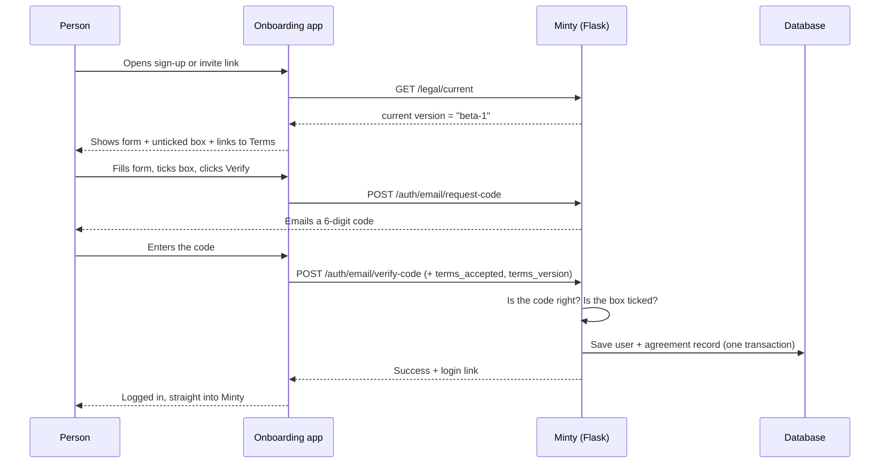
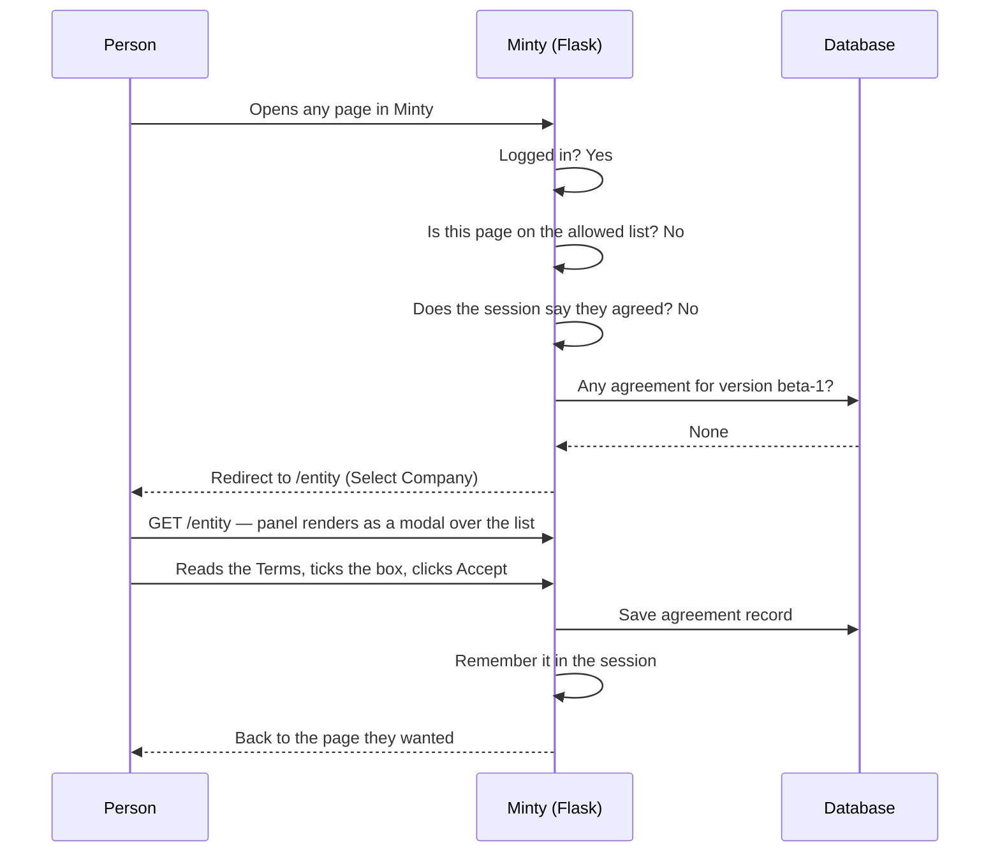

# Terms of Use Acceptance — Technical Design Document

**Source of the legal text:** `legal/terms/beta-1.md` — the Markdown is the master since 2026-09-18 (the Word original was converted to it and retired; its wording was identical)
**First version to ship:** `beta-1`
**Status:** Phase 1 (per-user) BUILT. Phase 2 (per-entity) planned — see §6.

**Not yet production-ready.** One blocker remains, content rather than code:
`legal/privacy/beta-1.md` is a 20-line placeholder that says so in its own text
and is unpinned in `_PINNED_HASHES`. `terms/beta-1` was completed and pinned on
2026-09-18 (date, contact email and address filled; its acceptance screen no
longer shows the "Draft" banner). See Dependencies.

---

## 1. Overview & Objective

### Summary

**What we are building:** a way for Minty to ask people to agree to the Terms of
Use, and to keep a permanent record of each agreement.

**Why:** right now nobody has agreed to anything. There is no tick box, no page
showing the Terms, and no record of who agreed to what. If someone said "I never
agreed to those terms," we could not prove otherwise.

The work has three parts:

1. **A tick box at sign-up.** The person agrees before their account is made.
2. **A saved record of each agreement.** Who agreed, to which version, when, and
   the exact words they saw.
3. **A blocking screen after login.** If a logged-in person has not agreed to
   the current version, they see this screen and cannot use Minty until they do.
   It renders as a **modal over the Select Company list** (`/entity`), not as a
   separate page — see §2 Flow B. `/legal/accept` still exists as the fallback
   route and as the canonical URL for the flow. **Since 2026-09-29, with
   always since phase 2**, `/entity` hands the browser to minty-web's list, and
   minty-web draws the same panel over every page of its own — see §4.8.

Part 3 sounds like a backup plan. It is not. It is the only part that covers
people who are already using Minty today, and it is the only part that works
when the Terms are rewritten later. It gets built first.

### Goals

| # | Goal |
|---|---|
| G1 | Every user of Minty has agreed to the current Terms — including people who signed up before this feature existed. |
| G2 | Each agreement is saved permanently and can be proven years later. |
| G3 | The record shows the exact wording the person saw, not just a version name. |
| G4 | When the Terms are rewritten, we can ask everyone again with one config change. |
| G5 | Old versions of the Terms stay readable forever. |
| G6 | Nobody can create an account without agreeing. |

### Non-Goals

Things this design deliberately does **not** cover:

| # | Not doing | Why |
|---|---|---|
| N1 | Writing the Privacy Policy text | That is legal writing, not engineering. It is a blocker (see Dependencies), but it is not part of this build. |
| N2 | Business-level agreements — **in Phase 1** | The Terms as written bind the individual, not the business: §5 says accounts belong to the individual, and §3 says an account exists independently of any Entity. So the Phase 1 record is tied to a person. This is now planned as **Phase 2** — see §6, including why it needs a different document rather than a second copy of this one. |
| N3 | Digital signatures | A tick box plus a saved record is the normal standard here. Real signatures are not needed. |
| N4 | Different Terms per country | One set of Terms, governed by Hong Kong law (section 22 of the Terms). |
| N5 | Cookie banner / marketing consent | Different problem, different rules. Not mixed in. |
| N6 | Asking again on a set schedule | People are asked again only when the Terms actually change in a meaningful way. |

### Dependencies

**Things we need that are outside this code:**

| Dependency | What it is | Risk |
|---|---|---|
| **Privacy Policy document** | Section 19 of the Terms points at "the Minty Privacy Policy". That document does not exist. | **Blocker.** The tick box is meant to link to it. Either write it, or reword section 19. Only the legal owner can decide. |
| **Missing details in the Terms** | The header said `Last Updated: [DATE]`; section 23 said `[INSERT EMAIL]` and `[INSERT ADDRESS]`. | **Resolved 2026-09-18.** Header now `18 September 2026`; §23 gives `hello@dailyminty.com` and `Level 5, K11 Atelier, 728 King's Road, Quarry Bay, HONG KONG`. Both the `.md` and the source `.docx` were updated and `terms/beta-1` pinned. |
| **The onboarding app** | A separate Next.js app at `C:\Projects\New_Repo\onboarding`. It owns the sign-up and invite screens. | Two apps must be released together. Needs planning. |
| **Xero login** | People can join Minty by logging in with Xero. That screen belongs to Xero, so we cannot put a tick box on it. | Handled by the blocking screen instead. Not a blocker. |
| **Database** | PostgreSQL, schema `pettycashv2`. One new table. | Normal migration. Low risk. |

No new third-party services are needed. Nothing here calls out to the internet.

---

## 2. Architecture & Workflow

### The pieces

```
┌──────────────────────┐     ┌──────────────────────┐
│  Onboarding app      │     │  Minty (Flask)       │
│  (Next.js, port 3030)│     │  the main app        │
│                      │     │                      │
│  • sign-up screen    │────▶│  • checks agreement  │
│  • invite screen     │     │  • saves the record  │
│  • the tick box      │     │  • blocking screen   │
└──────────────────────┘     │  • shows the Terms   │
                             └──────────┬───────────┘
                                        │
                             ┌──────────▼───────────┐
                             │  PostgreSQL          │
                             │  terms_consent table │
                             └──────────────────────┘

                             ┌──────────────────────┐
                             │  legal/ folder       │
                             │  the Terms text,     │
                             │  one file per version│
                             └──────────────────────┘
```

The Terms text lives in the code folder as plain text files, one per version.
They are read once when the app starts. They are never edited after publishing
a new version means a new file.

### Flow A — Someone signs up (tick box path)

This covers self sign-up and invited users. Both create their own account.



The important part: the user row and the agreement record are saved **together**.
If one fails, both fail. We never end up with an account that has no agreement.

### Flow B — Someone who has not agreed opens Minty (blocking path)

This covers everyone else: existing users, Xero users, and users created by a
manager/admin at their business.



### State machine

Each person is in one of three states. The state is worked out from the saved
records, not stored as a field.

```
                    ┌─────────────────┐
   New person  ───▶ │  NOT_AGREED     │
   or Terms         │                 │
   were rewritten   │  Blocked from   │
                    │  using Minty    │
                    └────────┬────────┘
                             │
                    ticks box and accepts
                    (at sign-up or on the
                     blocking screen)
                             │
                             ▼
                    ┌─────────────────┐
                    │  AGREED_CURRENT │
                    │                 │
                    │  Normal use     │
                    └────────┬────────┘
                             │
                    Terms rewritten and
                    marked as a major change
                             │
                             ▼
                    ┌─────────────────┐
                    │  OUT_OF_DATE    │
                    │                 │
                    │  Blocked again  │
                    └────────┬────────┘
                             │
                    accepts the new version
                             │
                             ▼
                       AGREED_CURRENT
```

| State | Meaning | Can use Minty? |
|---|---|---|
| `NOT_AGREED` | No record for the current version | No — sent to the blocking screen |
| `AGREED_CURRENT` | Has a record for the current version | Yes |
| `OUT_OF_DATE` | Agreed to an older version only | No — sent to the blocking screen |

`OUT_OF_DATE` and `NOT_AGREED` behave the same. They are listed separately
because the blocking screen shows a "here is what changed" note for people who
are out of date, and does not for brand-new people.

### How a rewrite works

There is one setting called `CURRENT_TERMS_VERSION`. When we change the Terms in
a meaningful way, we add a new text file and change that setting. Everyone moves
from `AGREED_CURRENT` to `OUT_OF_DATE` at once, and everyone gets asked again.

Small changes — a typo, a corrected address — get a new file but the setting is
**not** changed. Nobody is disturbed.

---

## 3. Data Model & Schema

### New table: `pettycashv2.terms_consent`

One row per agreement. Rows are only ever added — never changed, never deleted.

```sql
CREATE TABLE pettycashv2.terms_consent (
    id            VARCHAR(36)  PRIMARY KEY,
    user_id       VARCHAR(36)  NOT NULL
                  REFERENCES pettycashv2."user"(id) ON DELETE CASCADE,
    terms_version VARCHAR(32)  NOT NULL,
    document_hash VARCHAR(64)  NOT NULL,
    accepted_at   TIMESTAMPTZ  NOT NULL DEFAULT now(),
    source        VARCHAR(32)  NOT NULL,
    ip_address    VARCHAR(45),
    user_agent    VARCHAR(512)
);

CREATE UNIQUE INDEX ix_terms_consent_user_version
    ON pettycashv2.terms_consent (user_id, terms_version);

CREATE INDEX ix_terms_consent_user
    ON pettycashv2.terms_consent (user_id);
```

### What each field is for

| Field | Type | Meaning |
|---|---|---|
| `id` | text, 36 | Unique id for the row. Matches how `user.id` works today. |
| `user_id` | text, 36 | Who agreed. Points at the existing `user` table. |
| `terms_version` | text, 32 | Which version, e.g. `beta-1`. |
| `document_hash` | text, 64 | A fingerprint of the exact wording shown. Explained below. |
| `accepted_at` | timestamp | When. Stored with the time zone. |
| `source` | text, 32 | How they agreed. One of: `signup_otp`, `signup_invite`, `gate`, `hub` (minty-web's panel, since 2026-09-29). |
| `ip_address` | text, 45 | Their internet address. Long enough for the newer IPv6 format. |
| `user_agent` | text, 512 | Which browser they used. |

### Why `document_hash` matters

Saving "they agreed to `beta-1`" only proves they clicked a button with a label
on it. It does not prove what the document said.

So we also save a fingerprint a 64-character code worked out from the text
itself. Change one letter of the document and the code changes completely. Years
later, we can hold up the document and the code and show they match.

The fingerprint is worked out from the plain text file when the app starts, not
from a PDF. PDF files include the time they were made, so making the same PDF
twice gives two different fingerprints.

Without the hash, we can prove User clicked, but not what they clicked on and worse, we couldn't disprove the accusation that we edited the terms afterwards. The hash pins the exact wording to the exact click, so neither side can rewrite what was agreed.

### Why the unique index

`(user_id, terms_version)` is unique. This means one person can only have one
record per version. If they double-click, or open the screen in two tabs, or the
request is retried, we get one row — not two. The code treats "this already
exists" as success, not as an error.

### Why nothing is stored on the `user` table

A simpler design would add a `terms_version` column to `user`. It would work
until the first rewrite, then throw away all history — you would only ever know
the latest answer, never the trail.

Speed is not a reason to change this. The check result is remembered in the login
session, so the table is only read once per login. See section 5.

### Deleting users

`ON DELETE CASCADE` means if a user is deleted, their agreement records go too.
This is on purpose. Section 13 of the Terms allows permanent deletion, so keeping
records about a deleted person is data we have no reason to hold.

### No back-filling

When this goes live, we do **not** create records for existing users. They never
agreed. They will be asked on their next login. Inventing records would defeat
the entire point of having them.

### Where the Terms text lives

```
legal/
  terms/
    beta-1.md          ← the wording (the master copy; pinned by hash)
    beta-1.pdf         ← optional download copy, built once at release
  privacy/
    beta-1.md
  registry.py          ← version list, dates, fingerprints
```

Rules:

- A published file is **never** edited. Fix something → new version.
- Old versions are **never** deleted, even when nobody is on them any more.
- The `.md` is the master copy of the legal wording and what the website shows;
  there is no Word original any more. A new version starts as a new `.md`.

---

## 4. API Specification

### 4.1 `GET /legal/current`

Tells the front end which version is live, so it can send the right version name
back when someone agrees.

Login required: **no**

**Response `200`**

```json
{
  "terms_version": "beta-1",
  "terms_url": "/legal/terms",
  "privacy_url": "/legal/privacy",
  "effective_date": "2026-07-02"
}
```

---

### 4.2 `GET /legal/terms` and `GET /legal/terms/<version>`

Shows the Terms as a normal web page. The second form shows an older version.

Login required: **no** — someone signing up does not have an account yet.

| Code | When |
|---|---|
| `200` | Page shown |
| `404` | That version does not exist |

Same two routes exist for `/legal/privacy`.

Each page has a **Download a copy** button linking to the PDF for that version.
The web page is the main form; the PDF is a convenience.

---

### 4.3 `GET /legal/accept`

The standalone acceptance page. Shows the Terms in a scrollable box, a link to
the Privacy Policy, one unticked box, an **Accept & Continue** button, and a
**Decline** link (which logs out).

**This is no longer where the gate sends people.** The gate redirects to
`/entity`, where the same panel renders as a modal over the Select Company
list. This route remains as the fallback for anyone arriving by a path that
does not pass through `/entity`, and as the canonical URL for the flow.

Page and modal share three partials — `legal/_terms_styles.html`,
`_terms_panel.html`, `_terms_script.html` — so the two cannot drift apart.

Login required: **yes**

| Code | When |
|---|---|
| `200` | Screen shown |
| `302` → their dashboard | They have already agreed; nothing to do |

If they are out of date rather than brand new, the page also shows a short "what
changed" note.

---

### 4.4 `POST /legal/accept`

Saves the agreement from the blocking screen.

Login required: **yes**. CSRF-protected (a standard check that the request came
from our own page).

**Request**

```json
{
  "terms_version": "beta-1",
  "accepted": true
}
```

**Responses**

| Code | Body | When |
|---|---|---|
| `200` | `{"status": "success", "redirect_url": "/dashboard"}` | Saved |
| `400` | `{"status": "error", "message": "Please tick the box to continue."}` | Box not ticked |
| `409` | `{"status": "error", "code": "version_changed", "terms_version": "beta-2"}` | The Terms changed while they had the page open. Screen reloads with the new text. |

---

### 4.5 `POST /auth/email/verify-code` *(existing endpoint, being changed)*

This is the endpoint that creates accounts today. Two new optional fields are
added.

**Request — new fields in bold**

```json
{
  "email": "someone@example.com",
  "code": "123456",
  "first_name": "Ann",
  "last_name": "Lee",
  "terms_accepted": true,
  "terms_version": "beta-1"
}
```

**Behaviour**

| Situation | Result |
|---|---|
| Existing user logging in | Fields ignored. Login works as before. |
| New account, box ticked | Account created + agreement record saved together |
| New account, fields missing | **During rollout:** allowed, they meet the blocking screen later. **After rollout:** rejected with `400`. |
| New account, `terms_accepted: false` | `400` — `{"status": "error", "message": "You must accept the Terms of Use to create an account."}` |

The two-step behaviour matters. Both apps are released separately, so for a short
window the onboarding app may still be sending the old request shape. If Flask
rejected those immediately, every sign-up would break during that window.

---

### 4.6 `GET /minty/api/users/<user_id>/consents` *(admin view)*

Lets a admin look up someone's agreement history.

Login required: **yes**, with the same permission used elsewhere for viewing
users in that business.

**Response `200`**

```json
{
  "user_id": "…",
  "consents": [
    {
      "terms_version": "beta-1",
      "accepted_at": "2026-08-10T09:14:22+08:00",
      "source": "signup_invite",
      "document_hash": "a3f1…"
    }
  ]
}
```

---

### 4.8 `GET /api/me/terms` and `POST /api/me/terms/accept` *(minty-web's panel, 2026-09-29)*

Flask's `/entity` sends the browser to minty-web (always, since phase 2) whether or
not an acceptance is owed, and minty-web draws the panel (a port of
`_terms_panel.html`) over every page of its own. These two routes are what it reads
and posts (`blueprints/legal/routes/hub.py`). Bearer token, not the session; CORS for
minty-web; CSRF-exempt.

- `GET /api/me/terms` → `{"owed": false}`, or `{"owed": true, "document": {version,
  effective_date, html, show_draft_notice}, "is_update", "previous_version", "links":
  {terms, privacy, previous}}`.
- `POST /api/me/terms/accept` `{"accepted": true, "terms_version": "beta-1"}` → the
  same checks as §4.4 (one function, `accept_current_terms`): `400` not ticked, `409`
  `{"error": "version_changed", "terms_version": <live>}`, `500` no document, else the
  record with `source = "hub"` and `200 {"ok": true, "terms_version": <live>}`.

Both are on the gate's allowed list (§5.2), and an agreement given there is honoured
by the gate on the next Flask page — it falls back to the database when the session
has no answer.

### 4.7 What every other endpoint does now

Every existing page and API in Minty is now checked before it runs. If the person
is logged in but has not agreed:

| Request type | Response |
|---|---|
| Normal page view | `302` redirect to `/entity`, which renders the panel as a modal |
| Background/JavaScript request | `403` with `{"status": "error", "code": "terms_acceptance_required"}` |

The split matters. Minty's screens make a lot of background requests, and a
redirect sent to one of those fails silently — the user sees nothing happen at
all, with no clue why.

---

## 5. Security & Edge Cases

### 5.1 The checks happen on the server

The tick box on screen is a convenience. It is not the real check.

Anyone reasonably technical can change what a browser sends. So Flask
independently refuses to create an account unless the agreement is genuinely
there. Without this we could end up with saved records for agreements that were
never actually given which is worse than no record at all, because they look
real.

### 5.2 The allowed list, and the lock-out risk

The blocking check runs on every request. It must skip a small list of pages, or
nobody can ever escape it:

- `/legal/accept` — the standalone screen
- `/legal/terms`, `/legal/privacy` and their older versions
- `entity.entity_list` — **where the gate now sends people.** Without this the
  gate redirects to a page it blocks, which is a loop with no exit
- **log out** — someone who refuses must always be able to leave
- the login and email-code pages
- static files (images, styles)
- health checks used by the server

**The cost of allowing `entity.entity_list`:** someone who has not agreed can
load that one page and, by removing the modal in devtools, read their company
NAMES. They still cannot enter any of them — every other entity route stays
gated. That is a deliberate, bounded trade for putting the panel where the
design asks for it. If it ever becomes unacceptable, render the list empty
server-side whenever terms are outstanding, so there is nothing behind the
modal to reveal.

**This is the biggest risk in the whole design.** Get this list wrong and every
person is locked out of Minty with no way back in — administrators included.
Not slow, not broken in part. Locked out.

It must be tested before release, including the specific case of a person who
refuses to agree still being able to log out.

### 5.3 Remembering the answer, and why it self-clears

Reading the database on every single request would be wasteful. So after the
check passes, the answer is kept in the login session.

The trick is **what** is kept. The session stores the version name, not a
yes/no flag:

```
session["terms_ok"] = "beta-1"
```

The check compares that against `CURRENT_TERMS_VERSION`. So when the Terms are
rewritten and the setting moves to `beta-2`, every existing session stops
matching by itself. No cache to clear, no sessions to wipe, no extra step in the
release. This is the main reason the version name is stored instead of `true`.

### 5.4 Two things happening at once

**Same person, two tabs.** They open the blocking screen twice and accept in
both. The unique index means the second save hits a "already exists" error, which
the code treats as success. One record, no error shown.

**Account and record saved together.** At sign-up, the user row and the agreement
record are written in one transaction. If either fails, neither is saved. There
is never an account without an agreement, and never an agreement without an
account.

**Terms change while a screen is open.** Someone opens the blocking screen, walks
away, and we release new Terms. When they come back and click Accept, the version
they send no longer matches. They get `409`, the page reloads with the new text,
and they agree to that instead. We never save a record for a version that is no
longer live.

### 5.5 Sending people back where they came from

After accepting, the person returns to whatever page they originally wanted. That
address is kept in their session — not in the web address bar.

If it came from the web address, someone could craft a link that sends users to
an outside website straight after they log in. The address is also checked to be
a path inside Minty before it is used.

### 5.6 Deploying two apps at once

Minty (Flask) and the onboarding app are separate and release separately. Order
matters:

1. Release Flask first, accepting the new fields but not requiring them.
2. Release the onboarding app, now sending the fields.
3. Once both are confirmed live, turn on the requirement.

Doing step 3 early breaks every sign-up until step 2 lands.

### 5.7 Non-browser clients

If anything other than a browser ever logs in as a user — a script, an
integration — the `403` blocking response will stop it, and it has no way to tick
a box.

Nothing like this exists in Minty today. It should be confirmed before release,
because it is easy to miss and it fails in a confusing way.

### 5.8 Keeping old versions readable

If an old text file were deleted or edited, every agreement record pointing at it
would become worthless — we could no longer show what was agreed to.

So published versions are never touched. The stored fingerprint is also checked
against the file when the app starts, so if a file is ever changed by accident,
we find out immediately rather than years later when it matters.

### 5.9 What the Terms themselves say about changes

Section 20 says that continuing to use Minty after an update counts as accepting
it. That allows a weaker approach — just publish and carry on.

This design asks explicitly anyway for meaningful changes. The clause permits the
easier route; it does not require it. A recorded click is far stronger than "they
kept using it" if it is ever questioned, and the cost is one click per person.

---

## 6. Phase 2 — the entity-level agreement (planned, not designed)

Management has asked for a **second** acceptance at company level, shown when
someone creates an entity in the onboarding wizard. This section records what
that would mean, what has to exist first, and what is deliberately still open.

**Nothing here is built. Do not start building from this section** — the first
item below is a hard prerequisite and it is not an engineering task.

### 6.1 The prerequisite: it needs a different document

The instinct is right; the timing is early; and the missing piece is legal
drafting, not code.

Recording our current Terms a second time against an entity buys nothing. The
document itself says who it binds — §5, "User accounts belong to the individual
user" — so storing a second copy of that text against a company does not create
a company obligation. Two records of one agreement, with no added meaning.

A company-level layer is only real when it is a **separate document** with a
different subject and different content:

| Layer | Document | Who accepts | Covers |
|---|---|---|---|
| Individual (Phase 1, built) | Terms of Use | every user | acceptable use, account security, no professional advice |
| Company (Phase 2, planned) | Master agreement / subscription terms | someone with authority to bind the business | fees, liability cap, data processing, term and termination, IP |

Enterprise customers will additionally ask for a **DPA**. Under Hong Kong's
PDPO that is a separate instrument again, not a clause in the Terms.

### 6.2 What actually triggers it

Money. §11 of the current Terms already says so:

> "If fees are introduced, continued use of the Service may require acceptance
> of additional billing or subscription terms."

That is the natural moment, and the reason to wait. A shop_manager ticking a box
should not be what commits their employer to a subscription — which is precisely
the problem an entity agreement solves, and today there is nothing to commit
them to. §18's HKD 100 liability cap is justified in the text by the service
being free, so it has to be revisited in the same pass.

### 6.3 What to do in the meantime (cheap, honest)

Surface §4's authority representation as an explicit acknowledgement at entity
creation:

> "I confirm I am authorised to set up this company on Minty."

One line, one tick box, recorded. §4 already says the person represents this;
today they represent it silently by reading a clause nobody reads. This closes
the real gap for a few hours of work and does not pretend to be a company
agreement.

### 6.4 Sketch of the schema, if it proceeds

A second table, never a column on `terms_consent` — the two layers have
different subjects, different documents and different lifecycles.

```sql
CREATE TABLE pettycashv2.entity_terms_consent (
    id                  VARCHAR(36) PRIMARY KEY,
    entity_id           VARCHAR(36) NOT NULL REFERENCES pettycashv2.entities(id) ON DELETE CASCADE,
    accepted_by_user_id VARCHAR(36) NOT NULL REFERENCES pettycashv2."user"(id) ON DELETE RESTRICT,
    agreement_version   VARCHAR(32) NOT NULL,
    document_hash       VARCHAR(64) NOT NULL,
    accepted_at         TIMESTAMPTZ NOT NULL DEFAULT now(),
    accepted_by_role    VARCHAR(20) NOT NULL,   -- role held AT THE TIME
    ip_address          VARCHAR(45),
    user_agent          VARCHAR(512)
);

CREATE UNIQUE INDEX ix_entity_terms_consent_entity_version
    ON pettycashv2.entity_terms_consent (entity_id, agreement_version);
```

Two differences from `terms_consent` worth noticing:

- **`ON DELETE RESTRICT`** on the accepting user, not CASCADE. Who bound the
  company is the single most important fact in the row. If deleting a user
  erased it, the company's agreement would silently lose its signatory.
- **`accepted_by_role`** stores the role held *at the time of acceptance*.
  Roles change. "An admin accepted this" must stay answerable years later, when
  that person may be a cashier or gone entirely.

### 6.5 Questions that must be answered before this is designed

Listed rather than guessed at. Each changes the build materially.

| # | Question | Why it matters |
|---|---|---|
| 1 | Which role can accept? `admin` and above, or `accountant` too? | Too low and a junior binds the company; too high and nobody present can proceed. |
| 2 | Gate entity **entry**, or only entity **creation**? | Creation-only leaves every existing entity unbound forever. Entry-gating blocks real work for people with no authority to unblock it. |
| 3 | What happens to entities that already exist? | Backfill is not an option here for the same reason as Phase 1 — nobody agreed. So every existing company needs a first acceptance, by someone with authority, at a moment that does not wreck their day. |
| 4 | The accepting person leaves the company. Does the agreement survive? | It should — a company contract does not lapse when an employee resigns. But then `accepted_by_role` and RESTRICT above are load-bearing. |
| 5 | Sole traders — one person, one company. | Are they asked twice, back to back? Two screens for one human is a bad experience and needs a deliberate answer, not an accident. |
| 6 | Does a user who declines the entity agreement keep their personal account? | Phase 1's Decline logs out. Here the two layers can disagree, and the app has to do something coherent. |

### 6.6 Where it would sit in the product

The mockups place it in the entity-onboarding wizard (a separate Next.js app,
9 steps, Bearer-token auth to Flask). Two engineering notes for whoever picks
this up:

- The wizard authenticates with a **Bearer token**, while `POST /legal/accept`
  is session-based `@login_required`. A wizard-side acceptance needs either a
  token-authenticated endpoint or `credentials: 'include'` plus CORS. This is a
  real decision, not a detail.
- The Figma shows the panel with the step bar visible and **no step active** —
  i.e. a gate in front of step 1, not a step in the sequence. Implementing it
  that way avoids touching step numbering, the resume logic
  (`onboarding_saved_step`) and `getDisplaySteps()`.

---

## Open decisions

| # | Decision | Who decides | Blocks |
|---|---|---|---|
| 1 | Write the Privacy Policy, or reword section 19? | Legal owner | The tick box wording; the whole release |
| 2 | ~~Contact email, address, and effective date for the blanks~~ Decided 2026-09-18: `hello@dailyminty.com`, `Level 5, K11 Atelier, 728 King's Road, Quarry Bay, HONG KONG`, `18 September 2026`. `terms/beta-1` pinned. | Legal owner | — |
| 3 | Tell existing users by email first, or let them meet the screen? | Business | Nothing — timing only |
| 4 | Section 4 "acting on behalf of a business" — its own tick box, or a line of text? | Business | Small piece of the sign-up screen |
| 5 | **Phase 2:** who writes the company-level agreement, and when? | Legal owner | All of §6. Until this document exists there is nothing to build. |
| 6 | **Phase 2:** does it ship with billing, or before it? | Business | Sequencing. §11 and §18 both assume the service is still free. |
